## Введение
Данная статья имеет, в основном, историческое значение. Мне хотелось бы вспомнить и описать красивый метод булевой оптимизации, которому нас учили в ЛЭТИ в 80х годах прошлого века. В наше время, в связи с широким распространением компьютерных программ логического синтеза (например. Simplify), актуальность этого метода значительно снизилась, но, тем не менее надеюсь, что ценители красоты оценят его по достоинству.
 

## Задача о покрытии в булевой алгебре
Данный метод предназначен для решения важнейшей практической задачи в булевой алгебре – а именно задачи о покрытии. Неформальная формулировка может звучать так: имеется булева функция от нескольких входных переменных (возможно, не полностью определенная). Требуется найти минимальное покрытие этой функции в заданном базисе. (Причем, в качестве базиса может применяться номенклатура элементов какой-либо логической серии микросхем либо просто библиотека элементов для ПЛИС либо ASIC)

Данная задача имеет прикладное практическое значение в области цифровой электроники и логического синтеза. Иногда эту задачу сводят к нахождению минимальной ДНФ или КНФ, но в практическом плане наше определение более полезно. Причем, как правило, решается она в два этапа – сначала находится минимальная ДНФ либо КНФ, а затем ищется ее оптимальное покрытие в заданном базисе. Сейчас такие задачи решаются программами компьютерного логического синтеза. Наилучшее решение, в общем случае, находится методом полного перебора, который в случае достаточно большого числа переменных требует нереальных затрат ресурсов и времени. (Известно, что количество всех возможных булевых функций зависит от числа входных переменных n как  . Таким образом, от одной переменной мы имеем всего 4 различных функции, от двух – 16, от трех – уже 256 и так далее.)

Поэтому на практике используют различные эвристики, и результат может сильно отличаться от оптимального.
 

## Простой практический пример
Зададим простую булеву функцию от 2хвходных переменных и напишем для нее ДНФ и КНФ. Функцию зададим следующей таблицей:

|вх. `X_1` |вх. `X_0` |вых. `Y` |
|-------|------|--|
|`0` |`0` |`0` |
| `0`| `1`|`1` | 
| `1`|`0` |`1` |
| `1`|`1` |`0` |

Чтобы написать для нее ДНФ, надо написать формулы для всех строчек, где Y равна единице и соединить их через функцию “или”:

$$
Y = !X_1 \& X_0 | X_1 \& !X_0
$$

Чтобы получить КНФ, надо закодировать все нули через операции “или” и соединить их через операцию “и”:

$$
Y=X_1|X_0 \& !X_1|!X_0
$$

Легко понять, что формулы эти эквивалентны:

$$
(!X_1 \& X_0) | (X_1 \& !X_0) ó (!X_1 \& X_0)|X_1  \&  (!X_1 \& X_0)|!X_0 ó(!X_1|X_1)  \&  (X_0|X_1)  \&  (!X_1|!X_0)  \&  (X_0|!X_0) ó(X_0|X_1)  \&  (!X_1|!X_0)
$$

Чтобы реализовать эту логическую функцию в виде электронной схемы, надо закодировать (покрыть) одну из этих формул доступными нам логическими элементами. Это могут быть либо микросхемы, реализующие функции программируемой логики, либо библиотечные функции из какой-либо библиотеки элементов. Например, использовав микросхемы К1533ЛА3, содержащие элементы `2И-НЕ`, можно покрыть эту функцию так:

_Рис. 1. Реализация функции “исключающее или” на элементах 2И-НЕ_

Здесь мы использовали тождество:

$$
Y = !X1 \& X0 | X1 \& !X0 \leftrightarrow [!(!X1 \& X0) \& !(X1 \& !X0)]
$$

При этом мы израсходовали 5 логических вентилей и 2 корпуса, т.к. в каждом корпусе содержатся 4 лог. вентиля. Можно убедиться (самостоятельно), что использование функции 2ИЛИ-НЕ приводит к аналогичному результату.

Если нам доступен более широкий набор логических элементов, как это бывает в библиотеках функций для ПЛИС или ASIC, то можно покрыть эту логическую функцию иначе, например так:

_Рис. 2. Реализация той же функции на других логических вентилях._

Если же, например, у нас имеется мультиплексор, то мы можем реализовать эту функцию непосредственно на нем:

_Рис. 3. Вариант реализации на мультиплексоре_

Конечно, ввиду того, что сам мультиплексор реализуется с посредством нетривиальных логических функций, такой прием неэффективен при проектировании для ASIC и ПЛИС, но он широко применялся при проектировании на схемах малой степени интеграции.

Даже на таком простом примере видно, что задача покрытия – весьма нетривиальна. Добавим, что с повышением числа входных переменных, сложность ее решения растет экспоненциально и уже для нескольких сотен переменных решение “в лоб”, т.е. полным перебором становится нереализуемым на любом современном компьютере.

И, в заключение, для тех, кто еще не догадался – мы рассматривали реализацию функции “исключающее или”.

## Задача поиска минимальной ДНФ (КНФ) ДНФ и КНФ

В общем случае, логическую функцию можно задать таблицей. В ней будет $2^n$ строк, где $n$ – число входных переменных. Наша задача – записать функцию, заданную этой таблицей в виде логической формулы от входных переменных. Имеется много способов решения данной задачи.

В частности, имеется математическая теорема, что любую логическую функцию от $n$ переменных можно покрыть функциями вида

$$
f = |^l_{i=1} \hat{x}_0 \& ...\& \hat{x}_{n-1}
$$

Здесь знаком $|$ обозначена операция **логическое или**, а индекс $i$ пробегает по всем выходным единицам. Выражение вида $\hat{x}_0 \& ... \hat{x}_{n-1}$ называется “логический терм”, а домик означает переменную либо ее инверсию. Такое представление называется “дизъюнктивная форма”, сокращенно ДНФ. ДНФ может быть “совершенной”, когда присутствуют все $n$ входных переменных, либо сокращенной, когда количество переменных в терме меньше $n$.

Соответственно, выражение вида

$$
f = \&^l_{i=1} \hat{x}_0 | ...| \hat{x}_{n-1}
$$

называется “конъюктивная форма”, сокращенно КНФ. Все вышесказанное сказанное про ДНФ относится и к КНФ, за исключением того, что операции “и” и “или” меняются местами, а термы выписываются для выходных значений, равных 0.

## Постановка задачи
Задача – найти минимальную ДНФ (КНФ) для заданной функции. При этом, в общем случае, функция может быть не полностью определена. Это значит, что имеются входные комбинации, которые никогда не используются (либо безразличны). Для того, чтобы описать методы решения (для небольшого числа входных переменных), рассмотрим несложную учебную задачу.
 

## Учебная задача
Задача: Разработать схему преобразования цифр от 0 до 9, заданных в двоичном коде в сигналы управления семисегментного индикатора. Выход – 1 – сегмент включен, 0 – сегмент выключен. Так же условимся, что код больше, чем 9 в двоичном представлении появиться не может.

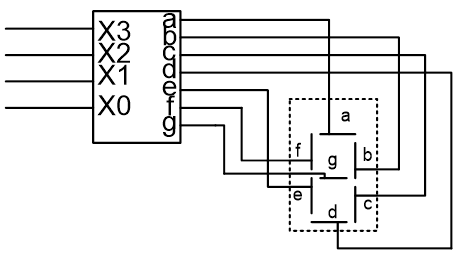

_Рис. 4. Модуль управления семисегментным индикатором_

Как решаются задачи такого типа?

Для начала выпишем таблицу функций для всех входных и выходных переменных:

| Дес. цифра | Входы X 3210 | Выходы abcdefg |
|---|---|---|
| 0 | `0000` | `0000000` |
| 1 | `0001` | `0110000` |
| 2 | `0010` | `1101101` |
| 3 | `0011` | `1111001` |
| 4 | `0100` | `0110011` |
| 5 | `0101` | `1011011` |
| 6 | `0110` | `1011111` |
| 7 | `0111` | `1110000` |
| 8 | `1000` | `1111111` |
| 9 | `1001` | `1111011` |
| - | `1010` | `*******` |
| - | `1011` | `*******` |
| - | `1100` | `*******` |
| - | `1101` | `*******` |
| - | `1110` | `*******` |
| - | `1111` | `*******` |

Как видим, функция оказалась недоопределенной на некоторых входных значениях. Это облегчает дальнейшую оптимизацию. Кроме того, выход получился векторным, что для нас означает необходимость минимизации семи отдельных выходных функций вместо одной.

## Общий принцип минимизации

Общий принцип – исключение из терма незначащих переменных. Так, для кодирования одной точки нам требуются все `n` входных переменных. Для кодирования отрезка – `n-1`. Квадрат кодируется `n-2` переменными, а куб – `n-2`. И так далее. Таким образом, мы должны находить элементы с общими переменными и исключать эти переменные из термов. Для этого нам нужно находить в многомерном пространстве входных переменных геометрические элементы – точки отрезки, плоскости, кубы и гиперкубы.

Это объяснение кажется очень абстрактным, но после рассмотрения простого примера все станет понятно.

## Карты Карно

Можно записать скалярную булеву функцию в виде двумерной таблицы. Запишем, например значение функции для выхода `a`:

| X3 X2 \ X1 X0 | `11` | `10` | `01` | `00` |
|---|---|---|---|---|
| `11` | `*` | `*` | `*` | `*` |
| `10` | `*` | `*` | `1` | `1` |
| `01` | `1` | `1` | `1` | `0` |
| `00` | `1` | `1` | `0` | `0` |

Такая таблица называется картой Карно и на ней, в принципе, можно отыскивать вышеописанные геометрические закономерности. Как это сделать, можно посмотреть, например, в Википедии по [ссылке](https://ru.wikipedia.org/wiki/%D0%9A%D0%B0%D1%80%D1%82%D0%B0_%D0%9A%D0%B0%D1%80%D0%BD%D0%BE), где тема исчерпывающе объяснена, поэтому мы ее больше затрагивать не будем. Мы же подробно рассмотрим менее известный альтернативный метод минимизации булевых функций, а именно – минимизацию на многомерных булевых кубиках, которая, по нашему мнению, гораздо удобнее и нагляднее.

## Минимизация на многомерных булевых кубиках

### Что такое булевый кубик

Рассмотрим ось, соответствующую какой-либо булевой переменной, на которой имеются два входных значения – 0 и 1. Нарисуем на ней два кружочка. Значение входных переменных будем писать под кружочками, а выходной – внутри. Получаем булевый отрезок.

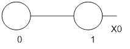

_Рис. 5. Булевый отрезок_

В этом случае возможны всего 4 булевы функции – константы 0 и 1, повторитель и логический инвертор. Они запишутся так:

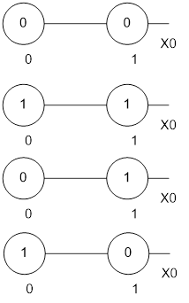

_Рис. 6. Все функции от двух булевых переменных_

Для двух входных переменных у нас получится булевый квадрат и количество реализуемых функций составит 16 (перечислять их не будем):

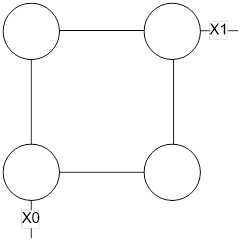

_Рис. 7. Булевый квадрат_

Абсолютно аналогично, получим булевый кубик:

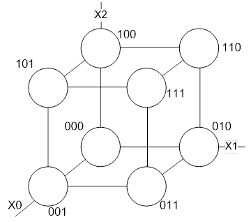

_Рис. 8. Булевый куб_

Здесь мы подписали под кружочками входные переменные в формате {X2,X1,X0}

И здесь начинается самое интересное! Мы можем продолжить рисование наших кубиков и для размерности больше 3. Это весьма удивительно, ведь в реальном мире размерность больше трех воспринимается как абстракция, которую нельзя изобразить! В дискретной математике, однако, все иначе, и мы можем рисовать кубики размерности большей, чем 3. Поскольку в нашей задаче производится минимизация функции от четырех входных переменных, нам нужен четырехмерный кубик, и мы его сейчас нарисуем!

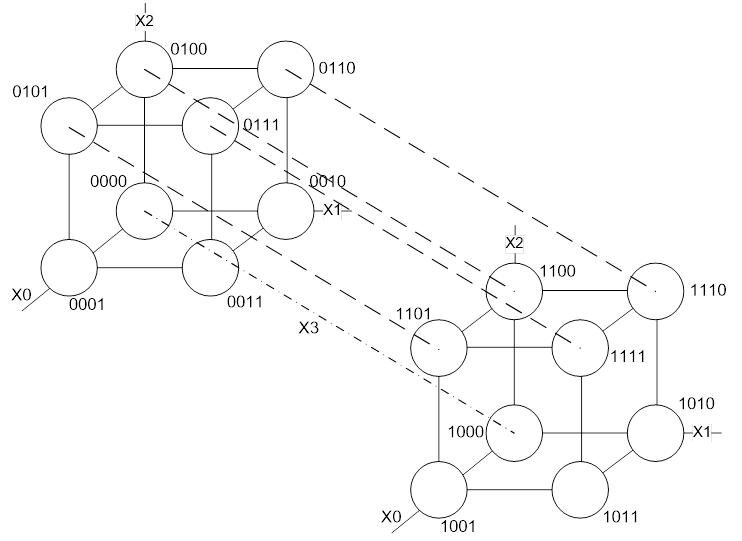

_Рис.9 . Четырехмерный булевый гиперкуб_

Вот он какой, наш четырехмерный кубик! Кружочки подписаны значением входных переменных, что можно и не делать. Штрих-пунктирной линией обозначена переменная X3, а пунктиром – трехмерный подкубик $X_2=1$. (Вообще, легко показать, что один 4х-мерный гиперкуб содержит в себе 8 трехмерных разрезов).

При наличии минимальной практики, на таком кубике хорошо визуально различимы различные геометрические элементы, что позволяет легко находить минимальные формы.

Теперь рассмотрим кубики более высокой размерности, а затем вернемся к нашей задаче.

### Булевы гиперкубы размерностью выше четвертой

Возникает вопрос, а существует ли предел размерности, которую можно отобразить на гиперкубе. Нет, такого предела не существует, но, к сожалению, имеется предел человеческого восприятия. Как оказалось, максимальная размерность входных переменных, при которой человек способен различать геометрические элементы является семи. Нарисуем сразу гиперкубик этой размерности, причем он содержит в себе все гиперкубики более низких размерностей:

Возникает вопрос, а существует ли предел размерности, которую можно отобразить на гиперкубе. Нет, такого предела не существует, но, к сожалению, имеется предел человеческого восприятия. Как оказалось, максимальная размерность входных переменных, при которой человек способен различать геометрические элементы является семи. Нарисуем сразу гиперкубик этой размерности, причем он содержит в себе все гиперкубики более низких размерностей:

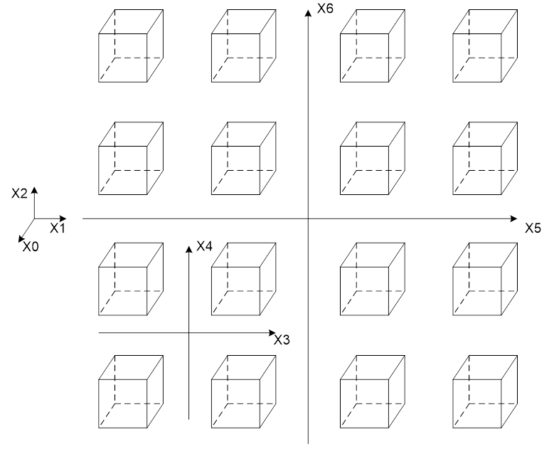

_Рис. 10. Семимерный булевый гиперкуб (развертка на плоскости)_

Возможно, впрочем, правило 7 измерений относится только к развертке на плоскости, изображенной на предыдущем рисунке. На рисунке ниже изображен гиперкубик размерности 9, состоящий из 64х обычных трехмерных кубиков. Честно признаемся, мы с таким кубиком не работали, но выглядит он так, что похоже, его можно использовать на практике.

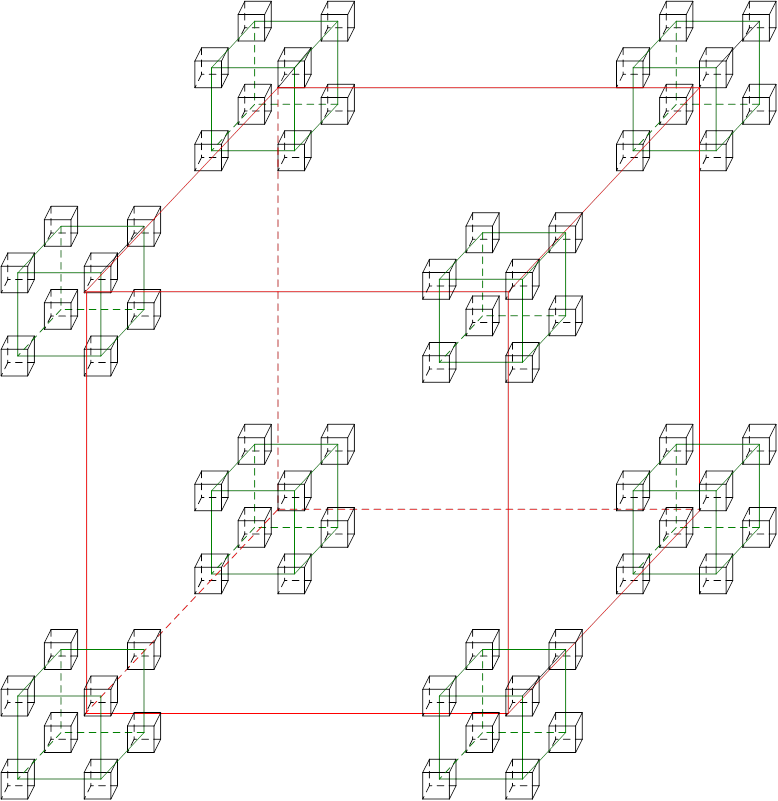

_Рис. 11. Девятимерный булевый гиперкуб_

## Учебная задача (продолжение)

Покажем, как решается наша задача на примере работы с четырехмерным кубиком. Сначала минимизируем 7 выходных функций отдельно друг от друга.
Сегмент a
Произведем минимизацию булевой функции для сегмента `a` семисегментного индикатора. Для начала нарисуем сам кубик. Естественно, так подробно, как на Рис. 9 в практической работе его не прорисовывают. Кружочки для быстроты не рисуют, а выходы пишут рядом с кружочками. Тогда у нас получается что-то вроде:

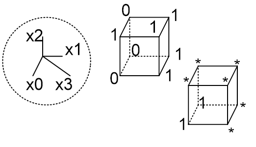

_Рис. 12. Логическая функция для сегмента `a` с неопределенными состояниями_

В пунктирном круге мы разместили напоминалку о направлении координат. Обычно ее не так же специально не вырисовывают, а держат в уме. Теперь мы можем приступить к минимизации. Это можно сделать разными способами. В зависимости от того, какими функциями мы будем в дальнейшем покрывать нашу форму. Возможны 4 варианта: ДНФ, КНФ, а так же ДНФ и КНФ с инверсией.

Объясним, как пишется ДНФ. Мы должны покрыть все единицы, нули нас не интересуют. При этом мы можем доопределять звездочки так, как нам удобно.

Если доопределить звездочки как 1, то сразу видим, что мы имеем два гиперкубика и одну гиперплоскость, которые частично перекрываются. Для удобства они выделены цветом:

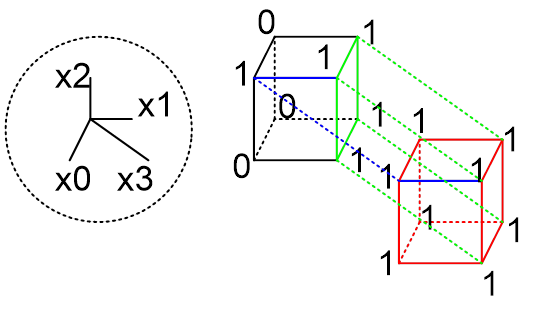

_Рис. 13. Логическая функция для сегмента `a` с доопределением состояний_

Таким образом, нашу функцию для сегмента `a` можно закодировать всего тремя неполными термами:

$$
a= X[3] | X[1] | (X[0] \& X[2])
$$

Если в библиотеке элементов имеются функции 3ИЛИ и 2И, то для покрытия потребуются всего две логические ячейки:

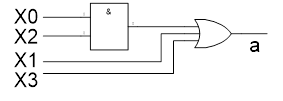

_Рис. 14. Вариант покрытия функции для сегмента "a"_

Теперь минимизируем остальные 6 функций:

## Сегмент b

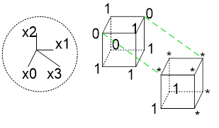

_Рис. 15. Логическая функция для сегмента "b" с неопределенными состояниями_

Будем кодировать КНФ. Доопредилив звездочки на зеленых отрезках как 0, получим два отрезка. И еще один ноль придется закодировать полным термом:

$$
b= ( X[3] | X[2] | X[1] | X[0] ) \& ( !X[2] | !X[1] | X[0] ) \& ( !X[2] | X[1] | !X[0] )
$$

## Сегмент c

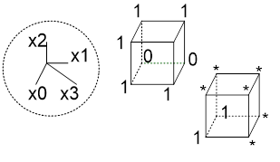

_Рис. 16. Логическая функция для сегмента "c" с неопределенными состояниями_

Кодируем КНФ, требуется всего один неполный терм:

$$
c= X[3] | X[2] | X[0]
$$

## Сегмент d
 
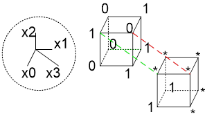

_Рис. 17. Логическая функция для сегмента "d" с неопределенными состояниями_

Здесь ситуация более сложная. Если кодировать ДНФ, то получаем один куб, две плоскости и один отрезок (обозначен зеленым пунктиром), всего 4 терма. Если же кодировать КНФ, то получаем 3 отрезка (два на первом кубе и один обозначен красным пукнктиром), соответственно, 3 терма. Приведем ДНФ:

$$
d= X[3] | ( !X[0] \& X[1] ) | ( !X[2] \& X[1] ) | (X[2] \& !X[1] \& X[0])
$$

## Сегмент e

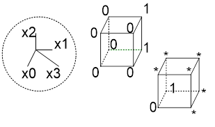

_Рис. 18. Логическая функция для сегмента "e" с неопределенными состояниями_

Здесь видно, что если кодировать ДНФ, то получаем две плоскости, всего два коротких терма:

$$
e= (X1 \& !X0) | ( X3 \& !X0) (ДНФ)
$$

Интересно, что от переменной $X_2$ вообще ничего не зависит!

## Сегмент f

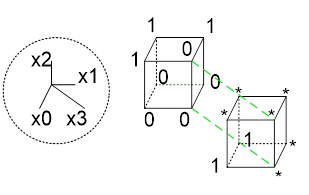

_Рис. 19. Логическая функция для сегмента "f" с неопределенными состояниями_

Кодируя КНФ, получаем две плоскости, и, соответственно, всего два терма:

$$
f= (X3 | X2) \& (!X0 | !X1) (КНФ)
$$

## Сегмент g

И, наконец, последний оставшийся сегмент
 
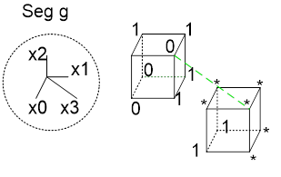

_Рис. 20. Логическая функция для сегмента "g" с неопределенными состояниями_

Если кодировать ДНФ, получается 4 терма – кубик и три плоскости. Если же кодировать КНФ, получаем 2 плоскости и, соответственно, два терма. Поэтому выбираем второй способ:

$$
g= (X[3] | X[2] | X[1] ) \& (!X[2] | !X[1] | !X[0]) (КНФ)
$$

## Собираем все вместе

Теперь можно написать все семь формул вместе:

$$
a= X[3] | X[1] | (X[0] \& X[2])
b= ( X[3] | X[2] | X[1] | X[0] ) \& ( !X[2] | !X[1] | X[0] ) \& ( !X[2] | X[1] | !X[0] )
c= X[3] | X[2] | X[0]
d= X[3] | (!X[0] \& X[1] ) | ( !X[2] \& X[1] ) | (X[2] \& !X[1] \& X[0])
e= (X1 \& !X0) | ( X3 \& !X0)
f= (X3 | X2) \& (!X0 | !X1)
g= (X[3] | X[2] | X[1] ) \& (!X[2] | !X[1] | !X[0])
$$ 

Следующий этап – совместная оптимизация. Для этого нужно выделить и совместно использовать общие части формул. Мы, однако, сделаем это позже, а сейчас проверим полученные нами формулы. Ведь, если мы где-то ошиблись, оптимизация окажется бессмысленной.

Как производить такую проверку? И здесь самое время перейти к современным средствам автоматизированной верификации и языкам описания аппаратуры (HDL).

## Совместная оптимизация

Один из возможных вариантов совместной оптимизации приведен в виде модуля `drv7seg_OPT` на языке **verilog** а так же схемы на Рис. 21, ниже.

## Компьютерная симуляция

Чтобы провести компьютерную симуляцию, нам надо написать функциональные модули, а так же модули, необходимые только для тестирования. Симуляцию будем вести на языкае verilog, а в качестве симулятора – программу modelsim/questasim.

## Описание на языке Verilog

Сначала мы написали 4 модуля на верилоге – один для полного дешифратора кодов от 0 до 14 и 3 для дешифрации кодов от 0 до 9. В модулях `drv7seg_1` и `drv7seg_varA` мы использовали оператор case, позволяющий задать все выходы a-g, в то время как в модуле `drv7seg_varB` использовались индивидуальные оптимизированные формулы для каждого выхода, а в модуле `drv7seg_OPT` – совместно оптимизированные. Так же был написан тестбенч GTB, подающий на входы всех модулей код от 0 до15 и считывающий их выходы. Для удобства наблюдения была написана функция, переводящая выходы семисегментного индикатора обратно в целочисленное представление.

_[См. Код Модулей](2019-02-13-minimize_boolean/Modules.v)_

Соответственно, по этим формулам можно составить следующую схему:

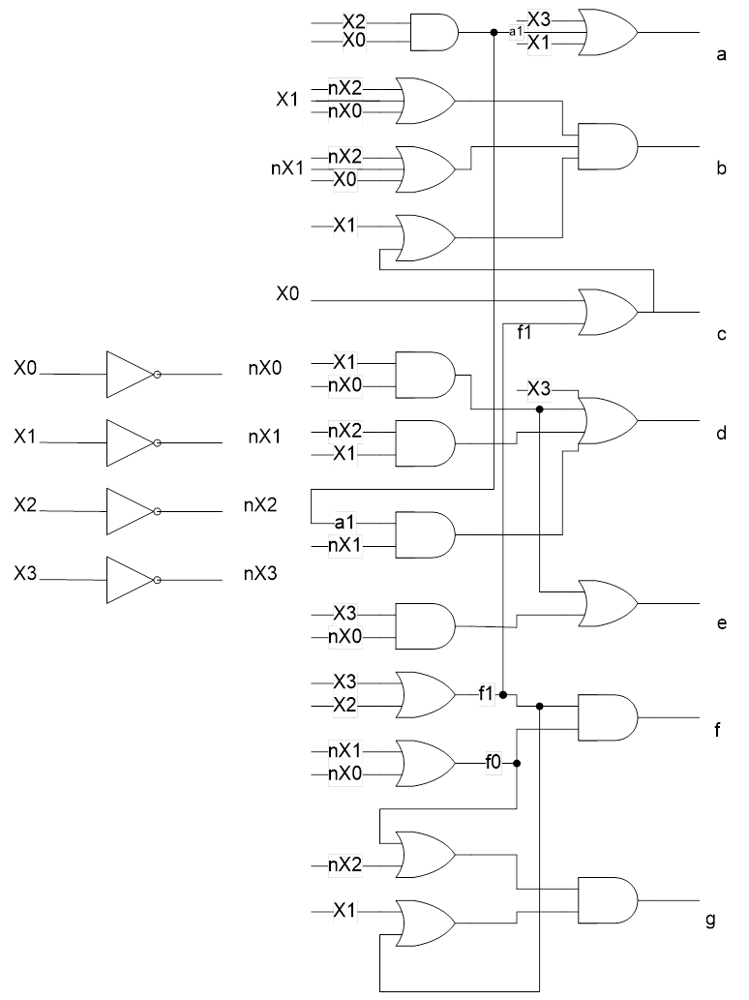

_Рис. 21. Пример реализации схемы на элементах НЕ, ИЛИ, И с оптимизацией_

## Результаты симуляции

Результаты симуляции приведены ниже. На вход всех модулей подается icode, далее с выхода считываются коды управления семисегментным индикатором, которые преобразуются обратно в целочисленный код. Кодом -1 кодируются комбинации, не соответствующие ни одной 16-ричной цифре. Дополнительно были выведены выходы сегмента a всех 4х тестируемых модулей. Как видно, все выходные коды на отрезке 0-9 совпадают друг с другом. Что касается отрезка 10-15, то там коды различаются, что связано с процессом оптимизации. Выходные коды модулей `drv7seg_varB` и `drv7seg_OPT` совпадают, что говорит о том, что совместная оптимизация проведена корректно. У модуля `drv7seg_varA` результат на отрезке 10-15 не определен, что соответствует примененному оператору case.

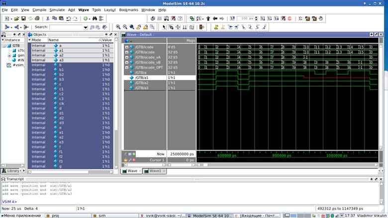

_Рис. 22. Симуляция в программе modelsim_

## Синтез и имплементация

Чтобы проверить, как результаты оптимизации повлияют на результат для ПЛИС, была проведена имплементация модулей `drv_7seg_*` на платформах Intel Cyclone-V, Xilinx Artix-7 и Lattice. Для Intel и Xilinx использовались собственные синтезаторы, а для Lattice – Synplify Pro for Lattice. (Использовались пакеты Xilinx Vivado 2017.1, Intel Quartus Prime 17.1 и Lattice Diamond 3.10)

В результате оказалось, что ручная оптимизация вообще никак не влияет на конечный результат! Этот результат, конечно, не удивителен, т.к. элементная база ПЛИС – ячейки LUT (до 6и входов включительно), которые позволяют реализовать любую функцию от 6и и менее входов табличным способом, т.е. для любой реализации нашей задачи потребуется всего 7 ячеек LUT! Единственное отличие – в имплементации семисегментного индикатора 0-9 или 0-15. Причем синтезаторы Intel и Xilinx выполнили свою работу абсолютно одинаково! Для Lattice результат еще интереснее – Synplify реализовал этот логический блок на одном модуле блочной памяти!

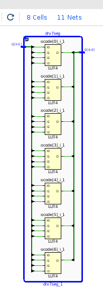

_Рис. 23. Имплементация схемы управления семисегментным индикатором для цифр 0-F в САПР Vivado_

 
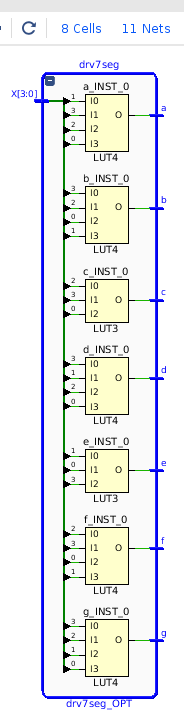

_Рис. 24. Имплементация схемы управления семисегментным индикатором для цифр 0-9 в САПР Vivado_

## Выводы

Какое практическое значение имеет навык минимизации булевых функций при проектировании для ПЛИС в наше время? Скорее всего – никакого! Современные программы синтеза делают эту работу лучше человека, к тому же они учитывают множество других факторов, таких как особенности архитектуры ПЛИС, а так же производят множество дополнительных оптимизаций (например, балансировку булевых функций относительно триггеров). Возможно, при проектировании для ASIC, навык минимизации мог бы пригодиться, т.к. там библиотека компонентов более похожа на классическую логику, в отличие от LUT, используемых в ПЛИС.

Все же прогресс не стоит на месте, поэтому сейчас больший эффект дает оптимальное проектирование на системном уровне, а все оптимизации на локальном уровне берет на себя компьютер. И, если программа синтеза работает неэффективно, логично улучшать программу, а не возиться с локальной оптимизацией самостоятельно.