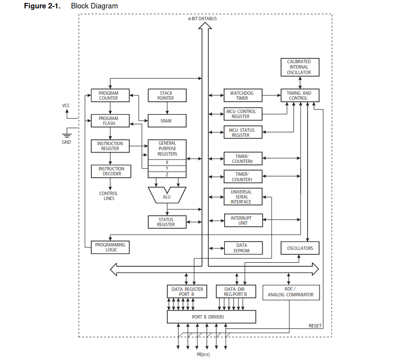
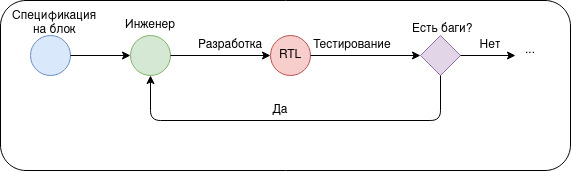
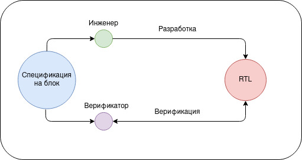
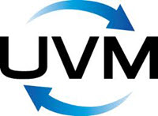
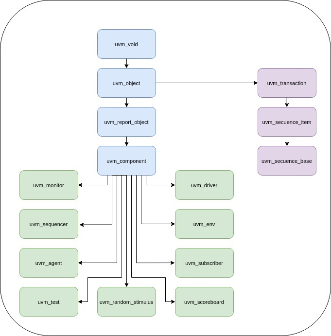
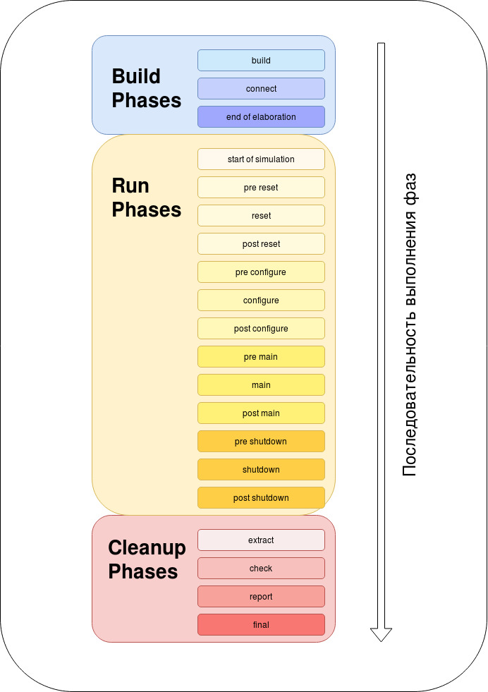
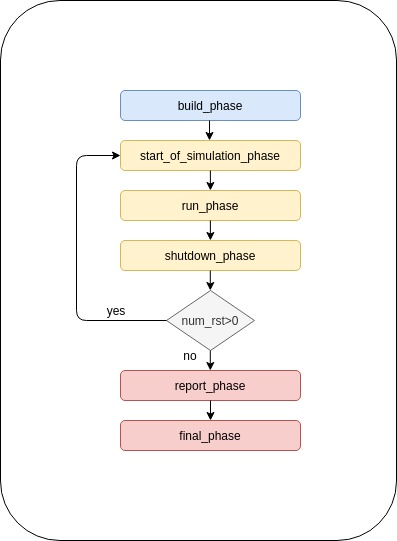
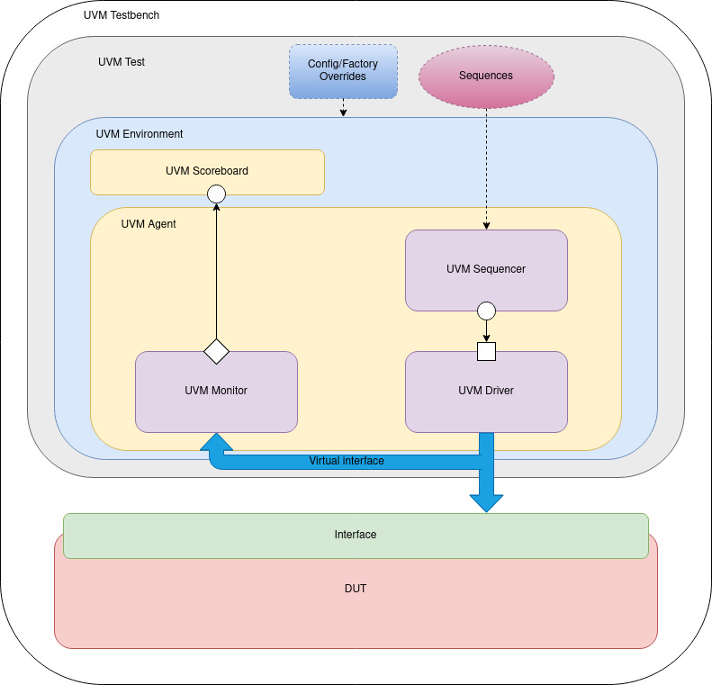
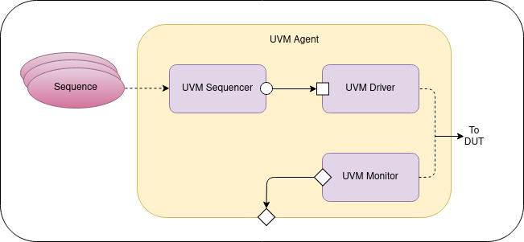

> **Автор**: krendkrend

# UVM общие сведения и организация методологии

_*О найденных опечатках и замечаниях просим сообщить_

## Список условных обозначений, сокращений и терминов.

- **DUT** – Design Under Test
- **HDL** – Hardware Description Language
- **VIP** – Verification Intellectual Property
- **TLM** – Transaction-Level Modeling
- **UVM** – Universal Verification Methodology
- **SoC** - System on a Chip

## Введение

Постоянное увеличение сложности интегральных схем, размеров чипа, а также уменьшение технологических процессов, растущая сложность устройства ведет к увеличению количества багов и брака выходных устройств, выполненных в кремнии.

Сегодня даже самый младший в серии микроконтроллер включает в себя множество подмодулей. Как сделать так, чтобы устройство правильно выполняло свои функции?

Правильно - нужно его верифицировать!

Основная **задача верификации** - доказать, что аппаратный блок выполняет все возложенные на него задачи в соответствии со спецификацией на устройство.

Если посмотреть на микросхему ATtiny85 (8-битный AVR микроконтроллер фирмы Atmel является младшей в линейке), которая имеет всего лишь 8 пинов и стоит 150 рублей в чип и дипе, то можно удивиться ее возможностям.



_Блок-диаграмма ATtiny85, заимствованная из официальной документации_

- Память программ (FLASH) - 8КБ
- ЗУ (SRAM) - 512 байт
- Энергонезависимая память (EEPROM) - 512 байт
- USI (Universal Serial Interface) - универсальный последовательный интерфейс. Может - использоваться в двухпроводном (I2C/TWI) и трехпроводном (SPI) режиме
- 4-х канальный 10-разрядный АЦП
- Аналоговый компаратор
- 2 8-битных таймера-счетчика
- Сторожевой таймер
- 8 выводов, 6 из которых могут использоваться как линии ввода-вывода

Как работает каждый блок в отдельности, как происходит передача данных из одного блока в другой, нет ли багов при взаимодействии по интерфейсам с внешним миром и.т.д. Все это необходимо тщательно проверить до отправки изделия на фабрику.

Современные устройства представляют собой совокупность программной и аппаратной части.

- **Аппаратная часть** (_hardware_) — устройство сбора и обработки информации, например компьютер, плата видеозахвата, биометрический детектор, калибратор и т. п.
- **Программная часть** (_software_) — специализированное программное обеспечение (как правило, написанное компанией-производителем аппаратной части), обрабатывающее и интерпретирующее данные, собранные аппаратной частью. Например: встроенное программное обеспечение, операционная система.

С обнаружением бага в программной прошивке у нас есть возможность выпустить новую версию программного кода, скомпилировать его и залить на наше устройство. Тем самым, мы исправим баг в устройстве.

С аппаратными модулями, выполненными в кремнии, подобный фокус не пройдет.

Конечно, есть пути решения данной проблемы, но все они слишком затратны для исправления бага в кремнии (FIB - [Focused Ion Beam](https://ru.wikipedia.org/wiki/%D0%A4%D0%BE%D0%BA%D1%83%D1%81%D0%B8%D1%80%D1%83%D0%B5%D0%BC%D1%8B%D0%B9_%D0%B8%D0%BE%D0%BD%D0%BD%D1%8B%D0%B9_%D0%BF%D1%83%D1%87%D0%BE%D0%BA)). Это будет работать, если необходимо сделать исправления на штучных устройствах, но если речь идет про партию из десятка тысяч микросхем? Скорее всего, чип признают мертворожденным. Гораздо проще будет потратить деньги на выпуск новой ревизии чипа с исправленным функционалом, чем исправлять имеющийся брак.

Выходит так, что гораздо дешевле проверить аппаратный блок до его выхода, подвергнув блок полномасштабной проверке на наличие багов.

Ни для кого не секрет, что этап верификации является более долгим, чем этап RTL-описания блока. Приблизительное разделение временных затрат на написание рабочего кода можно разделить в следующем процентном соотношении.


|Постановка задачи |Разработка RTL | Отладка и тестирование | Документирование|
|--|--|--|--|
|15 | 30 |45 | 10|



Получается, что инженер проверяет свою реализацию RTL со своим же видением спецификации, выраженной в эталонной поведенческой модели. В этом случае очень легко ошибиться и начать подгонять тесты под RTL и наоборот. Цена ошибки будет велика и может привести к неправильной работе устройства, вплоть до полной неработоспособности.

> Например, инженер сделал Ethernet контроллер и полностью протестировал его собственным набором тестов, которые он сделал в соответствии со спецификацией IEEE 802.3. Все тесты прошли успешно. Инженер со спокойной душой передал RTL контроллера дальше по цепочке топологам. Спустя время, в руках оказывается готовая микросхема, которую все спешат опробовать в деле. К тестовой плате с микросхемой контроллера подключен Ethernet кабель, но интернет пакетов контроллер не видит. Инженер показывает своим коллегам результаты пройденных тестов на своих симуляциях, но от этого легче не становится - Ethernet как не работал, так и не работает. Спустя некоторое время, приходит другой инженер со своим набором тестов для Ethernet, прогоняет их и видит кучу ошибок, которые говорят о несоответствии контроллера со спецификацией.

Человеческого фактора можно избежать, если эталонную поведенческую модель пишет один человек, а RTL - другой. Пусть инженер преобразовывает спецификацию в RTL, верификатор преобразовывает спецификацию в тестовое окружение и поведенческую модель.



## Что такое UVM?

В свое время компании большой тройки (Mentor, Cadence, Synopsys) пытались решить проблему пере используемости и стандартизации тестового окружения - компания Synopsys разработала методологию Verification Methodology Manual (VMM), а компании Mentor Graphics и Cadence объединялись для создания Open Verification Methodology (OVM).

После этого компании решили объединить свои усилия и создать единый верификационный стандарт, следуя которому, всегда можно получить положительный результат за относительно короткий промежуток времени и этим стандартом стал UVM.

**Universal Verification Methodology** (UVM) - Стандартизированная методология проверки цифровых схем, состоящая из библиотеки классов, которая вносит значительную автоматизацию в язык SystemVerilog. Например, последовательности, функции автоматизации данных (печать, копирование, сравнение) и.т.д.



Сами по себе библиотеки UVM являются открытыми. Их поддержкой занимается компания Accellera, а на ее сайте вы можете найти всю необходимую информацию о UVM. Так что в процессе разработки любой желающий всегда может обратиться к исходникам для понимания что же именно происходит внутри того или иного компонента.

Помимо библиотеки базовых классов, UVM предоставляет два важных документа: справочное руководство по API в UVM и руководство пользователя, где показано, как применять UVM на практике.

### Ссылки на материалы

- [UVM 1.2 User Guide](http://www.accellera.org/images/downloads/standards/uvm/uvm_users_guide_1.2.pdf)
- [VM 1.2 Reference Implementation](https://accellera.org/images/downloads/standards/uvm/uvm-1.2.tar.gz)
- [Standard Universal Verification Methodology Class Reference](https://accellera.org/images/downloads/standards/uvm/UVM_Class_Reference_Manual_1.2.pdf)

Если говорить простыми словами, то UVM - это набор классов с заранее определенными методами, упрощающих жизнь верификаторам.

## Преимущества использования UVM методологии

1. Использование единого стиля разработки для всех верификационных проектов.
    Код становится удобно читаемым для всех, кто знаком с UVM.

2. Переиспользуемость компонентов, написанных ранее.
    Данный подход позволяет переиспользовать ранее созданные компоненты для следующих проектов, а также использовать сторонние наработки для своих проектов. Время, которое потребуется для осознания как работает сторонний компонент (агент / компонент) будет в разы меньше, если он будет написан по методологии UVM.

    > Например, вам нужно будет единожды разработать VIP (Verification Intellectual Property) APB и использовать его во всех последующих проектах (где имеется APB, разумеется).

3. Возможность делегирования выполняемых работ по созданию тестового окружения и непосредственно самих тестов. Разделение создания нужных компонентов для тестирования между командой верификаторов, обеспечивая тем самым экономию времени.

    > Например, написанием агента может заниматься один человек, разработкой тестового окружения - второй, созданием эталонной модели - третий, написанием покрытия (coverage-а) - четвертый и.т.д.

4. Уменьшение времени, затраченного на написание элементов синхронизации между разными компонентами окружения. Можно сфокусироваться на написании тестов.

    > При использовании UVM методологии нет необходимости думать, как именно будут передаваться данные между компонентами. Все это придумано за вас и уже включено внутри библиотеки UVM. Достаточно просто присоединить по стандарту компоненты и вы получите готовое тестовое окружение (соединение секвенсора с драйвером, монитора с чекером и.т.д.)

5. Библиотека базовых классов уже подтвердила свою работоспособность и отсутствие косяков. Множество компаний используют UVM методологию как основную для верификации проектов. Постоянная поддержка и развитие стандарта (На данный момент последняя ревизия библиотеки UVM 2020-1.1)

6. Работа в любом симуляторе, поддерживающем стандарт IEEE 1800.

    > Если ваша компания перестанет сотрудничать с одним поставщиком САПР и начнет сотрудничество с другим, вам не нужно будет тратить много времени на перенос проекта в новый симулятор. Купленные VIP не зависят от определенного САПР. Они будут также работать в симуляторе конкурента.

## Основные классы UVM

UVM состоит из четырех основных классов

- `uvm_void`
- `uvm_object`
- `uvm_transaction`
- `uvm_component`

### `uvm_void`

Класс `uvm_void` - это абстрактный базовый класс для всех остальных классов UVM, без методов и переменных. Все остальные классы являются наследниками от `uvm_void`.

Необходимости использовать данный класс в реальных проектах нет. Сталкиваться вы будете с тремя другими классами.

### `uvm_object`

Класс uvm_object является родительским для `uvm_transaction` и `uvm_component`. Содержит в себе набор базовых методов для таких операций, как создание, копирование, сравнение, печать и запись. Также, содержит в себе идентификационные поля - имя объекта, имя типа объекта.

Некоторые методы в классе

- `compare()`
- `copy()`
- `print()`
- `record()`
- `get_name()`
- `uvm_transaction`

Класс `uvm_transaction` необходим для создания стимулов и транзакций. Помимо унаследованных методов от `uvm_object`, имеет интерфейс синхронизации и записи, начала и конца транзакции.

### `uvm_component`

`uvm_component` - это статические объекты, существующие на протяжении всего теста. Каждый uvm_component имеет уникальный адрес в иерархической системе тестбенча, к примеру `env.agent.driver`.

Для компонентов появляется понятие фаз, которые отсутствовали для других классов. О фазах поговорим чуть ниже, сейчас главное знать, что они есть только у uvm_component и наследников данного класса.

Некоторые методы в классе

- `get_parent()`
- `get_full_name()`
- `build_phase()`
- `report_phase()`

Ниже представлена иерархическая блок-схема всех компонентов, входящих в состав UVM



## UVM Factory

**UVM Factory** - Фабрика. Основополагающее понятие в UVM методологии. Обеспечивает гибкость и масштабируемость в тесте и дает возможность переопределить поведение любых базовых компонентов объектов в тестовом окружении без каких-либо изменений в коде. Для этого фабрике необходимо знать все типы классов, созданных в тестбенче. Процесс занесения названий классов называется регистрацией в Фабрике.

Прежде всего, важно понимать, что в соответствии с методологией UVM мы никогда не должны создавать новые компоненты или объекты с использованием конструктора класса `new()`. Вместо этого нужно использовать Фабрику для создания компонентов (объектов, транзакций). Запись в Фабрику выполняются путем регистрации компонентов при их определении. Для создания компонента (объекта, транзакции) с использованием Фабрики используется функция `create()`.

Фабрика упрощает замену объекта одного типа объектом другого типа без изменения кода проекта. Это называется переопределением _Overriding_`_, и с помощью "Фабрики" возможно 2 типа переопределения (описано ниже).

- _Type Overriding_ (`set_type_override`) - переопределение компонента по типу
- _Instance Overriding_(`set_inst_override`) - переопределение компонента по имени

Для того, чтобы использовать переопределение компонентов, а также все остальные преимущества UVM, необходимо выполнить 3 обязательных шага.

### 1.Зарегистрировать компонент в Фабрике

Каждый компонент должен быть зарегистрирован в фабрике. Сделать это можно за счет использования специального макроса. Ниже продемонстрирован код регистрации компонентов и объектов с использованием макросов.

```systemverilog
class my_driver extends uvm_driver;
`uvm_component_utils(my_driver) // регистрация компонента в Фабрике.
     …
endclass: axi_driver

class my_cfg extends uvm_object;
`uvm_object_utils(my_cfg) // регистрация объекта в Фабрике.
    ...
endclass
```

### 2. Определение конструктора класса и объекта

В каждом компоненте и объекте должен быть явно описан конструктор класса. Конструктор класса позволяет инициализировать компонент в фабрике с помощью функции `create()`.
```systemverilog
class my_driver extends uvm_driver;
  `uvm_component_utils(my_driver)  
  // конструктор компонента
  function new (string name = "my_driver", uvm_component parent = null);
    super.new(name, parent);
  endfunction
endclass: my_driver


class my_cfg extends uvm_object;
  `uvm_object_utils(my_cfg) // регистрация объекта в Фабрике.
  // конструктор объекта
  function new (string name = "my_cfg");
    super.new(name);
  endfunction
endclass
```

### 3. Создание экземпляра компонента и объекта.

Весь UVM проект имеет иерархическую структуру, где внутри окружения содержатся агенты, а внутри агентов содержатся драйверы, мониторы и прочее. Инициализация младших компонентов, происходит в более старших.

Создание экземпляра компонента происходит за счет статического метода `create()`. Получается, что каждый компонент в тесте имеет свой уникальный иерархический путь и свое уникальное имя.

```systemverilog
class my_agent extends uvm_agent;
  `uvm_component_utils(my_agent)
  my_driver drv;
  my_monitor mon;
  my_cfg  cfg;
    
  function new (string name = "my_agent", uvm_component parent = null);
    super.new(name, parent);
  endfunction
    
  function void build_phase (uvm_phase phase);
    super.build_phase(phase);
    drv = my_driver::type_id::create("drv", this); // создаем экземпляр драйвера с       именем и “drv” и указываем родительский класс для него.
    mon = my_monitor::type_id::create("mon", this);
    cfg = my_cfg::type_id::create("cfg"); // создаем экземпляр объекта с именем.
  endfunction: build_phase
endclass: my_agent
```

Зарегистрировав все компоненты и создав UVM проект, мы можем просто переопределять в тесте определенные компоненты, тем самым создавая новые воздействия на DUT.

Переопределение типа означает, что каждый раз, когда тип класса компонента создается в иерархии Testbench, на его месте создается замещающий тип, то есть производный класс исходного класса компонента. Переопределение осуществляется ко всем экземплярам этого типа компонента.

Синтаксис переопределения по типу выглядит следующим образом

```systemverilog
<original_type>::type_id::set_type_override(<substitute_type>::get_type(), replace);
```

Синтаксис переопределения определенного экземпляра выглядит следующим образом

```systemverilog
<original_type>::type_id::set_inst_override(<substitute_type>::get_type(), <path_string>);
```

Переопределение определенного экземпляра распространяется только на один компонент, к которому мы указываем иерархический путь `<path_string>`.

Более подробно о переопределении можно прочитать [здесь](http://www.learnuvmverification.com/index.php/2015/08/19/how-uvm-factory-works/).

В данном проекте наглядно представлена работа переопределения по типу в UVM [проекте](https://www.edaplayground.com/x/9Yp).

## UVM Phases

- Фазы в методологии UVM необходимы для синхронизации окружения (_environment_) и всех компонентов, содержащихся в нем.
- Фазы представлены методами обратного вызова (_callback-ами_), набор предопределенных фаз представлены в классе uvm_component.
- Каждый класс, наследуемый от uvm_component, должен быть реализован в фазах (объявление, соединение с другими компонентами, конфигурация), которые исполняются в заранее известном порядке.
 - Run-time фазы представлены в виде task-ов, все остальные фазы представлены в виде функций
Все фазы разделены условно на три большие категории

- Build Phases
- Run-time Phases
- Clean up Phases

### Build Phases

Фазы выполняются до моделирования. В данных фазах происходит регистрация в Фабрике UVM компонентов, настройка их конфигураций и подключение к другим компонентам в тестовом окружении.

Все подкатегории `build` фазы являются функциями, значит, не задействуют времени моделирования.

### Run-time Phases

Старт симуляции приходится на run фазу.

Run фаза - главная фаза симуляции. Все подкатегории, что входят в run фазу являются `task`-ами.

Одно из отличий `task`-а от `function` - возможность встраивания временных задержек. Между прочим, лайфхак - если необходимо внутри `function` выполнить `task` можно, используя конструкцию `join … none`.

### Clean up Phases

В данной категории представлены следующие фазы - `extract`, `check`, `report` и `final`. Результаты теста собираются в отчет. Так, например, в `report` фазе можно вывести информацию о количестве ошибок, или предупреждений, которые произошли за время симуляции

Ниже представлена схема с основными фазами, а также таблица с кратким описанием того, что в какую фазу происходит.



| Категория фаз | UVM Фаза | Тип метода | Краткое описание |
|---|---|---|---|
| build | build_phase | функция | Построение верификационного окружения, а также для создания экземпляров компонентов внутри окружения. |
| build | connect_phase | функция | Соединение компонентов между собой внутри тестбенча через TLM порты. |
| build | end_of_elaboration | функция | Отображение топологии UVM компонентов и иерархической структуры проекта. |
| build | start_of_simulation_phase | функция | Начальная инициализация компонентов или отображение структуры. |
| run | run_phase | задача | Непосредственно само моделирование, которое задействует время симуляции. |
| clean | extract_phase | функция | Извлечение фактических (actual) данных и вычисление эталонных (expected) данных для дальнейшего сравнения результатов. |
| clean | check_phase | функция | Отображение результатов по наличию ошибок в тесте. |
| clean | report_phase | функция | Записывается общий итог проведенного теста (прошел тест или нет). |
| clean | final_phase | функция | Обычно используется для выполнения операций в последнюю минуту перед выходом из моделирования. |

Заметим, что в процессе создания тестового окружения можно использовать не все фазы, а только необходимую часть. Если у вас нет необходимости отображать иерархическую структуру проекта, то просто не делайте этого.

Также, возможно создать закольцовывание фаз. Предположим, нам нужно рандомизировать изначальные значения в компонентах, которые обычно происходят в `start_of_simulation_phase`.

Данную задачу можно решить множеством способов, но если решать все это с помощью UVM фаз, то сделать это можно способом, изображенным на блок схеме ниже.



Также, на eda playground представлен рабочий проект с [закольцованными фазами](https://edaplayground.com/x/VJg2).

## UVM TestBench

Основные компоненты UVM окружения представлены на схеме ниже.




Поговорим о каждом компоненте в отдельности.

### UVM Testbench

**UVM Testbench** содержит в себе экземпляр модуля, который мы собираемся тестировать **Design under Test** (DUT) и непосредственно сам UVM тест. Также, в тестбенче происходит настройка взаимодействия между тестом (динамической частью) и DUT-ом (статической).

Взаимодействие происходит между этими двумя компонентами тестбенча за счет виртуального интерфейса, который связывается со статическим интерфейсом DUT.

Происходит это за счет регистрации интерфейсов в таблице базы данных (корректное название - регистрация в фабрике), в которой мы их можем хранить под заданным именем. Точно также они могут быть извлечены позже каким-либо другим компонентом тестовой среды. Рассмотрим нижеприведенный код тестбенча.

```systemverilog
`include "my_test_package.sv"
module tb_top;
//* Import UVM Package */
import uvm_pkg::*; // импорт UVM package
import my_test_package::*; // импорт package с различными тестовыми сценариями.

clock_if   test_clk_if();       // создание экземпляра клокового интерфейса
apb_if     test_apb_if (.clk(test_clk_if.clk)); // создание экземпляра APB интерфейса

// Создаем экземпляр DUT и присоединяем интерфейс к нему
dut test_dut(.dif(test_apb_if));

initial begin
  uvm_config_db#(virtual clock_if)::set(null, "uvm_test_top.env", "clk_vif", clk_if);
  uvm_config_db#(virtual apb_if)::set(null, "uvm_test_top.env", "apb_vif", apb_if);
  run_test();
end
endmodule : tb_top
```

- ``include "uvm_macros.svh"`
    Импорт UVM макросов, необходимых для работы по методологии UVM.

- ``include "my_test_package.sv"`
    Импорт `package` с тестовыми сценариями.

- `uvm_config_db#(virtual clock_if)::set(null, "uvm_test_top.env", "clk_vif", clk_if);`
    Регистрация в фабрике интерфейса `clk_if`. Задание иерархического пути, по которому его смогут найти другие компоненты уже внутри теста `uvm_test_top.env`.

    Класс `uvm_config_db` предоставляет удобный интерфейс для записи и чтения в базу данных. Рассмотрим два основных метода данного класса

    Кстати, чтобы посмотреть все имеющиеся записи в базе данных необходимо добавить при компиляции проекта ключ `+UVM_CONFIG_DB_TRACE`

- run_test();
    Компиляция всего проекта происходит один раз. Как мы помним, Статической частью в проекта является DUT. UVM тест является динамической частью, которая может меняться в процессе тестирования. если оставить `run_test()` пустым, без названия конкретного теста, то мы можем при запуске из командной строки указывать название конкретного теста с помощью опции `+UVM_TESTNAME=base_test`

Можно, конечно запускать и следующим образом тесты

`run_test("base_test");`

Но если у вас не один, а несколько тестов, то вам придется менять вручную название теста внутри тестбенча и ждать перекомпиляции всего проекта. Возможно, на маленьких проектах это не будет занимать много времени, но при тестировании серьезных проектов (например SoC - system on a chip), в которой внутри очень много логики, вам придется потратить немало времени. Так что лучше делать изначально все правильно. Ниже приведен фрагмент Makefile-а с использованием +UVM_TESTNAME для разных целей. Рассмотрением makefile-ов мы в рамках данной статьи не будем - это предмет другой статьи.

```makefile
base_test:
${TOOL} $(TOOL_OPTS) $(UVM_OPTS) ${ENGUI} ${SOURCE_LIST}+UVM_TESTNAME="<"span lang="EN-US" >base_test
bring_up_test:
${TOOL} $(TOOL_OPTS) $(UVM_OPTS) ${ENGUI} ${SOURCE_LIST}+UVM_TESTNAME="<"span lang="EN-US" >bring_up_test
```

### UVM Test

Главный класс в UVM окружении. В нем происходит

- Начальная конфигурация uvm компонентов
- Инициализация начальных компонентов верхнего уровня (`uvm_env`)
- Инициализация стимулов для стартовых последовательностей

Рассмотрим код `uvm_test`.

```systemverilog
class base_test extends uvm_test;
  `uvm_component_utils(base_test) 
  my_env env;
  
  function new(string name = “base_test”, uvm_component parent);
    super.new(name, parent);
  endfunction
      
  function void build_phase(uvm_phase phase);
    env = my_env::type_id::create("env", this);
  endfunction
```

- ``uvm_component_utils(base_test)`
    Регистрация компонента в фабрике. Заметим, что используется макрос, который хранится в `uvm_macros.svh`.

- `my_env env;`
    Объявление окружения с именем `env` класса `my_env`.

- `function new(string name =" “base_test”, "uvm_component parent);`
    Конструктор класса new. Является обязательным для всех uvm компонентов и объектов.

    Как мы уже говорили ранее, компоненты от объекта отличаются тем, что  компонент является частью иерархической структуры теста. Следовательно, в конструкторе класса должно присутствовать не только имя компонента, но и должен быть указан компонент родитель.

- `function void build_phase(uvm_phase phase);`
    Фазы, о которых было рассказано ранее служат для синхронизации всего окружения и агентов. В данной фазе мы видим

- `env =" my_env::type_id::create("env", "this);`
Вызов конструктора класса env для регистрации объекта в фабрике. Присвоение имени и родительского компонента в фабрике.

### UVM Environment

Окружение (_environment_) это контейнер, который содержит в себе агенты (_agent_) и (_scoreboard_). Также, может содержать внутри себя другие окружения.

Пример: система на кристалле (system on a chip - SoC) содержит в себе одно большое окружение с несколькими более мелкими окружениями. Делается это для более удобного разделения разного функционала устройства. В одном окружении будет храниться все, что связано с PCIe, в другом - все, что связано с USB и.т.д.

### UVM Agent



Агент является контейнером для других компонентов, относящиеся к определенному интерфейсу. Обычно агент включает в себя драйвер, монитор, секвенсор. Также, может включать в себя такие компоненты, как сборщик покрытия и анализатор протокола (_protocol checker_).

Агенты могут быть как активными (иметь в своем составе секвенсор и драйвер, который осуществляет воздействия на DUT), так и пассивным (иметь в своем составе только монитор, который занимается лишь анализом сигналов на интерфейсе).

Рассмотрим код стандартного агента.
```systemverilog
class my_agent extends uvm_agent;
  bit           is_active;
  my_driver     driver;
  my_monitor    monitor;
  my_sequencer  sequencer;
  
  `uvm_component_utils(my_agent)
  
  function new(string name, uvm_component parent);
    super.new(name, parent);
  endfunction
  
  function void build_phase(uvm_phase phase);
    monitor = my_monitor::type_id::create("monitor", this);
    if(is_active) begin
       driver = my_driver::type_id::create("driver", this);
       sequencer = my_sequencer::type_id::create("sequencer", this);
    end
   endfunction
  
  function void connect_phase(uvm_phase phase);
    if(is_active)
      driver.seq_item_port.connect(sequencer.seq_item_export);
  endfunction
endclass
```

Как можем заметить, в зависимости от бита `is_active` агент может быть как активным, так и пассивным. Управлением битом `is_active` идет при задании начальной конфигурации тестового окружения.

#### UVM SEQUENCE ITEM

Элементарная транзакция, соответствующая определенному протоколу. Именно она является минимальной единицей передачи между компонентами. Например, если у нас APB агент, значит, что и драйвер будет принимать для дальнейшей обработки именно `apb_item` транзакцию. uvm_analysis_port, который находится внутри монитора тоже будет передавать на следующие `компоненты` именно `apb_item` транзакцию.

#### UVM SEQUENCE

Sequence UVM - последовательность, которая содержит в себе набор воздействия на DUT на высоком уровне (какие транзакции в какой последовательности будут подаваться на DUT). Sequence не является частью иерархии UVM тестбенча.
```systemverilog
class my_sequence extends uvm_sequence;
  `uvm_object_utils(my_sequence)
  function new(string name="my_sequence");
    super.new(name);
  endfunction
endclass
```
- ``uvm_object_utils(my_sequence)`
    `uvm_sequence` является объектом, следовательно и макрос нужно вставлять соответствующий для регистрации объекта в фабрике.

- `function new(string name="my_sequence");`
    Так как это объект, то и конструктор класса содержит исключительно имя регистрируемого объекта.

Для работы каждая последовательность UVM привязывается к UVM Sequencer.

```systemverilog
apb_sequence.start(env.agent.sequencer);
```

#### UVM SEQUENCER

Sequencer служит арбитром для управления потоками транзакций, который он получает из Sequence.

#### UVM DRIVER

Driver преобразует получаемые от sequencer-а транзакции в конкретные состояния на выводах интерфейса DUT. Происходит преобразование с транзакционного уровня абстракции на сигнальный уровень абстракции (pin level).

#### UVM MONITOR

Monitor фиксирует конкретные состояния на выводах интерфейса DUT и преобразует их в более высокий уровень абстракции - транзакции Monitor может выполнять внутреннюю обработку транзакций (собирать покрытие, проверять корректность состояний на шинах, логгирование) или может передавать транзакции компонентам, подключенным к порту анализа (`uvm_analysis_port`).

#### UVM Scoreboard

Scoreboard - компонент, необходимый для сравнения эталонных значений с действительными данными, полученными из DUT. Данные, полученные из DUT приходят от монитора в виде транзакций и передаются им с помощью (`uvm_analysis_port`).

[UVM Hello World](https://www.edaplayground.com/x/296)

## Выводы

Статья получилась объемной по теории, но не по практическим примерам. Были рассмотрены вкратце основные классы UVM, UVM Testbench, понятие Фабрики, переопределение компонентов и основные назначения данной методологии. Думаю в следующий раз будет разумным рассмотреть практическую реализацию создания UVM агента и сделать на его основе небольшой проект.

Спасибо за внимание.
