> **Автор**: drakonof

# Быстрый старт: поднимаем PCIe (xdma)

_*О найденных опечатках и замечаниях просим сообщить_

## Постановка задачи

#### Цель урока

Запуск модуля PCIe (XDMA) на базовой плате.

#### Задачи:

1. Подготовка стенда;
2. Cборка проекта и конфигурация ПЛИС
3. Установка и тестирование XDMA драйвера
4. Вывод переданных данных

#### Используемые аппаратные средства

1. Отладочная компании Xilinx. Проект создан не относительно кита, а  SoC, который на нём установлен в целях максимального приближения к боевым платам
2. Настольный ПК с PCIe 2GEN разъемом, это важный момент, так как в PCIe 3GEN плата (zc706) не определится

#### Программные средства:
1. Vivado 2018.3
2. SDK в составе пакета  Vivado 2018.3
3. Терминал minicom
4. make
5. zip

## Дисклеймер

Сразу оговорюсь, что этот урок написан новичком для новичков и максимально вовлекает уже подготовленные Xilinx элементы, из которых будет собран проект. Используемая ОС на ПК - Linux Mint 18.3. Проект создан под SoC xc7z045ffg900-2 расположенный на отладочной плате ZC706 Evaluation Board, но может использоваться как опорный проект для разработки подобного на своей платформе. При переносе важно учитывать констрейнты пинов в XDC файле и уровни напряжения банков указанных в настройках ZYNQ7 IP.

При этом сам Zynq будет использоваться просто для вывода принятых по PCIe тестовых данных.

## 1. Подготовка стенда

Для начала, думаю, стоит напомнить, что всё соединяемое оборудование должно быть отключено от питания и соблюдены меры по защите от статического напряжения.

Вставите и закрепите плату в PCIe 2GEN разъем. Соедините USB-UART  miniUSB  и распаянный на борту платы jtag microUSB разъемы с USB 2.0 разъемами ПК. Также требуется соединить идущим в комплекте кабелем-переходником  разъем питания платы и блок питания ПК.  Включите плату и запустите компьютер.

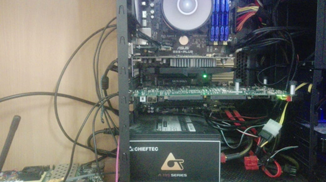
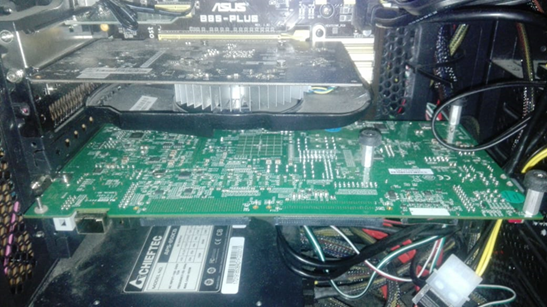
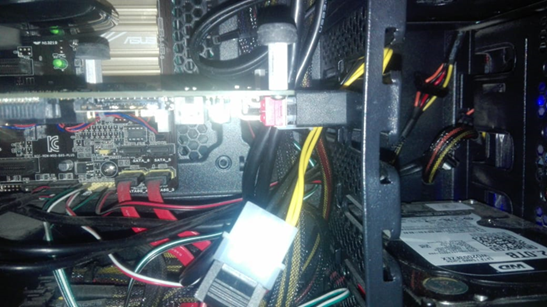

## 2. Сборка проекта и конфигурация ПЛИС

Скачайте из https://github.com/Drakonof/reference_projects xc7z045_xdma, поменяйте в  xc7z045_xdma.sh путь до бинарника Vivado 2018.3. В репозитории лежат: скриптовые файлы для сборки проекта, прошивка для процессорной части (в моём случае Zynq 7000, но подойдет и для MicroBlaze) и драйвер XDMA для Linux систем.

Важно совпадение версии Vivado, иначе блок диаграмма не соберётся и нужно будет делать это ручками (xc7z045_xdma.pdf со скринами лежит в репозитории проекта).

Запустите xc7z045_xdma.sh из терминала.

Первое, что произойдет (после ввода пароля суперпользователя) это то, что будет собран XDMA драйвер.  Затем скрипт запустит Vivado, создаст необходимые папочки, распихает по ним файлы и, наконец, запустит компиляцию.

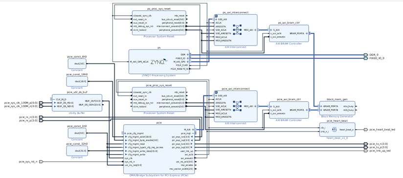

_Block Design в IP Integrator_

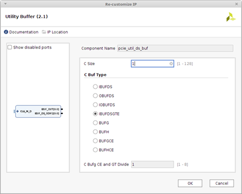

_Настройки `pcie_util_ds_buf`_

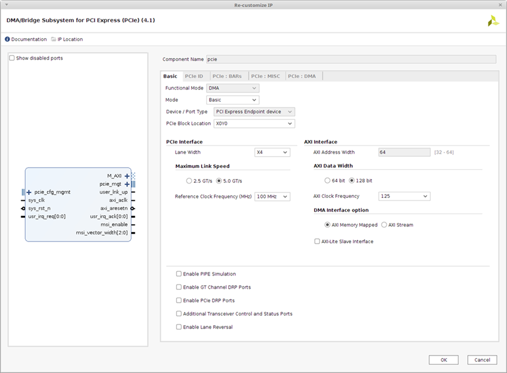

_Настройки PCIe_

Остальное по дефолту.

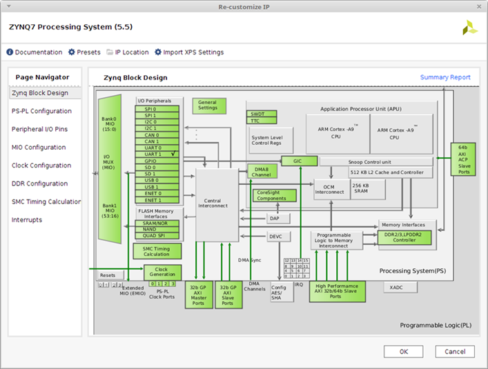
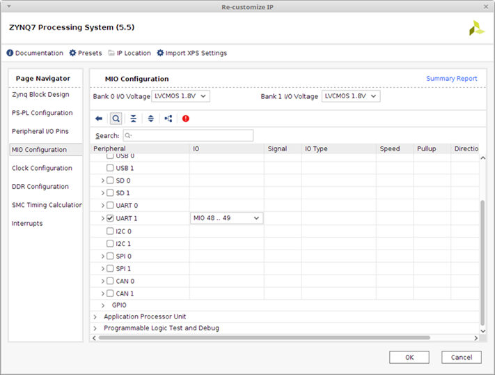
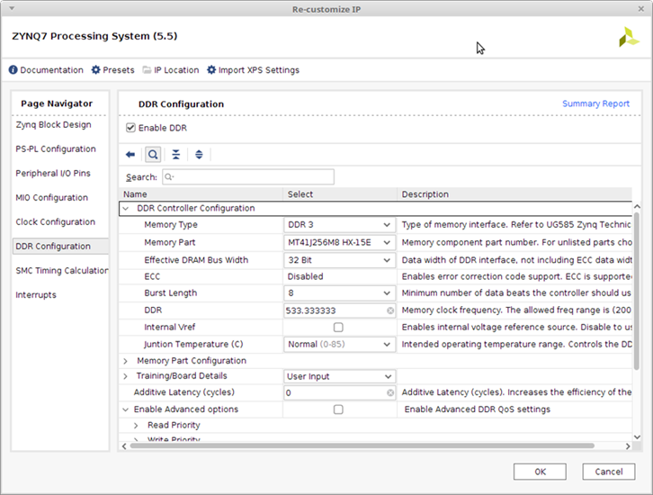

_Настройки PS_

Дождитесь конца компиляции и сконфигурируйте ПЛИС: вкладка **Flow Navigator→Program and Debug → Open Target**, потом там же **Program Device**, в появившемся окошек укажите путь до bit файла и нажмите OK.

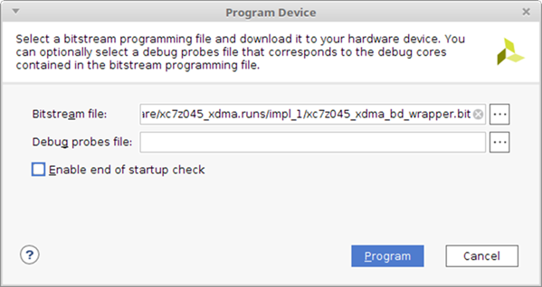

Закройте Vivado и перезагрузите компьютер не выключая плату.

## 3. Установка и тестирование XDMA драйвера
Сам драйвер предоставлен компанией Xilinx (https://github.com/Xilinx/dma_ip_drivers/tree/master/XDMA). В скаченном репозитории этот драйвер уже лежит.

После перезагрузки ПК откройте терминал и перейдите в директорию `xc7z045_xdma/software/linux_kernels/XDMA/tests`.

Введите там:
```shell
$ sudo ./load_driver.sh
Loading xdma driver...
The Kernel module installed correctly and the xmda devices were recognized.
DONE
```
Появится лог об успешной установке модуля ядра XDMA:

Потом введите:
```shell
$ sudo ./run_test.sh

```
Появится лог об успешно пройденном тесте драйвера:
```shell
Info: Number of enabled h2c channels =" 1

Info: Number of enabled c2h channels =" 1

Info: The PCIe DMA core is memory mapped.

Info: Running PCIe DMA memory mapped write read test

  transfer size:  1024

  transfer count: 1

Info: Writing to h2c channel 0 at address offset 0.

Info: Wait for current transactions to complete.

/dev/xdma0_h2c_0 ** Average BW =" 1024, "76.366623

Info: Writing to h2c channel 0 at address offset 1024.

Info: Wait for current transactions to complete.

/dev/xdma0_h2c_0 ** Average BW =" 1024, "36.362347

Info: Writing to h2c channel 0 at address offset 2048.

Info: Wait for current transactions to complete.

/dev/xdma0_h2c_0 ** Average BW =" 1024, "38.035809

Info: Writing to h2c channel 0 at address offset 3072.

Info: Wait for current transactions to complete.

/dev/xdma0_h2c_0 ** Average BW =" 1024, "46.922970

Info: Reading from c2h channel 0 at address offset 0.

Info: Wait for the current transactions to complete.

/dev/xdma0_c2h_0 ** Average BW =" 1024, "88.466522

Info: Reading from c2h channel 0 at address offset 1024.

Info: Wait for the current transactions to complete.

/dev/xdma0_c2h_0 ** Average BW =" 1024, "90.267982

Info: Reading from c2h channel 0 at address offset 2048.

Info: Wait for the current transactions to complete.

/dev/xdma0_c2h_0 ** Average BW =" 1024, "39.367958

Info: Reading from c2h channel 0 at address offset 3072.

Info: Wait for the current transactions to complete.

/dev/xdma0_c2h_0 ** Average BW =" 1024, "42.378845

Info: Checking data integrity.

Info: Data check passed for address range 0 - 1024.

Info: Data check passed for address range 1024 - 2048.

Info: Data check passed for address range 2048 - 3072.

Info: Data check passed for address range 3072 - 4096.

Info: All PCIe DMA memory mapped tests passed.

Info: All tests in run_tests.sh passed.
```
## 4. Вывод переданных данных
Теперь рассмотрим, как создать проект и очень небольшую программу для считывания в терминал  minicom  переданных в BRAM блок по PCIe данных. Можно конечно обойтись и без этого, но как новичку хочется попробовать всё.

Запустите Vivado и откройте проект.

Затем в Vivado нажмите **File→Export→Export Hardware…**. Появится окошко где поставьте галочку **Include bitstream** и укажите папку firmware как директорию для экспорта bitstream файла. Затем OK.


Затем опять File→Launch SDK и снова выбираете куда экспортировали bitstream файл, а во втором поле укажите  папку firmware как workspace.

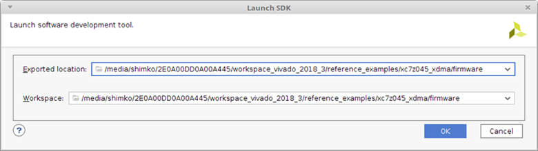

Откроется SDK в указанном workspace. В нём File→New → Application Project. В появившемся окне введите любое имя  для проекта, а остальные поля оставьте дефолтно.

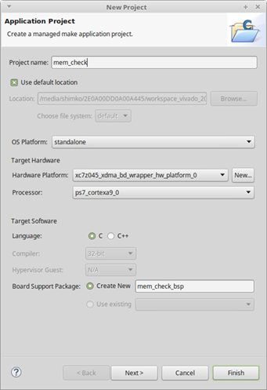

Нажмите Next. В следующей вкладке выберите Empty  Application и затем Finish.

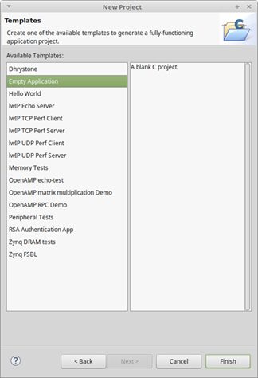

Дождитесь пересборки библиотек и просто перетащите мышкой файл  main.c из папки firmware в корень проекта во вкладке Project Explorer в SDK. В появившейся вкладке нажмите OK.

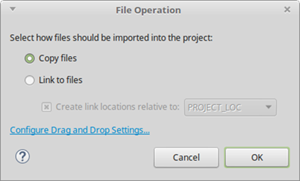

SDK автоматом пересоберёт программу (если Вы еще не успели отключить эту опцию).

Откройте системный терминал и введите:
```shell
$ sudo minicom
```
Откроется minicom.

Затем вернитесь в SDK нажмите правой кнопкой по проекту  _Run AS → Launch on Hardware (System Debugger)_. После запуска программа, в minicom попросит нажать любую клавишу с клавиатуры, что бы вывести переданные в BRAM тестом данные.

На этом всё. В следующем уроке будет рассмотрена передача данных через разъём SFP интерфейсом Gigabit Ethernet (1GE).