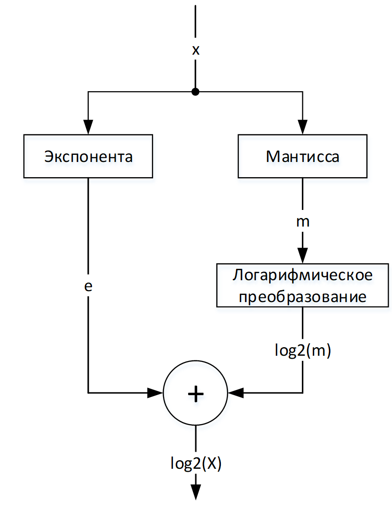
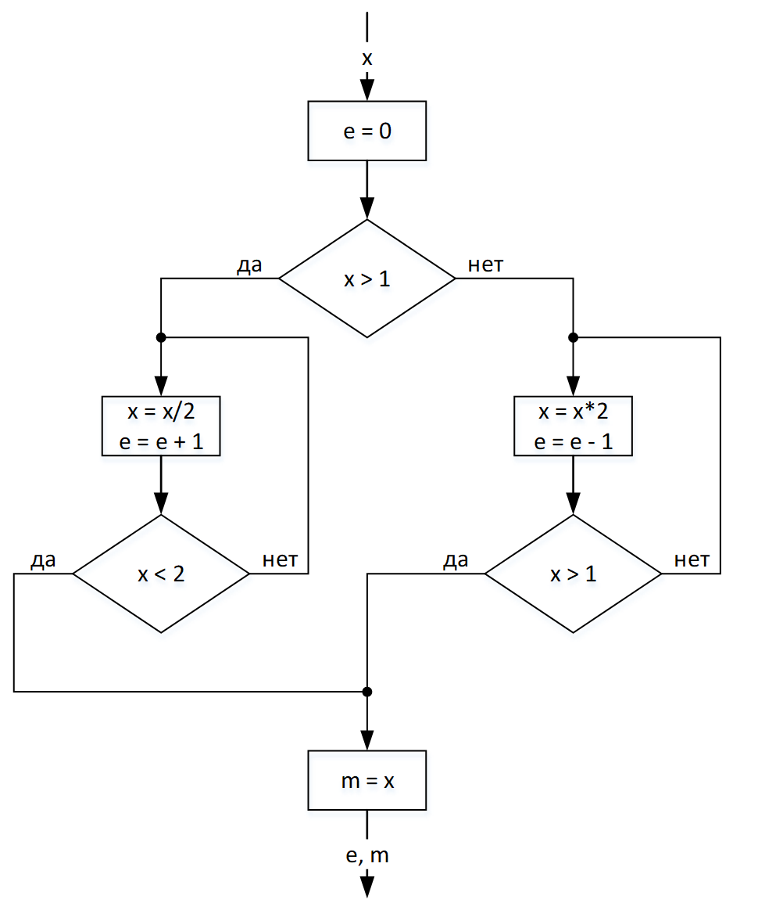
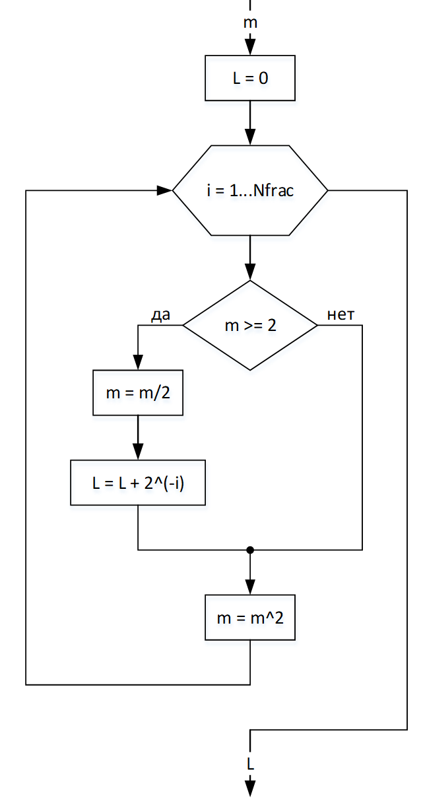
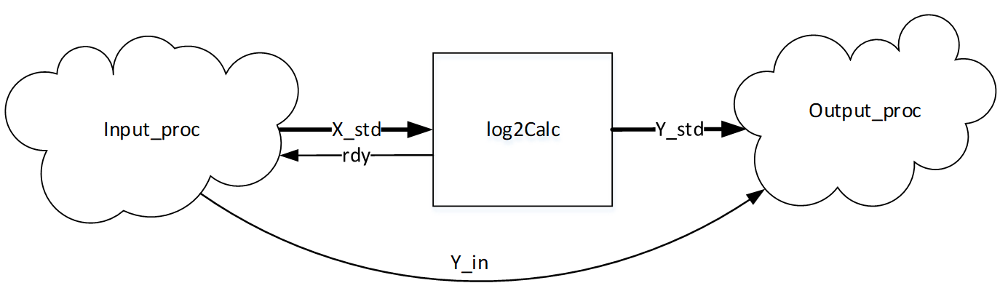
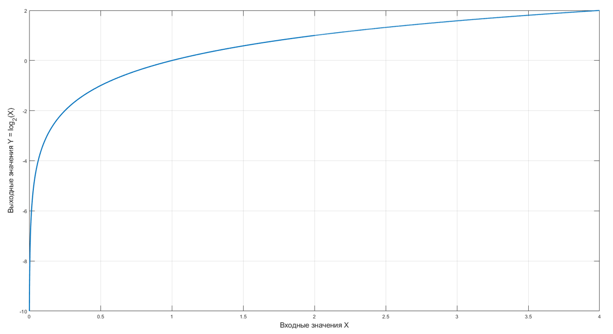
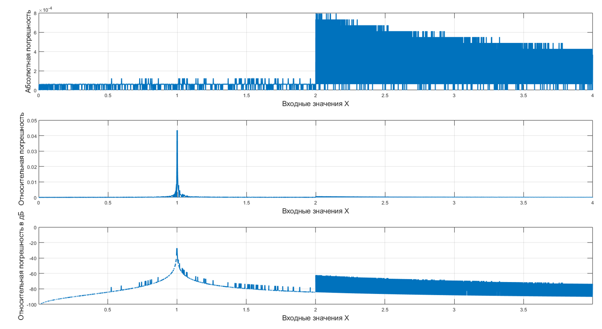
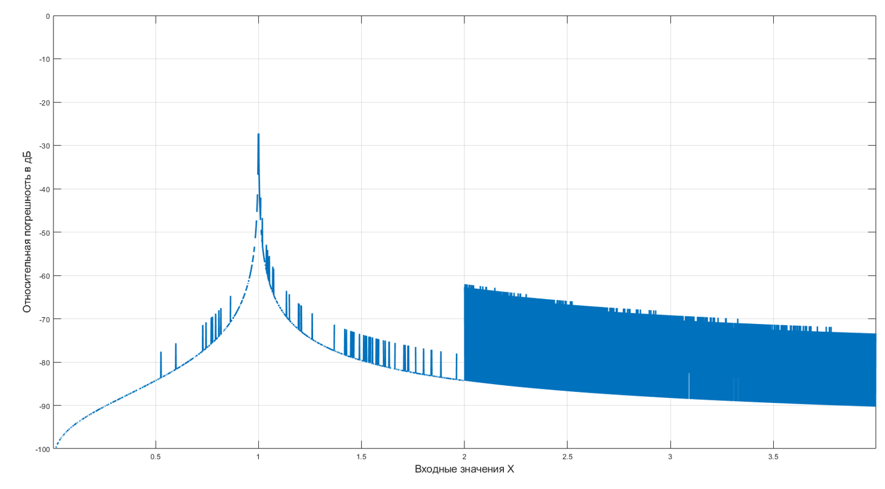

> **Автор**: quatoa

# Вычисление двоичного логарифма итерационным методом на ПЛИС

Вниманию читателя предлагается алгоритм вычисления логарифма по основанию 2, предоставляется исходный код RTL-блока, анализируется вычислительная точность и ресурсоемкость реализации.

В математических вычислениях и цифровой обработке сигналов на ПЛИС часто приходится прибегать к вычислению логарифма. Например, для преобразования мощности из мВт в дБм требуется вычисление логарифма по основанию 10:

$$
P_{dBm} = 10 * log_{10}⁡(PмВт ⁄ 1мВт)
$$

Вычисление логарифма является достаточно актуальной задачей, разработчики применяю разные методы вычисления [1]:

- табличный метод;
- итерационный метод;
- CORDIC метод;
- метод на основе рядов Тейлора.

Методы различаются точность, сложностью реализации и задержкой вычисления. Вниманию предлагается реализация итерационного метода вычисления логарифма по основанию 2 с фиксированной точкой. Вычисление $log_2(X)$ проще в реализации, чем вычисление натурального $ln(X)$ или десятичного $log_{10}(X)$. А преобразовать к логарифму с нужным основанием всегда можно всего через одно умножение: $log_A⁡B=log_C⁡B ⁄ log_C⁡A$ .

В статье описывается алгоритм вычисления с примерами, предоставляется исходный код RTL-блока, анализируется вычислительная точность и ресурсоемкость реализации.

## Алгоритм

Представим входное значение $X$ через мантиссу $m$ и экспоненту $e$ следующим образом:

$$
X=me^2
$$

Логарифм от $X$ может быть представлен, как сумма целой $e$ и дробной $log_2m$ составляющих

$$
Y = log_2⁡X = e + log_2⁡m
$$

Тогда алгоритм вычисления можно представить блок-схемой на рисунке 1. Сначала параллельно вычисляется экспонента $e$ и мантисса $m$, затем из мантиссы $m$ логарифмическим преобразованием находится $L = log_2(m)$, и в конце результаты суммируются.

Вычисление экспоненты $e$ и мантиссы $m$ можно представить блок-схемой на рисунке 2. Процесс вычисления $e$ и $m$ выполняется следующим образом:

- Определяется диапазон входного значения $Х$ – больше 1 или нет.
- Если больше 1, то $Х$ итерационно делится на 2 до тех пор, пока не - станет меньше 2. Число итераций непосредственно определяет - экспоненту $e$. Если меньше 1, то $Х$ итерационно умножается на 2 до - тех пор, пока не станет больше 1. Число итераций определяет - экспоненту $e$ с инверсией знака.
- Мантисса $m$ является $X$ после итераций умножения или деления.
Получив мантиссу $m$ можно вычислить $log_2(m)$ посредством логарифмического преобразования в соответствии с блок-схемой на рисунке 3. Процесс логарифмического преобразования выполняется следующим образом:

Запускается итерационный процесс с фиксированным числом шагов, равным требуемой разрядностью дробной части. На каждой итерации мантисса $m$ возводится в квадрат.
Если мантисса $m$ больше или равна 2, то $m$ делится на 2 и к результату $L$ суммируется $2^{-i}$, где $i$ – номер итерации; иначе - ничего.
По окончании итерационного процесса результатом логарифмического преобразования будет $L = log_2(m)$.



_Рисунок 1 – Блок-схема вычисления log2(x)_



_Рисунок 2 – Блок-схема вычисления экспоненты и мантиссы_



_Рисунок 3 – Блок-схема логарифмического преобразования_

## Пример №1
#### Дано: 

- Входное значение X = 10,23456789
- Точность (разрядность дробной части) – 10 бит.
#### Решение:

1. Вычисление $e$ и $m$
    Поскольку $X > 1$, значит производится деление. $e = 0$.

    | Итерация $i$ |Входное $X$ | Экспонента $e$, мантисса $m$ |
    |-----|-----|-----|
    |1 |$X = X/2 = 10,23456789/2 = 5,1172>2$ |$e = e+1 = 1$ |
    |2 |$X = X/2 = 2,5586 > 2$ | $e = e + 1 = 2$ |
    |3 |$X = X/2 =1,2793 < 2$ | $e = e + 1 = 3$ $m = 1,2793$|

    Экспонента $e = 3$.

    Мантисса $m = 1,2793$.

2. Логарифмическое преобразование

    | Итерация $i$ |Входное $X$ | Экспонента $e$, мантисса $m$ |
    |-----|-----|-----|
    |1 |$m = m^2 = 1,2793^2=1,6366<2$ |$L = 0$ |
    |2 |$m = m^2 = 2,6786>2$ $m=m/2=1,3393$ |$L = L+2^{-i}=0+2^{-2}=0,25$ |
    |3 |$m = m^2 = 1,7938<2$ |$L = 0,25$ |
    |4 |$m = m^2 = 3,2177 >2$ $m=m/2=1,6088$ |$L = L+2^{-4}=0,3125$ |
    |5 |$m = m^2 = 2,5884 >2$ $m=m/2=1,2942$ |$L = L+2^{-5}=0.34375$ |
    |6 |$m = m^2 = 1,6750 <2$ |$L = 0,34375$ |
    |7 |$m = m^2 = 2,8058 >2$ $m=m/2=1,4029$ |$L = L+2^{-7}=0,3515625$ |
    |8 |$m = m^2 = 1,9681 <2$ |$L = 0,3515625$ |
    |9 |$m = m^2 = 3,8736 > 2$ $m=m/2=1,9368$ |$L = L+2^{-9}=0,353515625$ |
    |10|$m = m^2 = 3,7512 >2$ $m=m/2=1,8756$ |$L = L+2^{-10}=0,3544921875$ |

    $$
    L=log_2⁡m=0,3544921875
    $$

3. Сумма

    Результатом $log_2(X)$ итерационным методом является сумма экспоненты $e$ и $L$

    $$
    Y = log_2X = e + L = 3+ 0,3544921875 = 3,3544921875
    $$

    Погрешность $err = |log_2⁡X_{true} - log_2⁡X_{approx} | = 0,000886$, но про нее будет далее.

## Пример №2

#### Дано: 

- Входное значение $X = 0,0666$
- Точность (разрядность дробной части) – 12 бит.

#### Решение:

1. Вычисление $e$ и $m$

    Поскольку $X < 1$, значит производится умножение. $e = 0$.

    Цикл:

    | Итерация $i$ |Входное $X$ | Экспонента $e$, мантисса $m$ |
    |-----|-----|-----|
    |1 |$X = X*2 = 0,666*2 = 0,1332<1$ |$e = e-1 = -1$ |
    |2 |$X = X*2 = 0,2664<1$ | $e = e - 1 = -2$ |
    |3 |$X = X*2 =0,5328<1$ | $e = e - 1 = -3$|
    |4 |$X = X*2 =1,0656>1$, значит конец цикла | $e = e - 1 = -4$ $m = 1,0656$|

    Экспонента $e = -4$.
    Мантисса $m = 1,0656$.

2. Логарифмическое преобразование

    Цикл из 12 итераций. $L = 0$.

    | Итерация i | Мантисса $m$                        | Результат $L$                 |
    | ---------- | --------------------------------- | --------------------------- |
    | 1  | $m = m^2 = 1{,}0656^2 = 1{,}1355 < 2$   | $$L = 0$$                   |
    | 2  | $m = m^2 = 1{,}2893 < 2$                | $$L = 0$$                              |
    | 3  | $m = m^2 = 1{,}6624 < 2$                | $$L = 0$$                              |
    | 4  | $m = m^2 = 2{,}7638 > 2$ $m = m/2 = 1{,}3819$ | $$L = L + 2^{-4} = 0{,}0625$$          |
    | 5  | $m = m^2 = 1{,}9096 < 2$                | $$L = 0{,}0625$$                       |
    | 6  | $m = m^2 = 3{,}6467 > 2$ $m = m/2 = 1{,}8233$ | $$L = L + 2^{-6} = 0{,}078125$$        |
    | 7  | $m = m^2 = 3{,}3247 > 2$ $m = m/2 = 1{,}6623$ | $$L = L + 2^{-7} = 0{,}0859375$$       |
    | 8  | $m = m^2 = 2{,}7634 > 2$ $m = m/2 = 1{,}3817$ | $$L = L + 2^{-8} = 0{,}08984375$$      |
    | 9  | $m = m^2 = 1{,}9092 < 2$$                | $$L = 0{,}08984375$$                   |
    | 10 | $m = m^2 = 3{,}6451 > 2$ $m = m/2 = 1{,}8225$ | $$L = L + 2^{-10} = 0{,}0908203125$$   |
    | 11 | $m = m^2 = 3{,}3217 > 2$ $m = m/2 = 1{,}6608$ | $$L = L + 2^{-11} = 0{,}09130859375$$  |
    | 12 | $m = m^2 = 2{,}7585 > 2$ $m = m/2 = 1{,}6608$ | $$L = L + 2^{-12} = 0{,}091552734375$$ |

    $$
    L=log_2⁡m=0,091552734375
    $$

3. Сумма

    Результатом $log_2(X)$ есть сумма экспоненты $e$ и $L$

    $$
    Y = log_2X = e + L = -4 + 0,091552734375 = -3,908447265625
    $$

    Погрешность $err = |log_2⁡X_{true} - log_2⁡X_{approx} | = 0,000113$, но про нее будет далее.

## Реализация

На основе представленного итерационного алгоритма разработан RTL-блок log2Calc.vhd и тестовый стенд tb_log2Calc на языке VHDL. Параметры и порты описаны в таблицах 1 и 2.

_Таблица 1 – Входные параметры блока `log2Calc.vhd`_

|Название |	Тип | 	Описание |
|--|--|--|
|`DW_IN` |	`natural` | 	Разрядность входного вектора данных |
|`DW_IN_FRAC` |	`natural` | 	Разрядность дробной части входного вектора данных, она же точность |
|`DW_OUT` |	`natural` | 	Разрядность выходного вектора данных |
|`DW_OUT_FRAC` |	`natural` | 	Разрядность дробной части выходного вектора данных, она же точность |

Параметры `DW_IN`, `DW_IN_FRAC` и `DW_OUT_FRAC` задаются пользователем, а разрядность выходного вектора `DW_OUT` задается функцией `calc_dw` из `log2Calc_pkg` на основе указанные выше трех параметров. RTL-блок не работает в конвейерном режиме, т.е. для вычисления одного значения требуется некоторое количество тактов, которое определяется функцией `calc_latency` из `log2Calc_pkg`.

_Таблица 2 – Входные и выходные порты блока `log2Calc.vhd`_


| Название	| Тип	| Направление | Описание |
|--|--|--|--|
| `clk` |	`std_logic` |	Вход	| Тактовый сигнал |
| `rst` |	`std_logic` |	Вход	| Асинхронный сброс |
| `valid_i` |	`std_logic` |	Вход	| Сигнал готовности входных данных |
| `data_i` |	`std_logic_vector(DW_IN - 1 downto 0)` |  Вход	| Входные данные |
| `rdy_o` |	`std_logic` |	Выход	| Сигнал готовности приема входных данных |
| `valid_o` |	`std_logic` |	Выход	| Сигнал готовности выходных данных |
| `data_o` |	`std_logic_vector (DW_OUT - 1 downto 0)` | Выход	| Выходные данные |

В тестовом стенде в соответствии со структурной схемой на рисунке 4 выполняются два процесса:

- процесс `input_proc` выполняет формирование входных данных на тестируемый блок с полным перебором входных значений `Xstd`;
- процесс `output_proc` получает выходные данные `Ystd` из тестируемого блока и эталонное значение `Yin`, вычисляет погрешность.
Точность вычисления оценивается на основе:

- абсолютная погрешность

$$
err_{abs} = |Y_{in} - Y_{out} |
$$

- относительная погрешность

$$
err_{rel} = |Y_{in} - Y_{out} | / Y_{in}
$$

- относительная погрешность в дБ

$$
err_{rel\_dB}=20 \cdot log_{10⁡}(|Y_{in} - Y_{out} | / Y_{in} ),
$$

где $Y_{in}$ – ожидаемый результат в формате `real`, $Y_{out}$ – вычисленный результат в формате `real`, полученный из вектора $Y_{std}$.



_Рисунок 4 – Структурная схема тестового стенда_

## Пример №3

`DW_IN = 12`, `DW_IN_FRAC = 10`, `DW_OUT_FRAC = 14`, что соответствует формату входных данных `ufix12_10` и выходных `fixX_14`.

На рисунке 5 изображен результат вычисления RTL-блоком `log2Calc.vhd`, который представляет собой график $Y = log_2(X)$. Поскольку входные данные представлены в формате `ufix12_10`, то они принимают значения от 0 до 4 с точностью $2^{-10}$. 



_Рисунок 5 – График вычисленной функции Y = log2(X)_

На рисунке 6 изображены графики трех видов рассматриваемых погрешностей. Наиболее информативной является относительная погрешность в дБ, на основе ее и будет оцениваться точность RTL-блока. Как видно из графика (см. рисунок 7) погрешность вычисления значительно возрастает в близи входного значения $X = 1$. Это объясняется тем, что $log_2(\sim 1)\approx 0$, т.е. возрастает отношение погрешности $|Y_{in}-Y_{out}|$ к ожидаемому значению $Y_{in}$ из-за того, что погрешность в целом постоянная (см. первый график на рисунке 6), а $Y_{in}$ мала. Максимальная относительная погрешность на рисунке 7 составляет -27,2 дБ в окрестности входного значения $Х = 1$.

Помимо этого, наблюдается возрастание погрешности при входных значениях больше $Х > 2$. Это объявляется тем, что при $X > 2$ начинает отрабатывать вычисление экспоненты и, вероятно, это вычисление вносит свою дополнительную погрешность.



_Рисунок 6 – График абсолютной, относительной и относительной в дБ погрешности_



_Рисунок 7 – График относительной погрешности в дБ_

## Точность

Проведен сравнительный анализ погрешности при разной точности входных и выходных данных, результаты представлены в таблице 3. Из таблицы можно сделать вывод, что сравнительно малая погрешность (-27 дБ) обеспечивается, когда точность выхода больше точности входа минимум на 4 разряда. Помимо этого, не рекомендуется устанавливать входную точность менее 10 разрядов.

_Таблица 3 – Сравнение относительной погрешности (дБ) при разной точности входных и выходных данных_

| Формат выходных данных | вход в формате `ufix12_10` |вход в формате `ufix14_12` |вход в формате `ufix16_14` |
|--|--|--|--|
|fixX_10|	0*	|    -**  | 	- |
|fixX_12|	-15,5|   0	  |  - |
|fixX_14|	-27,2| 	-15,6 |  0 |
|fixX_16|	-39,3| 	-27,2 | -15,6 |
|fixX_18|	-51,3| 	-39,3 | -27,2 |
|fixX_20|	-63,1| 	-51,3 | -39,3 |
|fixX_22|	-63,1| 	-63,4 | -51,3 |

> (*) – 0 дБ означает, что амплитуда абсолютной погрешности равна или сопоставима с амплитудой вычисленного значения
> (**) – абсолютная погрешность больше вычисленного значения, не рабочая конфигурация

## Ресурсоемкость

Ресурсоемкость RTL-блока в зависимости от параметров представлена ниже в таблицах 4. Сравнение проводилось на ПЛИС Xilinx Artix-7 в среде разработки Vivado 2018.3. RTL-блок не использует блочную память BRAM. Из приведенных результатов ресурсоемкости можно заметить, что при точности выходных данных более 20 бит снижается количество требуемых `LUT` и добавляется одно `DSP48E1`. Это объясняется тем, что некоторые операций на `LUT` при возросшей разрядности синтезатор считает, что оптимальнее выполнять на `DSP48E1`.

_Таблица 4 – Сравнение ресурсоемкости_

| Формат выходных данных | вход в формате `ufix12_10` (LUT/FF/DSP) |вход в формате `ufix14_12` (LUT/FF/DSP) |вход в формате `ufix16_14` (LUT/FF/DSP) |
|--|--|--|--|
|fixX_10 |	102/90/1 | 110/94/1 | 118/98/1 |
|fixX_12 |	108/96/1 | 116/98/1 | 122/102/1 |
|fixX_14 |	112/100/1 | 117/102/1 | 123/104/1 |
|fixX_16 |	122/109/1 | 128/111/1 | 133/113/1 |
|fixX_18 |	185/115/1 | 190/117/1 | 194/119/1 |
|fixX_20 |	136/121/2 | 135/123/2 | 142/125/2 |
|fixX_22 |	141/127/2 | 145/129/2 | 151/131/2 |

## Вывод
Представленный RTL-блок вычисления двоичного логарифма в формате точности с фиксированной точкой допустимо применять в разработке ПО под ПЛИС. Рекомендуется, чтобы точность выходных данных была больше входных минимум на 4 разряда. RTL-блок является кроссплатформенным.

## Литература

[1] A New Hardware Implementation of Base 2 Logarithm for FPGA - A.M.Mansour - 2015

## Код модуля и тестбенч

```vhdl
----====================================================================================================================
----=========== PKG
----====================================================================================================================
library IEEE;
use IEEE.STD_LOGIC_1164.ALL;
use IEEE.NUMERIC_STD.ALL;
use ieee.math_real.all;

package log2Calc_pkg is

    -- расчет выходной разрядности
    function calc_dw(
        dw_in       : natural;
        dw_in_frac  : natural;
        dw_out_frac : natural
    ) return natural;

    -- определение задержки
    function calc_latency(
        dw_out      : natural;
        dw_out_frac : natural
    ) return natural;

end package log2Calc_pkg;

package body log2Calc_pkg is

    ----------------------------------------------------------------
    -- расчет выходной разрядности
    ----------------------------------------------------------------
    function calc_dw(
        dw_in       : natural;
        dw_in_frac  : natural;
        dw_out_frac : natural
    ) return natural is
        variable dw_in_int  : natural;
        variable dw_out_int : natural;
        variable value      : natural;
    begin
        dw_in_int := dw_in - dw_in_frac;

        if (dw_in_int >= dw_in_frac) then
            dw_out_int := natural(ceil(log2(real(dw_in_int))));
        else
            dw_out_int := natural(ceil(log2(real(dw_in_frac))));
        end if;

        value := dw_out_int + 1 + dw_out_frac;

        return value;
    end function calc_dw;

    ----------------------------------------------------------------
    -- определение задержки
    ----------------------------------------------------------------
    function calc_latency(
        dw_out      : natural;
        dw_out_frac : natural
    ) return natural is
        variable dw_out_int : natural;
        variable value      : natural;
    begin
        dw_out_int := dw_out - dw_out_frac;
        value      := 2 ** (dw_out_int - 1) + (dw_out_frac + 1) + 2;
        return value;
    end function calc_latency;

end package body log2Calc_pkg;

----====================================================================================================================
----=========== ENTITY
----====================================================================================================================
LIBRARY ieee;
USE ieee.std_logic_1164.all;
USE ieee.numeric_std.all;

use work.log2Calc_pkg.all;

ENTITY log2Calc IS
    generic(
        DW_IN       : natural := 16;
        DW_IN_FRAC  : natural := 14;
        DW_OUT_FRAC : natural := 22;
        DW_OUT      : natural := work.log2Calc_pkg.calc_dw(16, 14, 22)
    );
    PORT(
        clk     : in  std_logic;
        rst     : in  std_logic;
        valid_i : in  std_logic;
        data_i  : in  std_logic_vector(DW_IN - 1 downto 0); -- unsigned
        rdy_o   : out std_logic;
        valid_o : out std_logic;
        data_o  : out std_logic_vector(DW_OUT - 1 downto 0) -- signed 
    );
END log2Calc;

ARCHITECTURE rtl OF log2Calc IS

    constant DW_IN_INT  : natural := DW_IN - DW_IN_FRAC;
    constant DW_OUT_INT : natural := DW_OUT - DW_OUT_FRAC;

    type state_t is (IDLE,
                     EXPONENT,
                     MANTISSA,
                     RESULT
                    );
    signal STATE : state_t;

    signal zero : std_logic;

    signal order         : boolean;     -- true - [1,..) / false - (0, 1)
    constant LEN_CNT_EXP : natural := 2 ** (DW_OUT_INT - 1) + 1;
    signal cnt_exp       : integer range 0 to LEN_CNT_EXP - 1;
    signal buf           : integer range 0 to LEN_CNT_EXP - 1;

    constant STD_1 : unsigned(DW_IN downto 0) := to_unsigned(integer(1.0 * real(2 ** DW_IN_FRAC)), DW_IN + 1); -- ровно 1
    constant STD_2 : unsigned(DW_IN downto 0) := to_unsigned(integer(2.0 * real(2 ** DW_IN_FRAC)), DW_IN + 1); -- ровно 2

    signal shift : unsigned(DW_IN downto 0);

    signal exp_rdy : std_logic;
    signal exp_sh  : signed(DW_OUT - 1 downto 0); -- значение целой части без дробной
    signal exp     : signed(DW_OUT - 1 downto 0); -- значение целой части с учетом выделения бит под дробную (дробная по нулям)

    function max_nat(a : natural;
                     b : natural
                    )
    return natural is
    begin
        if (a > b) then
            return a;
        else
            return b;
        end if;
    end function max_nat;

    constant DW_NORM_FRAC : natural                        := max_nat(DW_IN_FRAC, DW_OUT_FRAC);
    constant DW_NORM      : natural                        := DW_NORM_FRAC + 2; -- [0,4)
    signal norm           : unsigned(DW_NORM - 1 downto 0);
    constant STD2_NORM    : unsigned(DW_NORM - 1 downto 0) := to_unsigned(integer(2.0 * real(2 ** DW_NORM_FRAC)), DW_NORM); -- ровно 2

    signal cnt_mant : integer range 0 to DW_OUT_FRAC;
    signal mant     : std_logic_vector(DW_OUT - 1 downto 0);

begin

    log2_proc : process(clk, rst)
        variable shift2_v : unsigned(DW_NORM - 1 downto 0);
        variable mult2_v  : unsigned(2 * DW_NORM - 1 downto 0);
    begin
        if (rst = '1') then
            STATE <= IDLE;

            zero <= '0';

            order <= true;

            cnt_exp <= 0;
            buf     <= 0;

            exp_rdy <= '0';
            exp_sh  <= (others => '0');
            exp     <= (others => '0');

            shift <= (others => '0');
            norm  <= (others => '0');

            cnt_mant <= 0;
            mant     <= (others => '0');

            rdy_o   <= '0';
            valid_o <= '0';
            data_o  <= (others => '0');

        elsif rising_edge(clk) then

            case STATE is
                --====================================================================================================================
                --=========== ожидание, определение больше 1 или нет
                --====================================================================================================================
                when IDLE =>
                    valid_o <= '0';

                    if (valid_i = '1') then
                        if (unsigned(data_i) = 0) then
                            zero <= '1';
                        else
                            zero <= '0';
                        end if;

                        rdy_o <= '0';

                        buf     <= 0;
                        cnt_exp <= 1;
                        shift   <= unsigned('0' & data_i);

                        exp_rdy <= '0';
                        exp_sh  <= (others => '0');
                        norm    <= (others => '0');

                        cnt_mant <= 0;
                        mant     <= (others => '0');

                        if (unsigned('0' & data_i) < STD_1) then -- в диапазоне (0,1)
                            order <= false;
                        else            -- в диапазоне [1,..)
                            order <= true;
                        end if;

                        STATE <= EXPONENT;
                    else
                        rdy_o <= '1';
                    end if;
                --====================================================================================================================
                --=========== вычисление целой части
                --====================================================================================================================
                when EXPONENT =>

                    if (cnt_exp = LEN_CNT_EXP - 1) then
                        cnt_exp <= 0;

                        STATE <= MANTISSA;
                    else
                        cnt_exp <= cnt_exp + 1;
                    end if;

                    buf <= cnt_exp;

                    if (order) then     -- больше 1 [1,..)
                        -- смещаем вправо (делим на 2) до тех пор, пока не будет меньше 2
                        shift <= shift_right(shift, 1); -- /2
                        if (shift <= STD_2 and exp_rdy = '0') then
                            exp_rdy <= '1';
                            exp_sh  <= resize(to_signed(buf, DW_OUT_INT), DW_OUT);

                            if (DW_IN_FRAC = DW_NORM_FRAC) then
                                norm <= unsigned(shift((DW_IN_FRAC + 2) - 1 downto 0));
                            else
                                norm(DW_NORM - 1 downto DW_NORM - (DW_IN_FRAC + 2)) <= unsigned(shift((DW_IN_FRAC + 2) - 1 downto 0));
                                norm(DW_NORM - (DW_IN_FRAC + 2) - 1 downto 0)       <= (others => '0');
                            end if;

                        end if;
                    else                -- меньше 1 (0, 1)
                    -- смещаем влево (умножаем на 2) до тех порт, пока не будет больше 1
                        shift <= shift_left(shift, 1); -- *2
                        if (shift >= STD_1 and exp_rdy = '0') then
                            exp_rdy <= '1';
                            exp_sh  <= resize(-to_signed(buf, DW_OUT_INT), DW_OUT);

                            if (DW_IN_FRAC = DW_NORM_FRAC) then
                                norm <= unsigned(shift((DW_IN_FRAC + 2) - 1 downto 0));
                            else
                                norm(DW_NORM - 1 downto DW_NORM - (DW_IN_FRAC + 2)) <= unsigned(shift((DW_IN_FRAC + 2) - 1 downto 0));
                                norm(DW_NORM - (DW_IN_FRAC + 2) - 1 downto 0)       <= (others => '0');
                            end if;

                        end if;
                    end if;
                --====================================================================================================================
                --=========== вычисление дробной части
                --====================================================================================================================
                when MANTISSA =>

                    if (cnt_mant = DW_OUT_FRAC) then
                        cnt_mant <= 0;

                        -- overflow
                        if (exp_rdy = '1') then
                            exp <= shift_left(exp_sh, DW_OUT_FRAC);
                        else
                            exp <= to_signed(integer(-(DW_IN_INT - 1) * 2 ** (DW_OUT_FRAC)), DW_OUT);
                        end if;
                        rdy_o <= '1';
                        STATE <= RESULT;
                    else
                        cnt_mant <= cnt_mant + 1;
                    end if;

                    if (norm >= STD2_NORM) then
                        mant(DW_OUT_FRAC - cnt_mant) <= '1';

                        shift2_v := shift_right(norm, 1);
                        mult2_v  := shift2_v * shift2_v;
                    else
                        mult2_v := norm * norm;
                    end if;
                    norm <= unsigned(mult2_v(DW_NORM - 1 + DW_NORM_FRAC downto DW_NORM_FRAC));

                --====================================================================================================================
                --=========== суммирование целой и дробной частей
                --====================================================================================================================
                when RESULT =>
                    valid_o <= '1';
                    if (zero = '1') then -- если вход нуль, то выдаем минимально возможное значение
                        data_o(DW_OUT - 1)          <= '1';
                        data_o(DW_OUT - 2 downto 0) <= (others => '0');
                    else
                        data_o <= std_logic_vector(exp + signed(mant));
                    end if;

                    exp_rdy <= '0';
                    exp_sh  <= (others => '0');

                    norm <= (others => '0');
                    mant <= (others => '0');

                    STATE <= IDLE;

            end case;

        end if;

    end process;

END rtl;

```

Тестбенч: 

```vhdl
library IEEE;
use IEEE.STD_LOGIC_1164.ALL;
USE IEEE.NUMERIC_STD.all;
use ieee.math_real.all;
use std.textio.all;
use std.env.all;

entity tb_log2Calc is
    generic(
        DW_IN       : natural := 12;
        DW_IN_FRAC  : natural := 10;
        DW_OUT_FRAC : natural := 10
    );
end entity;

architecture beh of tb_log2Calc is

    procedure clk_wait(
        signal   clk : in std_logic;
        constant th  : integer
    ) is
    begin
        for i in 0 to th - 1 loop
            wait until rising_edge(clk);
        end loop;
    end procedure clk_wait;

    -- переводит число типа real в std_logic_vector длины dw и точности dw_frac
    function real2std(data    : real;
                      dw      : integer;
                      dw_frac : integer;
                      sign    : boolean
                     ) return std_logic_vector is
    begin
        if (sign) then
            return std_logic_vector(to_signed(integer(data * real(2 ** dw_frac)), dw));
        else
            return std_logic_vector(to_unsigned(integer(data * real(2 ** dw_frac)), dw));
        end if;
    end;

    -- переводит число типа std_logic_vector длины dw и точности dw_frac в real
    function std2real(data    : std_logic_vector;
                      dw_frac : integer;
                      sign    : boolean
                     ) return real is
    begin
        if (sign) then
            return real(to_integer(signed(data))) / real(2 ** dw_frac);
        else
            return real(to_integer(unsigned(data))) / real(2 ** dw_frac);
        end if;
    end;

    --====================================================================================================================
    --=========== вычисление целой части y = log2(x)
    --====================================================================================================================
    constant DW_IN_INT : natural := DW_IN - DW_IN_FRAC; -- разрядность целой части входных даннных

    constant DW_OUT : natural := work.log2Calc_pkg.calc_dw(DW_IN, DW_IN_FRAC, DW_OUT_FRAC); -- разрядность выходных данных

    constant LATENCY : natural := work.log2Calc_pkg.calc_latency(DW_OUT, DW_OUT_FRAC); -- вычислительная задержка блока

    --====================================================================================================================
    --=========== сигналы
    --====================================================================================================================
    constant PERIOD : time      := 10 us;
    signal clk      : std_logic := '0';
    signal rst      : std_logic := '1';

    signal en : std_logic;
    --    signal cnt : integer range 0 to NUM_DATA - 1;

    signal y_in     : real                                  := 0.0;
    signal y_in_std : std_logic_vector(DW_OUT - 1 downto 0) := (others => '0');

    signal x_valid : std_logic                            := '0';
    signal x_std   : std_logic_vector(DW_IN - 1 downto 0) := (others => '0');
    constant ONES  : std_logic_vector(DW_IN - 1 downto 0) := (others => '1');
    signal x       : real                                 := 0.0;

    signal rdy_o       : std_logic;
    signal rdy_z       : std_logic;
    signal y_out_valid : std_logic;
    signal y_out_std   : std_logic_vector(DW_OUT - 1 downto 0);
    signal y_out       : real := 0.0;

    constant DW_ERR      : natural := 32;
    constant DW_ERR_FRAC : natural := 20;

    signal err_abs             : real                                  := 0.0;
    signal err_relative        : real                                  := 0.0;
    signal err_relative_dB     : real                                  := 0.0;
    signal err_abs_std         : std_logic_vector(DW_ERR - 1 downto 0) := (others => '0');
    signal err_relative_std    : std_logic_vector(DW_ERR - 1 downto 0) := (others => '0');
    signal err_relative_dB_std : std_logic_vector(DW_ERR - 1 downto 0) := (others => '0');

begin

    -- clk, rst
    proc_clk : process
    begin
        wait for PERIOD / 2;
        clk <= not clk;
    end process;

    proc_rst : process
    begin
        rst <= '1';
        wait for 15.2 * PERIOD;
        rst <= '0';
        wait;
    end process;

    --====================================================================================================================
    --=========== формирование данных на блок
    --====================================================================================================================
    input_proc : process(clk, rst)
    begin
        if (rst = '1') then
            en <= '1';

            x_valid <= '0';
            x_std   <= (others => '0');

        elsif rising_edge(clk) then

            rdy_z <= rdy_o;

            if (en = '1') then
                if (rdy_z = '0' and rdy_o = '1') then
                    if (x_std = ONES) then
                        en      <= '0';
                        x_valid <= '0';
                    else
                        x_std <= std_logic_vector(unsigned(x_std) + 1);

                        x_valid <= '1';
                    end if;
                else
                    x_valid <= '0';
                end if;
            end if;

            y_in <= log2(x);

        end if;
    end process;

    x        <= std2real(x_std, DW_IN_FRAC, false);
    y_in_std <= real2std(y_in, DW_OUT, DW_OUT_FRAC, false);

    --====================================================================================================================
    --=========== тестируемый блок
    --====================================================================================================================
    inst_log2 : entity work.log2Calc
        generic map(
            DW_IN       => DW_IN,
            DW_IN_FRAC  => DW_IN_FRAC,
            DW_OUT_FRAC => DW_OUT_FRAC,
            DW_OUT      => DW_OUT
        )
        port map(
            clk     => clk,
            rst     => rst,
            valid_i => x_valid,
            data_i  => x_std,
            rdy_o   => rdy_o,
            valid_o => y_out_valid,
            data_o  => y_out_std
        );

    --====================================================================================================================
    --=========== сравнение вычисленного с ожидаемым, вывод погрешности вычисления
    --====================================================================================================================
    y_out <= std2real(y_out_std, DW_OUT_FRAC, true);

    output_proc : process(clk, rst) is
        variable err_abs_v    : real;
        variable err_rel_v    : real;
        variable err_rel_dB_v : real;
    begin
        if (rst = '1') then

        elsif rising_edge(clk) then

            err_abs_v    := y_in - y_out;
            if (y_in = 0.0) then
                err_rel_v := 0.0;
            else
                err_rel_v := abs (err_abs_v / y_in);
            end if;
            err_rel_dB_v := 20.0 * log10(err_rel_v);

            if (y_out_valid = '1') then
                err_abs          <= err_abs_v;
                err_relative     <= err_rel_v;
                err_relative_dB  <= err_rel_dB_v;
                err_abs_std      <= real2std(err_abs_v, DW_ERR, DW_ERR_FRAC, true);
                err_relative_std <= real2std(err_rel_v, DW_ERR, DW_ERR_FRAC, true);
                if (err_rel_v = 0.0) then
                    err_relative_dB_std <= err_relative_dB_std;
                else
                    err_relative_dB_std <= real2std(err_rel_dB_v, DW_ERR, DW_ERR_FRAC, true);
                end if;
            end if;

        end if;
    end process output_proc;

    proc_check_end : process is
    begin
        wait until (x_std = ONES and en = '0');
        clk_wait(clk, 200);
        report "END SIM" severity note;
        finish(0);
    end process proc_check_end;

end architecture;
```