> автор: alinkapirate

# Стратегии оптимизации HDL-кода и синтезатора нетлиста для FPGA

> *О найденных опечатках и замечаниях просим сообщить

## Введение

Проработав полтора года на должности трассировщика печатных плат, я начал глубокое погружение в мир FPGA. Обстоятельства сложились так, что погружение это было полностью самостоятельным. Через год с небольшим первая версия моего первого проекта прошла определённый набор тестов, а боевое железо прибыло из рук монтажников. И вот здесь меня ждал страшный сон разработчика: код, который работает в симуляции, но не работает в кристалле. Проект был достаточно большой и должен был работать на нескольких сотнях мегагерц. Для меня наступили дни сурка: «check reports → google or read documentation → edit code → generate bitstream → repeat». Каждый цикл мог длиться от нескольких часов до нескольких суток в зависимости от направления исследования. По мере погружения в проблему и изучения документации на используемую САПР, появилось понимание, что не всякий код описывает ту схему, которую планируешь увидеть в кристалле с учётом архитектуры используемой микросхемы.

В статье будет рассмотрена работа синтезатора нетлиста, его возможности по оптимизации кода и трудности, с которыми он может столкнуться. Показаны две техники написания кода логических схем на Verilog в зависимости от преследуемых целей оптимизации проекта на этапе синтеза. А также разбор некоторых настроек синтезатора Xilinx Vivado, которые призваны пытаться оптимизировать логическую схему за разработчика. В конце мы возьмём модуль, который попробуем привести к рабочему состоянию исключительно за счёт возможностей синтезатора.

Сразу скажу, что возможности синтезатора не настолько велики, чтобы любой код превратить в рабочую схему, но знать о них полезно. Например, сравнение схем и отчётов, полученных с различными значениями настроек синтезатора, могут стать отправной точкой для поиска узкого места в коде и его устранения.

Эта статья появилась в результате попыток упорядочить знания по теме, а также нескольких практических экспериментов. Замечания и дополнения приветствуются.

Если при команде synth_design вас прошибает холодный пот, и вы хотите поговорить об этом, то добро пожаловать.

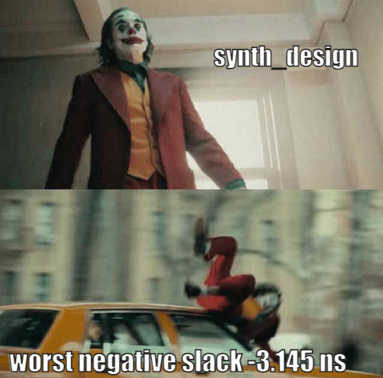

## Что может пойти не так после написания кода

Допустим, что HDL-код написан, прошёл все возможные тесты в симуляторе и одобрен тимлидом команды. Пришло время проверить насколько хорошо написанный код будет работать «в железе». А значит пора запускать синтез нетлиста.

Современные синтезаторы помимо большого количества настроек имеют заранее заготовленные наборы определённых значений настроек или стратегии. Стратегии предоставляют разработчику интуитивно понятный выбор: для увеличения частоты проекта стоит выбирать стратегии по оптимизации скорости (_Speed_), для уменьшения ресурсоёмкости стоит выбирать стратегии по оптимизации площади (_Area_). Разумеется, существуют и другие цели оптимизации, например по потребляемой мощности (_Power_), по тестопригодности (_DFT_, этот подход больше в сторону дизайна ASIC) и по времени работы САПР (_Runtime_). Эти алгоритмы выходят за пределы данной статьи, почитать про них можно в документации к используемому вами синтезатору. Однако иногда выбор определённых стратегий оптимизации может привести к неожиданным и даже противоположным результатам. Давайте попробуем разобраться что может к этому привести.

Результатом работы синтезатора является схема соединений логических примитивов (_нетлист_), которая будет использована для дальнейшей реализации нашего проекта в кристалле. А также всевозможные отчёты о количестве и типах потребляемых примитивов. Как правило, чем сложнее проект, тем больше логических элементов требуется для его реализации и тем большего уровня параллелизма он требует, чтобы повысить рабочую частоту. В проектах под ASIC для оценки рабочей частоты могут использоваться статические оценки задержки на соединения логических элементов, которые ограничены как производителем конечной микросхемы, так и требованиями проекта. А также модели логических примитивов, поставляемые заводом производителем микросхемы. Для разработчиков FPGA эти детали скрыты в недрах синтезатора, который поставляется в составе САПР. Информация есть лишь о количестве логических ресурсов каждого типа и схема их размещения в кристалле (архитектура). Поэтому после окончания синтеза нетлиста под конкретную FPGA разработчик может обнаружить, что максимальная рабочая частота проекта и его ресурсоёмкость отличаются от того, что прогнозировалось на этапе написания кода. Более того, поскольку речь идёт про FPGA, нетлист, утвержденный на этапе синтеза, может меняться (например, реализация сдвиговых триггеров на SRL вместо Flip-Flop или перемещение логики между общими примитивами и специализированными блоками). А значит и результаты ресурсоёмкости и временного анализа, которые генерирует синтезатор, являются оценочными.

Несмотря на это, уже после окончания синтеза можно обнаружить первые тревожные «звоночки»: 90 и более процентов потребляемых ресурсов, прогнозируемая рабочая частота ниже ожидаемой. Остановившись на этом этапе, можно здорово сэкономить время на создание заведомо нерабочих прошивок для FPGA. В следующих разделах статьи будут рассмотрены некоторые техники написания кода и настройки синтезатора, которые могут помочь в борьбе с этими непредвиденными препятствиями.

Однако прежде, чем глубже погрузиться в работу на уровне синтезатора, поговорим немного о то, что происходит с синтезированным нетлистом далее. Это поможет нам понять, чем может закончиться попытка разместить в кристалле первый же нетлист. Размещение и разводка – сложный итеративный процесс, который выполняет инструмент Place and Route (P&R). Во многих случаях определить, насколько успешно он завершится, заранее невозможно. Поскольку закупка FPGA обычно происходит задолго до появления конечной версии проекта, разработчикам не всегда удаётся точно спрогнозировать требуемую ресурсоёмкость (не говоря уже о том, что аппетит заказчика растёт на всем жизненном цикле проекта). А для настроек умолчанию P&R чаще всего падает с ошибкой, если требуемое количество ресурсов превышает количество, доступное на целевой FPGA. По мере приближения к такой ситуации число степеней свободы инструмента падает, а вместе с ним и качество результата. Так, P&R может разместить некоторые элементы топологии не там, где временные задержки оптимальны, а там, где хватит места. Это конечно же приведёт к увеличению задержек на межсоединениях, падению рабочей частоты проекта и скорее всего к увеличению времени на сборку проекта из-за безуспешных итеративных попыток инструмента P&R свести проект к рабочей схеме в кристалле.

Ранее было отмечено, что, если речь идёт про FPGA, синтезированный нетлист может претерпеть некоторые изменения. Однако эти изменения будет делать инструмент P&R, власть над которым разработчика ограничивает возможности САПР и знание разработчиком документации. Итоговый результат реализации проекта разработчик узнает только после окончания работы P&R, когда все логические элементы будут размещены в FPGA и соединены друг с другом нужным образом. Поэтому если разработчик принял неверные решения по оптимизации на этапах написания кода или синтеза, правда об этом может вскрыться далеко не сразу. А значит разработчик потратил много времени впустую на имплементацию некорректно работающей схемы. А возможно потратит и чужое время, если кристалл или прошивка уже ушли в производство или к заказчику и требуется программная заплатка на более высоком уровне.

При приближении доли использованных ресурсов кристалла к 100% можно столкнуться и с еще менее очевидным эффектом, чем рост времени имплементации и общее снижение качества ее результата: при приближении к использованию ресурсов FPGA на 100%, оптимизации по скорости (добавление триггеров, распараллеливание алгоритмов) могут наоборот понизить частоту проекта, в то время как оптимизация по площади может привести к увеличению частоты проекта. Такая ситуация может возникнуть, например, если начать бесконтрольно добавлять триггеры после каждой операции. Так-как архитектура FPGA жёстко задана производителем, схема может получиться неоправданно разреженной по площади кристалла. Что ведёт к увеличению задержек на межсоединения логических примитивов. И наоборот: если попытаться повторно использовать одни и те же логические примитивы для взаимоисключающих операций, схема станет компактнее и добавление большего количества триггеров не вызовет больших проблем [1]

Кратко обобщив этот раздел, можно сказать, что количество степеней свободы падает по мере продвижения разработчика от этапа написания HDL-кода к готовой прошивке. Не существует «волшебных» настроек синтезатора и инструмента Place and Route, которые приводит к идеальной топологии схемы в кристалле. Более того, есть неочевидные случаи, когда оптимизации по скорости приводят к понижению тактовой частоты, а оптимизация по ресурсам наоборот повышает частоту. Хорошо написанный и оптимизированный код сэкономит время работы САПР и подбор настроек для запуска синтезатора. Поэтому задача оптимизации проекта в первую очередь лежит на разработчике HDL кода и архитекторе реализуемых алгоритмов, а потом уже на настройках САПР.

Давайте рассмотрим две техники, которые могут помочь оптимизировать проект по ресурсоёмкости и по скорости. Обе можно применить как на уровне написания кода, так и на уровне работы синтезатора и я покажу каким образом это сделать.

## Оптимизация проекта на уровне написания кода

### Resource Sharing

Каждая описанная в коде операция требует ресурсов для реализации, например _Look-UpTable_, блочная память _BRAM_ или специализированные вычислительные блоки, такие как _DSP48_. При наличии в проекте схожих функциональных блоков возможно повторное использование ресурсов микросхемы с дополнительной логикой мультиплексирования входных и выходных данных. Этот подход называется **Resource Sharing**. Под функциональными блоками обычно подразумевается любая межрегистровая логика.

Рассмотрим простейший пример:

```verilog 
module simple_adder (
    output o_data,
    input i_data[2],
    input i_sel);
    assign o_data = i_sel ? i_data[0] + i_data[1] : i_data[0] + i_data[2];
endmodule
```

Логическая схема, которая соответствует коду модуля `simple_adder`, приведена на рис.1.

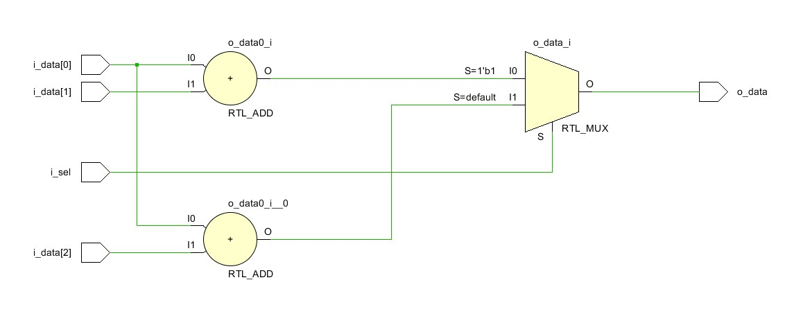

_Рисунок 1 Логическая схема модуля `simple_adder`_

Обе суммы `i_data[0] + i_data[1] и i_data[0] + i_data[2]` вычисляются независимо друг от друга, что возможно не является самым лучшим решением. Схему можно модифицировать, если заметить, что в обоих суммах первым слагаемым является `i_data[0]`, а второе зависит от входа `i_sel`. Таким образом, вычисление сумм `i_data[0] + i_data[1] и i_data[0] + i_data[2]` являются взаимоисключающими функциональными блоками, а значит нам может пригодиться Resource Sharing. Перепишем сумматор с использованием всего вышеописанного:

```verilog
module simple_adder_2 (
    output o_data,
    input i_data[0:2],
    input i_sel);
    wire temp_sum;
    assign temp_sum = i_sel ? i_data[1] : i_data[2];
    assign o_data =  i_data[0] + temp_sum;
endmodule : simple_adder_2
```

Логическая схема модуля `simple_adder_2` приведена на рис.2. Нам удалось избавиться от одного сумматора и выходного мультиплексора за счёт установки управляющего мультиплексора на входе оставшегося сумматора.


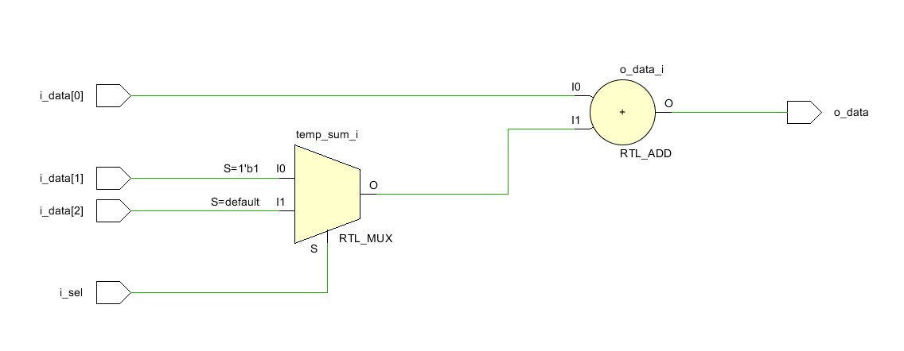

_Рисунок 2 Логическая схема модуля `simple_adder_2`_

В этом примере удалось сэкономить один сумматор, однако максимальная задержка между входом и выходом не изменилась: один сумматор и один мультиплексор. Попробуем немного усложнить код исходного модуля.

```verilog
module adder (
    output reg o_data,
    input i_data[0:2],
    input [1:0] i_sel);
    
    always @ (i_sel, i_data)
        case (i_sel)
            2'b00 : o_data <= i_data[0] + i_data[1];
            2'b01 : o_data <= i_data[0] + i_data[2];
            2'b10 : o_data <= i_data[1] + i_data[2];
            2'b11 : o_data <= i_data[0];
        endcase
endmodule : adder
```

Логическая схема, которая соответствует коду модуля `adder`, приведена на рис.3.

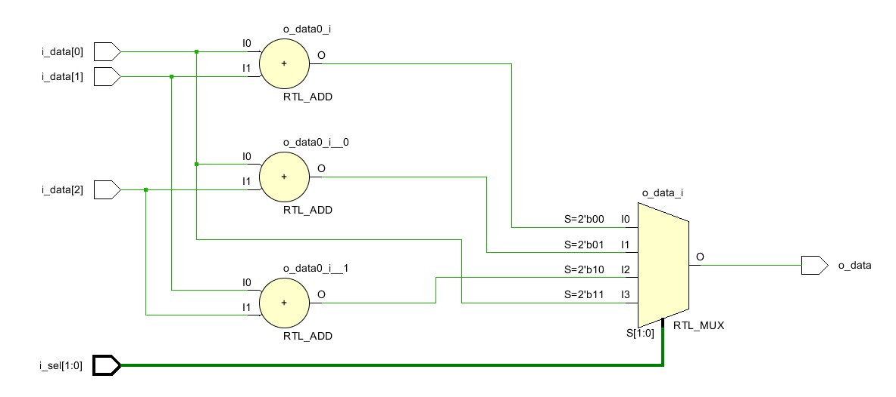

_Рисунок 3 Логическая схема модуля `adder`_

Для реализации схема требует три сумматора и один мультиплексор на четыре входа. Самая большая задержка будет определяться временем прохождения сигнала через один сумматор и один мультиплексор.

Взглянув на код, можно заметить, что первым слагаемым всегда является `i_data[0]` или `i_data[1]`, а второе слагаемое `i_data[1]`, `i_data[2]`, либо ноль. Посмотрим, как у нас получится сэкономить ресурсы переписав код с использованием Resource Sharing:

```verilog
module adder_2 (
    output o_data,
    input i_data[0:2],
    input [1:0] i_sel);
    wire add_input [0:1];
    
    assign add_input[0] = (i_sel == 2'b10) ? i_data[1] : i_data[0];
    assign add_input[1] = (i_sel == 2'b00) ? i_data[1] : (i_sel == 2'b11) ? 0 : i_data[2];
    assign o_data = add_input[0] + add_input[1];
endmodule : adder_2
```

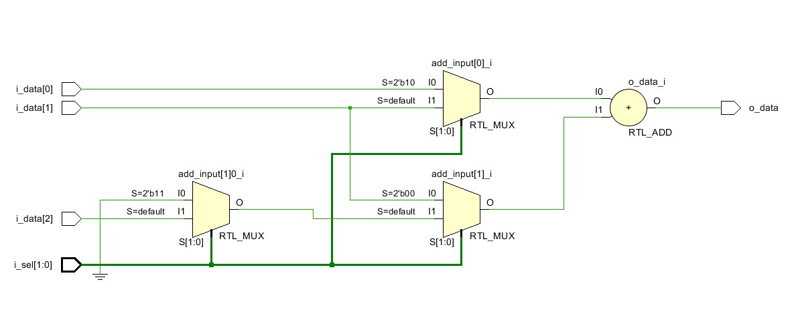

_Рисунок 4 Логическая схема модуля `adder_2`_

На схеме модуля `adder_2`, которая приведена на рис.4, удалось оставить всего один сумматор, однако за это нам пришлось заплатить размещением дополнительных мультиплексоров на входах оставшегося сумматора. Это породило дополнительный уровень логики между входом и выходом схемы: сигнал `i_data[2]` должен пройти два управляющих мультиплексора и выходной сумматор. В предыдущем случае `i_data[2]` как и все остальные сигналы данных проходит только через один сумматор и один мультиплексор. Разумеется, код можно ещё раз переписать, заменив цепочку мультиплексоров одним трёх входовым мультиплексором. Цель примера показать, что при неаккуратном описании переиспользования логики можно породить дополнительные логические уровни и как следствие ограничить диапазон рабочих частот.

В этом разделе показано, что логические схемы эквивалентные с точки зрения таблицы истинности, но различные по реализации, могут требовать различного количества ресурсов микросхемы. При использовании различных реализаций необходимо следить за ростом логических уровней межрегистровой логики и не допускать их взрывного роста.

### Retiming

Любой разработчик цифровых систем обработки знает, что последовательное соединение десятков сумматоров и мультиплексоров вряд ли заработают на приемлемой частоте даже в современных FPGA. Для увеличения максимальной рабочей частоты схемы комбинаторную логику разбивают триггерами (flip-flop, FF). Обычно хорошо спроектированный блок комбинаторной логики можно легко конвейеризировать путём добавления нескольких уровней триггеров. Обычно плата за это состоит в увеличении занимаемой ресурсами площади кристалла за счёт увеличения расстояния между блоками комбинаторной логики, а также в увеличении времени прохождения сигнала от входа к выходу модуля пропорционально количеству добавленных уровней триггеров.

Не всегда код модуля спроектирован идеально. И уж точно не всегда триггеры расставлены оптимальным образом. Это утверждение можно увидеть на верхней половине рис.5: триггеры добавлены, но `critical_path`, определяющий минимально допустимый период тактового сигнала `Tperiod`, почти не изменился, так-как добавленные триггеры не затронули комбинаторную логику.

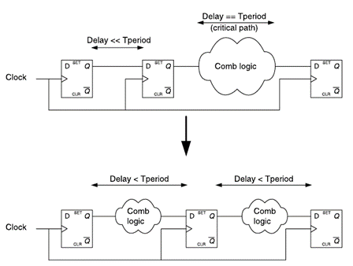

_Рисунок 5 Неоптимальная (вверху) и оптимальная (внизу) расстановка триггеров для конвейеризации комбинаторной логики_

Переместив один из триггеров, мы получим ту же самую схему с той же самой задержкой на прохождение сигнала, однако максимальная частота её работы будет выше, так-как часть комбинаторной логики переместилось между двумя первыми триггерами, что позволило уменьшить `Tperiod`.

Показанный выше приём называется Retiming (в некоторой литературе его называют Register Balancing): перемещение триггеров по комбинаторной логике с целью увеличения максимально достижимой рабочей частоты. Важно понимать, что в процессе операции Retiming могут появиться дополнительные триггеры, но при этом не происходит добавление новых этапов конвейеризации: задержка сигнала (измеряемая в количестве тактов) на прохождение логики не меняется. Чтобы пояснить это рассмотрим небольшой пример:

```verilog
module pipe (
    output o_data,
    input [7:0] i_data,
    input i_rst,
    input i_clk);

    reg [7:0] i_data_r;
    reg out;

    assign o_data = out;
    
    always @(posedge i_clk)
        if(i_rst) begin
            i_data_r <= 0;
            out <= 0;
        end else begin
            i_data_r <= i_data;
            out <= (i_data_r[0]|i_data_r[1]) & 
                   (i_data_r[2]|i_data_r[3]) & 
                   (i_data_r[4]|i_data_r[5]) & 
 (i_data_r[6]|i_data_r[7]);
        end
endmodule : pipe
```

Логическая схема, которая соответствует коду модуля `pipe`, приведена на рис.6

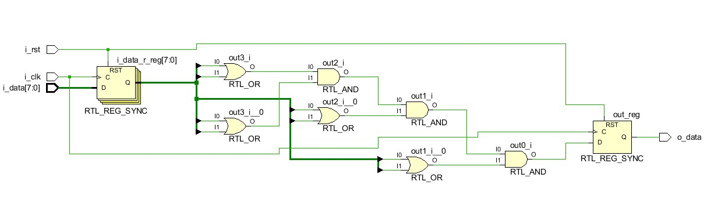

_Рисунок 6 Логическая схема модуля `pipe`_

Между уровнями входных и выходных триггеров располагается четыре уровня комбинаторной логики: логический вентиль `OR` и три логических вентиля `AND`. Попробуем переместить триггеры на входе модуля между вентилями `OR` и `AND`.

```verilog
module pipe_rb (
    output o_data,
    input [7:0] i_data,
    input i_rst,
    input i_clk);

    reg [3:0] temp_data_r;
    reg out;

    assign o_data = out;
    
    always @(posedge i_clk)
        if(i_rst) begin
            temp_data_r <= 0;
            out <= 0;
        end else begin
            temp_data_r[0] <= i_data[0] | i_data[1];
            temp_data_r[1] <= i_data[2] | i_data[3];
            temp_data_r[2] <= i_data[4] | i_data[5];
            temp_data_r[3] <= i_data[6] | i_data[7];
            out <= (temp_data_r[0]) & (temp_data_r[1]) & 
                   (temp_data_r[2]) & (temp_data_r[3]);
        end
endmodule : pipe_rb
```

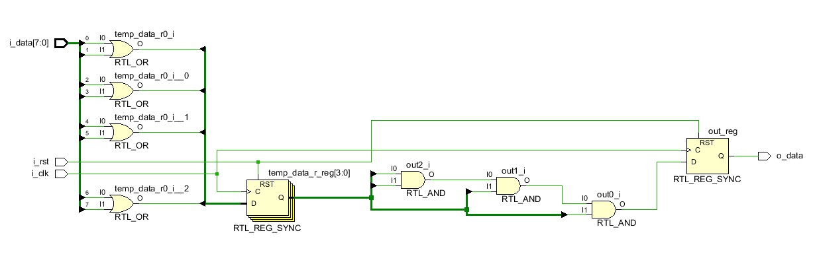

_Рисунок 7 Логическая схема модуля `pipe_rb`_

Обратите внимание, так-как триггеры со входа переместились в середину схемы, их количество изменилось: было 8 входных, а стало 4 промежуточных. В зависимости от архитектуры модуля и того, какие триггеры перемещаются, их количество может как уменьшиться, так и увеличиться, иногда на порядки. Поэтому следите за этим, так-как рост количества используемых триггеров приводит к увеличению ресурсоёмкости проекта и более разреженной по площади кристалла схеме, если речь идёт о FPGA и готовой архитектуре.

В процессе написания кода необходимо следить за балансом комбинаторной логики между различными слоями триггеров. Большое количество межрегистровой логики снижает тактовую частоту проекта. Однако неконтролируемое расположение триггеров может привести к неоптимальной реализации проекта в кристалле

### Retiming и переходы тактовых доменов

Практически ни один проект не обходится одной частотой тактового сигнала. Классический переход бита из одного тактового домена в другой (clock domain crossing, CDC) реализуется установкой двух и более дополнительных триггеров на стыке доменов для синхронизации.

Возлагая выполнение Retiming на синтезатор и не задав дополнительных ограничений, можно попасть в ловушку нарушения синхронизации: синтезатор не распознает переход тактовых доменов и растащит наши синхронизирующие триггеры по комбинаторной логике, «решая проблемы» с `critical_path`. Иллюстрация этой печальной ситуации представлена на рис.8.

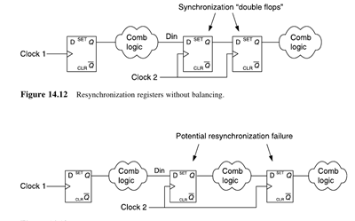

_Рисунок 8 Нарушение синхронизации тактовых доменов при использовании **Retiming**_

Поэтому при использовании встроенного в синтезатор Retiming не поленитесь указать, какие именно триггеры используются для CDC. Обычно это можно сделать специальными атрибутам синтеза или в проектных ограничениях.

В этом разделе были приведены примеры оптимизации кода по ресурсоёмкости и по скорости. Оптимизация кода на ранней стадии (до создания логической топологии) даёт разработчику наибольшую гибкость и контроль за итоговой схемой.

Однако, к сожалению, не всегда есть возможность редактировать код. Иногда приходится работать с тем, что есть. Но не стоит отчаиваться, обе рассмотренные техники оптимизации можно отдать на выполнение синтезатору.

## Оптимизация проекта на уровне синтезатора

### Блок схема и код модуля

В этом разделе я покажу немного более сложную схему, чем те, которые мы рассматривали до этого. Похожая схема образовалась в одном из моих учебных проектов, когда произошло сочленение двух модулей, написанных с разницей в полгода. Для статьи я немного упростил её, чтобы не углубляться в детали и утрировал некоторые моменты.

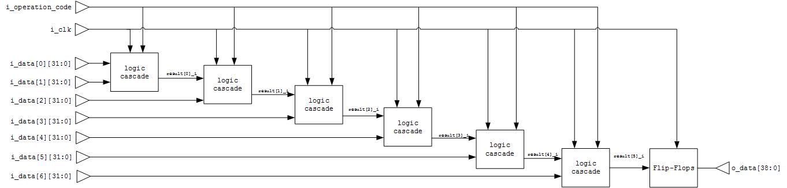

_Рисунок 9 Исследуемая схема_

Схема на рис.9 выполняет простую задачу: принимает на вход несколько 32-разрядных чисел и в зависимости от значения бита управляющего входа производит либо их суммирование, либо вычитание. На рис. 10 представлен один каскад схемы (обозначен как Logic cascade на рис.9), который включает в себя входные регистры, сумматор, вычитатель и мультиплексор. Каскад повторяется несколько раз в зависимости от количества входных данных, в данном случае шесть раз. За каскадами идёт цепочка последовательно включённых D-триггеров (Flip-Flops на рис.9), в данном случае четыре штуки. Синтезируемый код, а также полную версию логической схемы можно найти в репозитории, ссылка на который приведена в конце статьи.

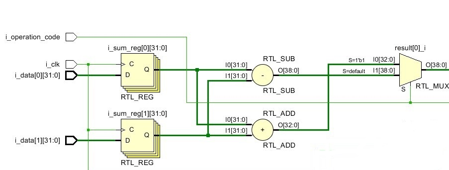

_Рисунок 10 Составная часть исследуемой схемы_

Вы уже наверняка догадались в чём дело. Все входные данные `i_data` имеют входные триггеры, за которыми идёт масса комбинаторной логики: сумматоры, вычитатели и мультиплексоры. Увенчано это безобразие цепочкой из четырёх триггеров. В оригинале схемы всё было не так жутко, однако цепочки из триггеров всё же встречаются в командной разработке: один разработчик поставил слой триггеров на выходе своего модуля, второй разработчик поставил слой триггеров на входе своего модуля. Взявший через некоторое время эти модули третий разработчик не стал заглядывать в код или читать документацию, а просто соединил выход со входом при помощи слоя внешних триггеров. И вот наш трёхслойный пирог из триггеров готов занять своё место в проекте.

Очевидно, что схема совершенного нерационально использует логические ресурсы и вряд ли взлетит на высоких частотах. Разумеется самым правильным решением будет переписать код модуля. Однако допустим, что у нас нет на это времени или исходник представляет собой трудночитаемый код, написанный давно ушедшим разработчиком. Попробуем побороть неоптимальную схему, не влезая в код. Для этого нам понадобятся опции встроенного в САПР синтезатора.

### Синтезатор Vivado и опции оптимизации

Поскольку я являюсь приверженцем фирмы Xilinx, все примеры будут на основе их САПР Xilinx Vivado. Синтезатор от Xilinx имеет довольно богатую россыпь настроек и возможностей задать различные ограничения при помощи специальных директив. Официальная документация [2] содержит более 250 страниц, но мы остановимся только на том, что было рассмотрено в предыдущих главах. Мы также не будем подробно рассматривать большую библиотеку уже готовых стратегий синтеза, а ограничимся изменением настроек по умолчанию. Кстати, среда разработки позволяет сохранить пользовательский набор настроек в новую стратегию.

Стоит отметить, что все опции, которые предоставляет синтезатор, начинают работать только при написании временных ограничений проекта (для Vivado это файл .xdc) [3], например желаемая рабочая частота схемы. В ином случае синтезатору просто будет не на что опереться при выборе алгоритма оптимизации и будет использован алгоритм по умолчанию.

### Resource Sharing

Синтезатор при включённой опции Resource Sharing идентифицирует взаимоисключающие функциональные блоки и назначает им одни и те же логические ресурсы, а также добавляет управляющую логику. При условии, что логика работы исключает возможность одновременной работы блоков, использующих одни и те же ресурсы, такой подход может дать значительное уменьшение занимаемой проектом площади кристалла.

Опция Resource Sharing в Vivado Synthesis имеет три возможных значения: On/Off/Auto. Значение по умолчанию Auto. Это значит, что ресурсная оптимизация будет применяться в любом случае, если это не приведёт к нарушению временных ограничений проекта. Значение On мотивирует синтезатор оптимизировать использование логических ресурсов даже там, где это может снизить рабочую частоту, поэтому поаккуратнее с этим значением. Значение Off ожидаемо запрещает синтезатору как-либо перераспределять ресурсы. Полезно, если по каким-то причинам вам нужно получить именно то включение примитивов, которое вы описали. Или если ресурсоёмкость схемы вас особо не беспокоит, так-как микросхема имеет огромный запас.

Непосредственная передача значения параметра Resource Sharing для синтезатора реализуется командой

```tcl
synth_design <…> -resource_sharing <value>
```

Интересно, что если проанализировать поставляемую Xilinx библиотеку стратегий, то опция `Resource Sharing` имеет значения `Off` только в двух стратегиях: `Flow_Perf_Optimized_high` и `Flow_Threshold Carry`, рекомендуемые к использованию, когда хочется выжать максимум по частоте и свободное место в кристалле ещё есть Все остальные стратегии используют значение Auto.

Cинтезаторы других производителей обычно также применяют опцию Resource Sharing по умолчанию, если функциональный блок, подходящий под эту опцию, не является одновременно тем самым критическим блоком, который определяет максимальную частоту всей системы (в терминологии Xilinx не содержит critical path). Однако, если синтезатор поддерживает ручное управление Resource Sharing, разработчику будет полезно проверить насколько увеличилось количество уровней вложенной логики по сравнению с отсутствием Resource Sharing. В зависимости от размеров и сложности проекта количество вложенной логики может возрасти на несколько уровней. И в результате несколько процентов сэкономленных ресурсов кристалла могут обернуться большим падением максимальной рабочей частоты микросхемы.

### Retiming

Современные синтезаторы обладают опцией `Register_Balancing` или `Retiming` в зависимости от производителя. При её включении синтезатор самостоятельно перемещает расставленные разработчиком триггеры для уменьшения периода тактовой частоты, если это перемещение не влияет на логику работы схемы. При этом модификация кода со стороны разработчика не требуется.

Есть два важных момента, на которых стоит остановиться, поскольку они справедливы для синтезаторов практически любого производителя:

1. синтезатор применяет Retiming только на `critical_path` и, если синтезируемая непосредственно по коду схема не выдерживает ограничений требуемой рабочей частоты. Триггеры во всех остальных местах при желании выполнить Retiming придётся перемещать по схеме путём редактирования кода;
2. синтезатор применяет Retiming только в случае, если триггеры на одном уровне логики имеют одинаковую схему включения `set` и `reset`. В случае, если часть триггеров будет иметь set, а часть `reset` или, одновременно `set` и `reset` (это включение лучше вообще не использовать), то синтезатор проигнорирует этот уровень триггеров во время выполнения Retiming, даже если эта часть схемы будет содержать `critical_path`;

В синтезаторе Vivadoпараметр Retiming имеет два возможных значения: On и Off. По умолчанию используется значение Off, которое сохраняется во всех стратегиях библиотеки за исключением уже упомянутых в предыдущем разделе `Flow_Perf_Optimized_high` и `Flow_ThresholdCarry`.

Непосредственная передача значения параметра Retiming для синтезатора реализуется командой

```tcl
synth_design <…> -retiming <value>
```

В документации отмечено, что в режиме блочного синтеза (опция `out-of-context`) триггеры на входе и выходе модуля не будут перемещаться. Поэтому можно получить совершенно разные результаты, синтезируя проект как единое целое и поблочно, будьте внимательны.

Есть ещё несколько фишек синтезатора Vivado, о которых стоит сказать, хотя в дальнейшем исследовании схемы они участвовать не будут:

1. синтезатор позволяет ограничить Retiming для разных частей проекта. Для этого необходимо в файле проектных ограничений синтезатору об этом сообщить:

```tcl
set_property BLOCK_SYNTH.RETIMING on [get_cellsfftEngine]

set_property BLOCK_SYNTH.RETIMING off [get_cellsquadEngine]
```

Указанное значение параметра будет передано во все экземпляры модулей `fftEngine` и `quadEngine`, а также во все вложенные в них экземпляры других модулей. Если нужно передать во внутренний модуль модуля `fftEngine` значение retiming `off`, то это нужно указать в проектных ограничениях отдельно после указания значения Retiming общего для всего блока;

2. синтезатор поддерживает атрибуты, которые позволяют более точно указать, какие триггеры надо перемещать и куда (`backward` т.е. ближе к входам или `forward` т.е. ближе к выходам). В таком случае для всего проекта будет применено значение `retiming`, переданное через командную строку за исключением тех триггеров, которые отмечены атрибутами. Атрибуты поддерживаются как в файле проектных ограничений (для меня более предпочтительный вариант),

```tcl
set_propertyretiming_backward 1 [get_cellsmy_sig_a];

set_propertyretiming_forward 1 [get_cellsmy_sig_b];
```
так и внутри Verilog кода.

```verilog
(*retiming_backward =" 1 *) "reg my_sig_a;

(*retiming_forward =" 1 *) "reg my_sig_b;
```

Поясню, что цифра `1` в данном случае является эквивалентом значению `Оn`, а не утверждает, что перемещать необходимо только один триггер или перемещать триггер только за соседний элемент комбинаторной логики. При запуске синтеза командой

```tcl
synth_design <…> -retimingoff
```

с учётом введённых ограничений, перемещение триггеров по Retiming будет реализовано только для триггера `my_sig_a`, который будет перемещён ближе к входным сигналам, и для триггера `my_sig_b`, который будет перемещён ближе к выходным сигналам [4];

3. в предыдущем разделе было упомянуто, что Retiming стоит с осторожностью применять в случае наличия CDC. Поэтому если триггеры sync_regs получают на вход асинхронный сигнал, укажите это в проектных ограничениях

```tcl
set_property ASYNC_REG TRUE [get_cellssync_regs*]
```
или внутри кода

```verilog
(* ASYNC_REG =" "TRUE" *) "reg [2:0] sync_regs;
```

### Результаты оптимизации работы синтезатора

В таблице 1 представлены результаты работы инструмента Place & Route с дефолтными настройками, на вход которому подавались результаты работы синтезатора с различными значениями настроек Resource Sharingи Retiming. Для расчётов использовалась схема с цепочкой из четырёх выходных триггеров. Целевая тактовая частота проекта, указанная в проектных ограничениях, равна 250 МГц.

В таблице приведены три значения параметров (Parameter_Value): количество примитивов LUT и FF, а также результат временного анализа Worst Negative Slack. Столбец Parameter_Value, % отражает процентное изменение параметра от настроек синтезатора по умолчанию: Resource sharing−Auto, Retiming−Off.

Таблица 1 Результаты работы инструмента Place&Route

| Resource_sharing | Retiming | Parameter_Name | Parameter_Value | Parameter_Value, % |
|------------------|----------|----------------|-----------------|--------------------|
| Auto | 	Off | 	Look-Up Tables |	380	| 100 |
| On | 	Off | 	Look-Up Tables |	380	| 100 |
| Off | 	Off | 	Look-Up Tables |	597	| 157.11 |
| Auto | 	On | 	Look-Up Tables |	345	| 90.79 |
| On | 	On | 	Look-Up Tables |	345	| 90.79 |
| Off | 	On | 	Look-Up Tables |	521	| 137.11 |
| Auto | 	Off | 	Flip_Flops |	334	| 100 |
| On | 	Off | 	Flip_Flops |	334	| 100 |
| Off | 	Off | 	Flip_Flops |	327	| 97.9 |
| Auto | 	On | 	Flip_Flops |	535	| 160.18 |
| On | 	On | 	Flip_Flops |	535	| 160.18 |
| Off | 	On | 	Flip_Flops |	620	| 185.63 |
| Auto | 	Off | 	WorstNegativeSlack |	-1.523	| 100 |
| On | 	Off | 	WorstNegativeSlack |	-1.523	| 100 |
| Off | 	Off | 	WorstNegativeSlack |	-2.392	| 157.06 |
| Auto | 	On | 	WorstNegativeSlack |	0.094	| 6.17 |
| On | 	On | 	WorstNegativeSlack |	0.094	| 6.17 |
| Off | 	On | 	WorstNegativeSlack |	0.506	| 33.22 |

Как и написано в документации, синтезатор автоматически проводит операцию Resource Sharing: количество примитивов и результаты временного анализа одинаковы для значений параметра `On` и `Auto`. Поэтому далее будем рассматривать только значения параметра Resource Sharing равные `On` и `Off`.

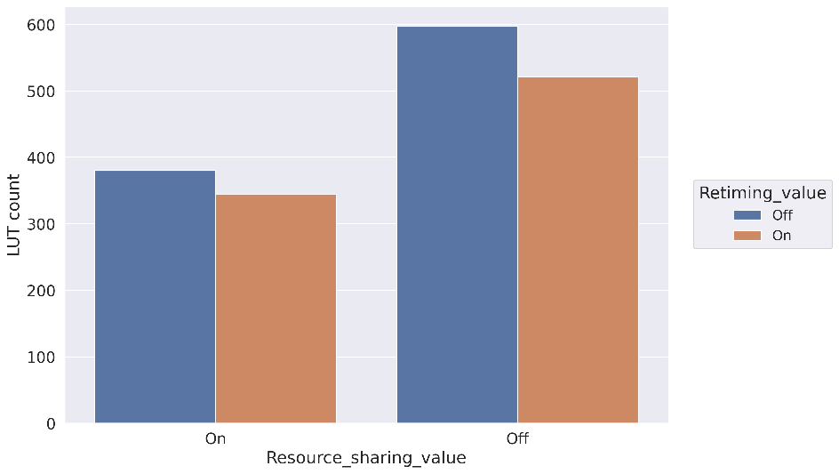

_Рисунок 11 Сравнение количества LUT и FF для 4х выходных триггеров_

На рис. 11 представлено сравнение количества примитивов Look-UpTable (LUT) и Flip-Flop (FF). Обратим внимание на два правых столбика графика LUT, соответствующий отключённому Resource Sharing. По сравнению со включенным Resource Sharing требуемое количество LUT возросло более чем на 30% вне зависимости от значения параметра Retiming.

Теперь обратим внимание на параметр Retiming. Количество потребляемых FF в зависимости от значения этого параметра меняется в довольно широком диапазоне (сравните синий и рыжий соседние столбики). При выключенном Resource Sharing требуемое количество FF возрастает ещё сильнее за счёт большего количества комбинаторной логики, которую необходимо разделить. Интересный момент: количество LUT немного меньше при включённом Retiming вне зависимости от значения Resource Sharing. Это можно объяснить меньшим размером сдвигового регистра, который образуется на выходе схемы из цепочки триггеров. В используемых настройках сдвиговый регистр глубиной больше трёх реализуется на примитивах LUT (это значение по умолчанию, его также можно изменить в настройках синтезатора, но мы не стали этого делать). Подробнее про это можно прочитать в документации Xilinx, например в [5] по запросу shift register look-up table или SRL. При включённом Retiming часть глубины сдвигового регистра, ушла на нужды Retiming, поэтому глубина SRL уменьшился, что привело к его реализации на FF, a не на LUT.

На рис.12 приведено сравнение параметра Worst Negative Slack (WNS) после выполнения этапа имплементации. Этот параметр рассчитывается исходя из требуемой тактовой частоты. Как было описано ранее, в качестве рабочей частоты взято значение 250 МГц. Очевидно, что для других значений тактовых частот значения WNS могут отличаться. Отрицательный WNS является верным признаком, что на входы некоторых триггеров может одновременно появиться и фронт тактового сигнала, и фронт данных (на самом деле, конечно, не совсем одновременно, производителем кристалла оговорен минимальный допуск между приходом фронтов тактового сигнала и данных на FF). Проще говоря, на заданной в проектных ограничениях тактовой частоте, прошивка в какой-то момент начнёт работать некорректно. В симуляторе это будет найти практически невозможно.

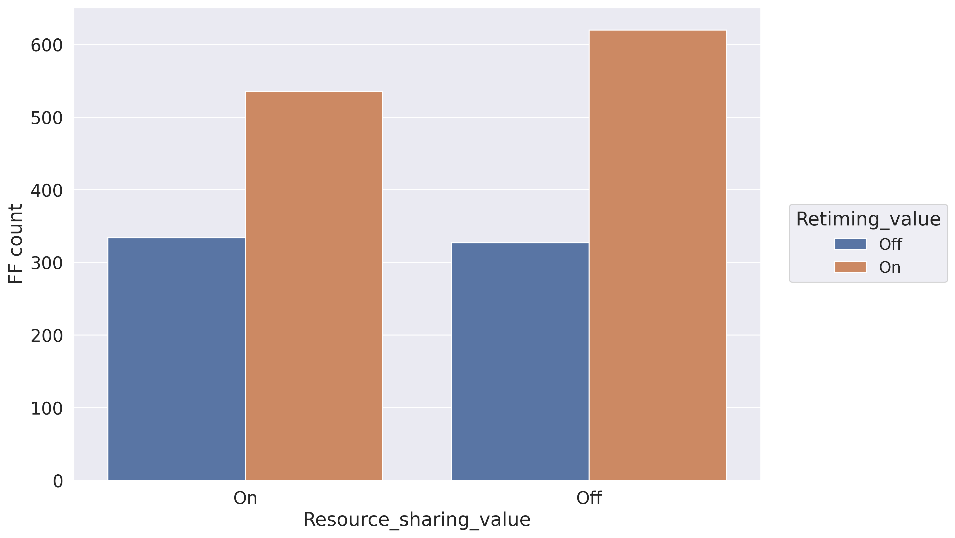

_Рисунок 12 Сравнение WNS для 4х выходных триггеров_

Только параметр Retiming помог спасти положение и заставить схему работать на требуемой частоте. Отключение Resource Sharing, как и ожидалось, только усугубляет ситуацию в отсутствие Retiming. А вот при включённом Retiming наоборот: отключение Resource Sharing наоборот улучшает ситуацию так-как количество управляющей логики, которую надо «раздробить» при помощи FF в этом случае меньше.

Расчёты, проведённые для количества слоёв выходных триггеров равных 2, 3 и 5 не показали интересных результатов, поэтому в статье разобраны не будут. Однако результаты имплементации для этих конфигураций можно найти в таблице из приложенного репозитория [6]. Вы можете и сами синтезировать схему для разных конфигураций синтезатора, изменив параметр O_SUM_SIZE, отвечающий за количество слоёв FF на выходе схемы. Или поиграться с количеством каскадов комбинаторной логики и разрядностью входных данных, подкрутив параметры `I_DATA_WIDTH` и `I_DATA_SIZE` соответственно.

Код не предполагал использование блочной памяти (BRAM) и вычислительных блоков `DSP48`. Если ваш код предполагает использование этих блоков, и вы экспериментируете с настройками синтезатора, обязательно проверяйте, что оптимизация не привела к переносу реализации функционала со специализированных блоков на стандартные LUTи FF.

## Заключение

В статье рассмотрены два вида оптимизации логических схем и показаны примеры их реализации на Verilog. Был взят синтетический пример плохой схемы, которая являлась результатом плохо написанного кода. Показано применение разобранных ранее оптимизаций на уровне синтеза нетлиста и приведён результат их использования в Xilinx Vivado. Возможности оптимизации инструмента Place&Route в рамках статьи не рассматривался.

Я не стал останавливаться на других полезных настройках синтезатора, таких как `max_fanout` или `fsm_encoding`. Возможно, это будет темой следующей статьи.

Разумеется, в боевых проектах изменение одних лишь настроек синтезатора не всегда спасают положение. Поэтому если после долгих часов работы САПР "обрадовал" вас упавшими таймингами или недостатком ресурсов микросхемы, стоит сначала взглянуть на код и постараться оптимизировать его в зависимости от преследуемых целей и имеющихся проблем.

## Ссылки

1. Advanced FPGA Design: Architecture, Implementation, and Optimization – Steve Kilts – 1st Edition – 2007
2. [Vivado Design Suite User Guide: Synthesis (UG901)](https://www.xilinx.com/support/documentation/sw_manuals/xilinx2018_3/ug901-vivado-synthesis.pdf)
3. [Vivado Design Suite Tutorial: Using Constraints (UG903)](https://www.xilinx.com/support/documentation/sw_manuals/xilinx2018_1/ug903-vivado-using-constraints.pdf)
4. [Retiming in Vivado Synthesis](https://forums.xilinx.com/t5/Design-and-Debug-Techniques-Blog/Retiming-in-Vivado-Synthesis/ba-p/934201)
5. [7 Series FPGAs Configurable Logic Block User Guide (UG474)](https://www.xilinx.com/support/documentation/user_guides/ug474_7Series_CLB.pdf)
6. [Репозиторий с кодом из статьи](https://github.com/alina-andreevna/syntheses_paper.git)