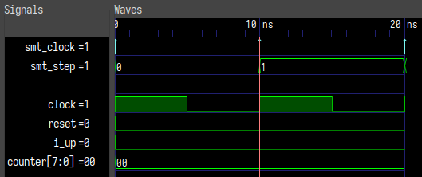
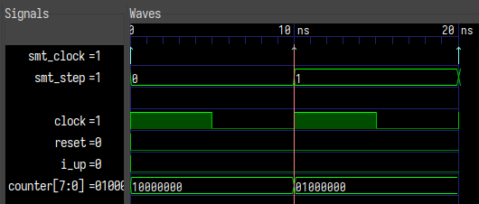
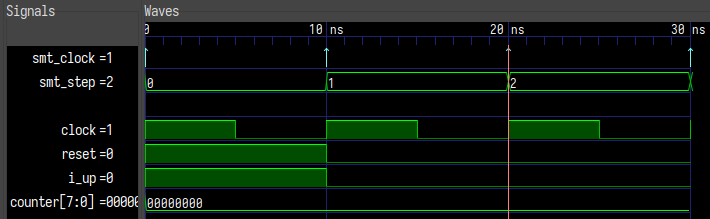
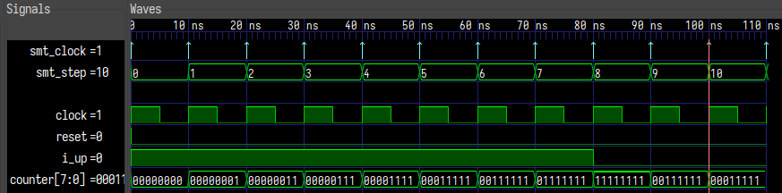
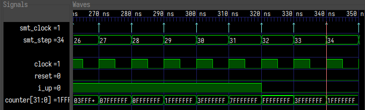
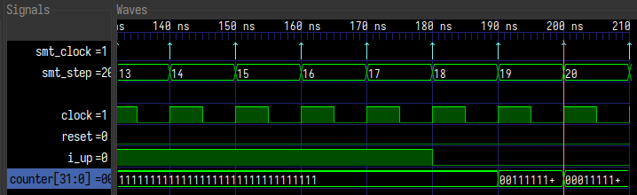
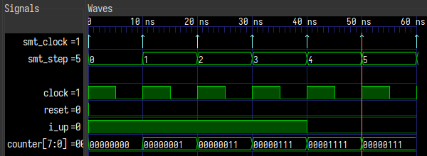

# Формальная верификация с SymbiYosys

> автор: punzik

## Что это такое и для чего оно нужно

**Формальная верификация** (_Formal Property Verification, FV_) - это верификация на основе доказательства эквивалентности схемы и формальной спецификации (модели). Формальная - значит описанная в виде математической (логической) формулы. В качестве формул в верификации RTL выступают утверждения (`assert`) и допущения (`assume`), которые описываются одноименными конструкциями языка Verilog или на специальном подмножестве SystemVerilog под названием **SVA** (_SystemVerilog Assertions_).

Формальная верификация отличается от функциональной (когда мы пишем тестбенч, запускаем симулятор и смотрим результат симуляции) тем, что формальная верификация "проверяет" сразу все возможные состояния логической схемы и пытается построить такой пример состояния (называется контрпример или counterexample), при котором будут нарушены утверждения (ассерты). Все состояния схемы проверятся с помощью математического решения системы логических уравнений, в которые отображается логическая схема. Решение уравнений выполняет специальная программа, которая так и называется - решатель (solver). Для решения логических уравнений применяется особый тип решателей, называемых [SAT солверы](https://en.wikipedia.org/wiki/Boolean_satisfiability_problem) (от слова _satisfiability_), или их обобщенная версия [SMT солверы](https://en.wikipedia.org/wiki/Satisfiability_modulo_theories) (_satisfiability modulo theories_).

При анализе логических схем применяется метод верификации, называемый проверкой моделей (Model Checking) с двумя подтипами - Bounded Model Checking (BMC) и Unbounded Model Checking. Bounded в данном случае означает временну́ю (количество тактов) границу проверки схемы. Т.е. проверяются не все состояния на бесконечной оси времени, а только заданное количество тактов, начиная с нулевого. Метод Unbounded Model Checking предполагает проверку на всей оси времени, для чего применяются различные математические методы, такие как математическая индукция.

Далее будет рассмотрен простой пример процесса формальной верификации с помощью открытого ПО [SymbiYosys](https://github.com/YosysHQ/sby), которое является фронтэндом для транслятора RTL в логическую схему ([Yosys](https://github.com/YosysHQ/yosys)) и решателей ([Boolector](https://github.com/Boolector/boolector), [Yices](https://github.com/SRI-CSL/yices2), [Z3](https://github.com/Z3Prover/z3) и другие).

## Простой пример BMC

Bounded Model Checking - это метод формальной проверки с очерченными и ограниченными временными рамками. Решатель начинает проверку с нулевого времени и заканчивает через отведенное количество тактов (реальных или виртуальных в случае многотактовой модели).

Задача решателя - найти такое состояние логической схемы, которое бы удовлетворяло всем допущениям (`assume`) и нарушало хотя бы один `assert`. Возьмём в качестве примера реверсивный счётчик в [унарном коде](https://en.wikipedia.org/wiki/Unary_coding), известном так же как thermometer code (число n представляется с виде n единиц начиная с нулевого бита). Вот его код:
```verilog
module unary_counter #(parameter LENGTH = 8)
    (input wire clock,
     input wire reset,

     input wire i_up,
     output wire [LENGTH-1:0] o_out);

    logic [LENGTH-1:0] counter;
    assign o_out = counter;

    always_ff @(posedge clock)
      if (reset)
        counter <= '0;
      else
        if (i_up)
          counter <= {counter[0 +: LENGTH-1], 1'b1};
        else
          counter <= {1'b0, counter[1 +: LENGTH-1]};

`ifdef FORMAL
`endif
endmodule // unary_counter
```
При подаче единицы на `i_up` счетчик будет прибавлять одну единичку к коду, если на входе будет ноль, счётчик будет убирать одну единичку.

В блоке, ограниченном дефайном `FORMAL` будет описана формальная спецификация счётчика. Этот код не будет использоваться синтезатором и функциональным симулятором.

Напишем спецификацию счетчика. Первым делом, ограничим состояния счетчика унарным кодом. Для этого запишем функцию проверки в виде обычного поведенческого кода на Verilog, и результат функции будем сравнивать с выходом счётчика через `assert`. Наш код будет делать сдвиг значения счетчика до первого встретившегося нуля, и если в результате сдвигов в остатке будут единицы, то код не унарный:
```verilog
`ifdef FORMAL
always_ff @(posedge clock) begin
    logic [LENGTH-1:0] check_out;

    check_out = o_out;
    for (int n = 0; n < LENGTH; n ++)
      if (check_out[0])
        check_out >>= 1;

    is_unary: assert(check_out == '0);
end
`endif
```

> Замечание по коду. Код хоть и поведенческий, но он должен быть потенциально синтезируемым, чтобы Yosys смог преобразовать его в логическую формулу.

> Замечание про Immediate и Concurrent ассертам. Термином Concurrent Assertions называют конструкции SVA assert property. Ассерты этого типа проверяются только по фронту клока, и предназначены для проверки событий, зависящих/растянутых во времени. Immediate assertions проверяются независимо от клоков, и выполняются как обычные конструкции языка в тех же регионах симуляции. Concurrent Assertions можно имитировать (с учётом особенностей регионов симуляции) с помощью Immediate, если последние завернуть в процесс, чувствительный к фронту клока.

SymbiYosys с открытыми парсерами пока не поддерживает Concurrent Assertions, по этому мы будем использовать Immediate. Это обычно более многословно, но тем не менее вполне юзабельно. (_Однако, можно купить платную версию SymbiYosys с парсером [Verific](https://www.verific.com/products/), которая поддерживает не только SVA, но и VHDL. Продукт называется [TabbyCad](https://www.yosyshq.com/tabby-cad-datasheet)_).

Можно обратить внимание на метку `is_unary` перед `assert`. Она не обязательна, но полезна, когда симулятор сообщит о нарушении ассерта. По этому имени будет сразу понятно, где произошла ошибка.

Следующим утверждением нашей модели будет то, что счётчик на каждом такте должен уменьшать или увеличивать значение. Он не должен оставаться в том же состоянии два такта подряд, если только это не состояние сброса (которое мы пока не будет учитывать) и счетчик не в крайних состояниях (все нули или все единицы).

Напишем утверждение:
```verilog
`ifdef FORMAL
always_ff @(posedge clock) begin
    if ($past(i_up) && !($past(counter) == '1))
      count_up: assert($countones(counter) -
                       $countones($past(counter))
                       == 1);

    if (!$past(i_up) && !($past(counter) == '0))
      count_dn: assert($countones($past(counter)) -
                       $countones(counter)
                       == 1);
end
`endif
```

Здесь применены две системные функции `$past` и $countones (есть и другие, например `$rose`, `$fell`, `$onehot`, о которых можно почитать в стандарте IEEE 1800 SystemVerilog). Функция `$past` возвращает значение сигнала на предыдущем такте (по этому она применима только внутри `always_ff`). Вторым аргументом можно указать количество тактов, на которое нужно вернуться, чтобы взять значение сигнала (по-умолчанию - один такт). Функция $countones возвращает количество единиц в векторе.

Таким образом мы описываем два **утверждения**:

1. Если на предыдущем такте сигнал `i_up` был равен единице, и счётчику было куда  считать, то в текущем такте его значение будет на единицу больше;
2. Если на предыдущем такте сигнал `i_up` был равен нулю, и счётчику было куда считать в обратном направлении, то в текущем такте его значение будет на единицу меньше;
Итак, мы специфицировали тип выхода счётчика и порядок счёта. Если не считать состояния сброса, похоже это всё, что нужно было описать. Будем считать это полной спецификацией счётчика.

Теперь попробуем проверить его. Для этого нужно написать конфигурационный файл для SymbiYosys (почитать про него подробней можно в [документации](https://symbiyosys.readthedocs.io/en/latest/reference.html)):
```
[tasks]
do_bmc

[options]
mode bmc

[engines]
smtbmc yices

[script]
read -sv -formal unary_counter.sv
prep -top unary_counter

[files]
unary_counter.sv
```

В разделе `[tasks]` указываем имя/имена задач (аналог целей в мейкфайле). Даже если задача одна, как у нас, имя все равно нужно указать. Имена задач произвольные.

Далее выбираем тип верификации - `BMC`, движок - `smtbmc` и решатель - `yices`. Про выбор движка и решателя можно так же почитать в документации к _SymbiYosys_. Чаще всего, для BMC и Unbounded применяют движок `smtbmc` с решателями `boolector`, `yices` или `z3`, т.к. эта связка покрывает все типы верификации, кроме `liveness`. Выбор конкретного решателя обычно основывается на скорости работы, а скорость зависит от таких факторов, как наличие памяти, сложность логических цепей и др. SymbiYosys позволяет автоматически подобрать движок и решатель, сравнивая скорость верификации (`sby --autotune`).  Исходный код сохраняем в файле `unary_counter.sv`, конфиг в `unary_counter.sby` и запускаем процесс верификации (показан не весь вывод программы):
```shell
$ sby -f unary_counter.sby
...
SBY [unary_counter_do_bmc] engine_0: ## 0:00:00 Checking assertions in step 1..
SBY [unary_counter_do_bmc] engine_0: ## 0:00:00 BMC failed!
SBY [unary_counter_do_bmc] engine_0: ## 0:00:00 Assert failed in unary_counter: count_dn
...
SBY [unary_counter_do_bmc] summary: counterexample trace: unary_counter_do_bmc/engine_0/trace.vcd
...
SBY [unary_counter_do_bmc] DONE (FAIL, rc=2)
```
Верификация завершилась с ошибкой, и программа нашла контрпример. Это может показаться странным, т.к счётчик написан вроде бы правильно, но давайте посмотрим временную диаграмму, которую программа сохранила в файл `unary_counter_do_bmc/engine_0/trace.vcd`:



Что же произошло? После установки начальных значений (про начальные значения поговорим ниже) решатель проходит заданное количество тактов, пытаясь в каждом из них найти состояние, нарушающее `assert`. Если этого не происходит, верификация считается пройденной успешно. У нас на первом шаге сработал `assert`, в котором симулятор пытается взять значения сигналов из предыдущего такта. Но т.к. это самый первый такт, предыдущих значений ещё нет и `assert` на `$past` всегда срабатывает.

Чтобы этого избежать, можно сделать дополнительный сигнал, который будет показывать существование прошлого состояния, и отключить `assert`, когда прошлого состояния ещё не существует:
```verilog
`ifdef FORMAL
logic f_past_valid = 1'b0;
always_ff @(posedge clock) f_past_valid <= 1'b1;

always_ff @(posedge clock)
  if (f_past_valid) begin
      if ($past(i_up) && !($past(counter) == '1))
        count_up: assert($countones(counter) -
                         $countones($past(counter))
                         == 1);

      if (!$past(i_up) && !($past(counter) == '0))
        count_dn: assert($countones($past(counter)) -
                         $countones(counter)
                         == 1);
  end
`endif
```

Запустим снова.

```shell
$ sby -f unary_counter.sby
...
SBY [unary_counter_do_bmc] engine_0: ## 0:00:00 Checking assertions in step 1..
SBY [unary_counter_do_bmc] engine_0: ## 0:00:00 BMC failed!
SBY [unary_counter_do_bmc] engine_0: ## 0:00:00 Assert failed in unary_counter: is_unary
...
SBY [unary_counter_do_bmc] summary: counterexample trace: unary_counter_do_bmc/engine_0/trace.vcd
...
SBY [unary_counter_do_bmc] DONE (FAIL, rc=2)
```
Снова ошибка, но теперь на проверке унарности кода. Посмотрим вейвформу:



Видно, что счётчик считает назад (`i_up` в низком состоянии), но значение его не совсем то, которое мы ожидали - это не унарный код.

Дело в том, что решатель BMC на каждом шаге пытается найти такое состояние, которое бы нарушало ассерты. Но если на шагах >0 ему в этом мешает логика, то на нулевом шаге ничего не мешает, и он может сразу установить заведомо ошибочные значения (что он и сделал, установив `8'b10000000`). По этому, чтобы ошибок не было, нужно либо ограничить значения в нулевом состоянии, либо отключить проверку в нулевом состоянии и сделать сброс всех регистров в корректное значение.

Делать сброс мы не будем, в нашем случае это избыточная функциональность и лишний код, а сделаем установку регистров в начальное значение с помощью `initial`:
```verilog
`ifdef FORMAL
initial counter = '0;
`endif
```

Запустим, и... снова ошибка:
```shell
$ sby -f unary_counter.sby
...
SBY [unary_counter_do_bmc] engine_0: ## 0:00:00 Checking assertions in step 2..
SBY [unary_counter_do_bmc] engine_0: ## 0:00:00 BMC failed!
SBY [unary_counter_do_bmc] engine_0: ## 0:00:00 Assert failed in unary_counter: count_up
...
SBY [unary_counter_do_bmc] summary: counterexample trace: unary_counter_do_bmc/engine_0/trace.vcd
...
SBY [unary_counter_do_bmc] DONE (FAIL, rc=2)
```

На этот раз сработал `assert count_up` на втором такте.



На временной диаграмме контрпримера видно, что решатель обнаружил, что во время сброса счетчик не считает. Это, очевидно, так и задумывалось, но не отражено в спецификации. Отразить этот момент можно двумя способами - перед assert-ом проверять прошлое состояние сброса на предмет активности или описать допущение (assume), что сброс никогда не принимает значение единицы. Обычно, в несложных схемах, используют второй способ, т.к. проверка схемы сброса - это отдельная задача.

Запишем допущение:
```verilog
`ifdef FORMAL
always_ff @(posedge clock) assume(!reset);
`endif
```
После добавления assume проверка счётчика проходит успешно.

Попробуем внести ошибки в код счётчика и посмотреть, как на это отреагирует симулятор. Изменим длину слайса в коде сдвига:
```diff
 else
- counter <= {1'b0, counter[1 +: LENGTH-1]};
+ counter <= {1'b0, counter[1 +: LENGTH-2]};
```
Запустим верификацию и получим срабатывание assert-а `count_dn`:
```shell
$ sby -f unary_counter.sby
...
SBY [unary_counter_do_bmc] engine_0: ## 0:00:00 Checking assertions in step 10..
SBY [unary_counter_do_bmc] engine_0: ## 0:00:00 BMC failed!
SBY [unary_counter_do_bmc] engine_0: ## 0:00:00 Assert failed in unary_counter: count_dn
...
SBY [unary_counter_do_bmc] summary: counterexample trace: unary_counter_do_bmc/engine_0/trace.vcd
...
SBY [unary_counter_do_bmc] DONE (FAIL, rc=2)
```


На вейвформе видно, что решатель нашел контрпример, в котором счётчик считает до самого большого значения, а затем, на шаге 10, пытается отсчитать на шаг назад, но терпит фиаско, и отсчитывает на два шага.

Можно попробовать внести другие ошибки в код, и убедиться, что формальная проверка их находит.

Кажется, что всё в порядке и на этом можно закончить, но мы используем Bounded Model Checking, а ошибка нашлась только на десятом шаге. Что будет, если мы увеличим разрядность счётчика например до 32?

Оставим эту ошибку, но изменим разрядность и запустим симуляцию снова. Удивительно (нет), но проверка прошла успешно:
```shell
$ sby -f unary_counter.sby
...
SBY [unary_counter_do_bmc] engine_0: ## 0:00:00 Checking assertions in step 19..
SBY [unary_counter_do_bmc] engine_0: ## 0:00:00 Status: passed
...
SBY [unary_counter_do_bmc] DONE (PASS, rc=0)
```

Обратите внимание на номер шага = 19. Дело в том, что по-умолчанию SymbiYosys в режиме BMC делает только 20 шагов, по этому решателю просто не хватило времени (глубины проверки), чтобы найти ошибочное состояние. За 20 тактов к нему просто невозможно прийти, какие бы входные сигналы мы не подавали.

Попробуем увеличить глубину проверки. Для этого добавим опцию depth в конфигурационный файл SymbiYosys:
```
[options]
mode bmc
depth 40
```
Запустим, и увидим, что на 34-м шаге решатель нашел путь до состояния, нарушающего assert count_dn. Снова посмотрим на временную диаграмму, и увидим, что, как и в предыдущий раз, счётчик досчитал до максимального значения, и на первом обратном отсчёте ошибся.



В связи с таким ограничением BMC нужно помнить, что при выборе количества тактов (глубины проверки) необходимо учитывать длину цепочек регистров, глубину счёта счетчиков и пр., т.к. если глубина будет меньше максимальной длины цепочки, BMC не просчитает все варианты состояния схемы и проверка будет неполной.

## Полное доказательство. Unbounded Model Checking

Однако, есть второй тип верификации, который называется **Unbounded Model Checking**, или полное доказательство - это ещё один метод формальной проверки логической схемы, продолжающий идею BMC, но, как можно понять из названия, без ограничений по времени, и основанный на применении математической индукции.

При выполнении доказательства решатель решает задачу обратно во времени. Сначала он ищет состояние, нарушающее любой `assert` (но удовлетворяющее всем assume), а затем пытается построить непротиворечивую последовательность назад во времени на некоторое количество тактов. Если последовательность построить не удалось (на некотором шаге выяснилось, что для дальнейшего продвижения нужно нарушить ограничения или перевести схему в невозможное состояние), то такое нарушение `assert`-а считается недостижимым.

Нужно сказать, что это сильное упрощение магии, которая происходит внутри решателя. Но для использования этой магии такого объяснения думаю достаточно.

Глубина проверки так же выбирается вручную (по-умолчанию 20), но обычно решатель быстрее упирается в невозможное состояние, чем достигает лимита шагов. Вообще, достаточно редко требуется большое количество шагов. А если требуется, то такая задача обычно не решается с помощью полного доказательства из-за большой сложности и "комбинаторного взрыва".

В отличие от BMC, начальное значение регистров (в левой части временно́й шкалы) очевидно не учитывает значения `initial`, т.к. является продуктом вычислений.

В SymbiYosys этот режим называется `prove`. Попробуем убрать опцию depth (чтобы проверка не провалилась на стадии BMC) и изменить режим на `prove`:
```
[tasks]
do_prove

[options]
mode prove
```
Запустим проверку:
```shell
$ sby -f unary_counter.sby
...
SBY [unary_counter_do_prove] engine_0.basecase: ## 0:00:00 Checking assertions in step 19..
SBY [unary_counter_do_prove] engine_0.basecase: ## 0:00:00 Status: passed
...
SBY [unary_counter_do_prove] engine_0.induction: ## 0:00:00 Trying induction in step 0..
SBY [unary_counter_do_prove] engine_0.induction: ## 0:00:00 Temporal induction failed!
SBY [unary_counter_do_prove] engine_0.induction: ## 0:00:00 Assert failed in unary_counter: count_dn
...
SBY [unary_counter_do_prove] summary: counterexample trace [induction]: unary_counter_do_prove/engine_0/trace_induct.vcd
...
SBY [unary_counter_do_prove] DONE (UNKNOWN, rc=4)
```

Видно, что фаза BMC прошла успешно, но на стадии индукции решатель нашел путь к ошибке. Временная диаграмма контрпримера выглядит следующим образом:



Теперь исправим ошибку и запустим тест снова (я оставил только значимые строки):
```shell
$ sby -f unary_counter.sby
...
SBY [unary_counter_do_prove] engine_0.induction: ## 0:00:00 Trying induction in step 20..
SBY [unary_counter_do_prove] engine_0.induction: ## 0:00:00 Trying induction in step 19..
SBY [unary_counter_do_prove] engine_0.induction: ## 0:00:00 Trying induction in step 18..
SBY [unary_counter_do_prove] engine_0.induction: ## 0:00:00 Temporal induction successful.
...
SBY [unary_counter_do_prove] DONE (PASS, rc=0)
```

Можно видеть, что индукция завершилась на третьем шаге. Т.е. для доказательства корректности схемы достаточно глубины 2. Если установить `depth` в 2, то тест выполнится успешно, но если поставить 1, то будет ошибка на нескольких `assert`-ах, т.к. программа не нашла пути до невозможного состояния длиной в 1 такт.

## Достижимость и покрытие

Но это ещё не всё. Кроме доказательства эквивалентности схемы и модели, бывает нужно проверить достижимость некоторых состояний схемы. Для этого можно использовать конструкцию cover. Вернём разрядность 8 бит и попробуем проверить, сможет ли наш счетчик достичь значения 8'b1000_0000. Для этого установим в конфиге режим cover:
```
[tasks]
do_cover

[options]
mode cover
```
А в код добавим одноименную конструкцию:
```verilog
`ifdef FORMAL
always_ff @(posedge clock)
  cover0: cover(counter == 8'b1000_0000);
`endif
```
Запустим и увидим, что решатель не нашел пути длиной в 20 тактов к этому значению счётчика:
```shell
$ sby -f unary_counter.sby
...
SBY [unary_counter_do_cover] engine_0: ## 0:00:00 Checking cover reachability in step 18..
SBY [unary_counter_do_cover] engine_0: ## 0:00:00 Checking cover reachability in step 19..
SBY [unary_counter_do_cover] engine_0: ## 0:00:00 Unreached cover statement at cover0.
...
SBY [unary_counter_do_cover] DONE (FAIL, rc=2)
```
Это было ожидаемо, т.к. счётчик работает в унарном коде, и выше мы доказали, что других состояний он иметь не может.

Попробуем изменить условие cover на достижимое, например на `8'b0000_1111`.
```shell
$ sby -f unary_counter.sby
...
SBY [unary_counter_do_cover] engine_0: ## 0:00:00 Checking cover reachability in step 4..
SBY [unary_counter_do_cover] engine_0: ## 0:00:00 Checking cover reachability in step 5..
SBY [unary_counter_do_cover] engine_0: ## 0:00:00 Reached cover statement at cover0 in step 5.
...
SBY [unary_counter_do_cover] summary: cover trace: unary_counter_do_cover/engine_0/trace0.vcd
...
SBY [unary_counter_do_cover] DONE (PASS, rc=0)
```
Проверка выполнилась успешно. Самое короткое расстояние до достижения нужного состояние - 4 такта. Этот путь SymbiYosys сохранил в файл VCD:



Cover, как и BMC, начинает поиск с начального состояния, по этому замечание по поводу глубины проверки касается и его.

Конструкция cover полезна при оценке "чрезмерной ограниченности" (over-constrained) спецификации, если нужно посмотреть какие-то граничные случаи, или для демонстрации тестовых примеров.

## Заключение

В статье был продемонстрирован очень простой пример как по количеству внутренних состояний, так и по разнообразию входных данных, по этому может быть не совсем понятно, для чего это вообще нужно, и почему бы не использовать тестбенч. Однако, если представить, что входные данные - это несколько широких слов с десятками управляющих сигналов, то становится понятно, что обычным тестбенчем уже невозможно проверить всё. Придется применять различные техники для ограничения словаря входных воздействий, например, рандомизацию. Вот здесь и может пригодиться формальная верификация, ведь для неё не нужно ничего сокращать, с ней будут проверены все возможные сценарии использования вашего модуля. Нужно только правильно написать спецификацию :)

Однако, при всей привлекательности формальной верификации она имеет ряд ограничений, не позволяющей ей полностью заменить функциональную верификацию. Главным недостатком является экспоненциальный рост сложности решения при увеличении размера схемы. Этот эффект называется комбинаторным взрывом. Частично этот взрыв можно отодвинуть, грамотно ограничивая область возможных значений с помощью `assert` и `assume`, или используя только метод BMC. Но и здесь есть пределы.

В связи с этим, формальную верификацию целесообразно применять на уровне блоков или IP, а с помощью функциональной верификации проводить тестирование на уровне подсистем и системы в целом.

<div id="telegram-comments"></div>

<script async src="https://telegram.org/js/telegram-widget.js?22"
        data-telegram-discussion="fpgasystems_events/2119"
        data-comments-limit="20">
</script>