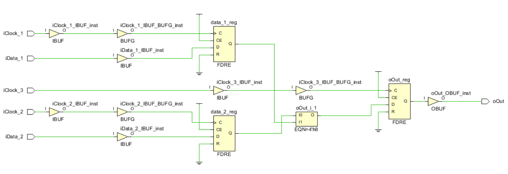
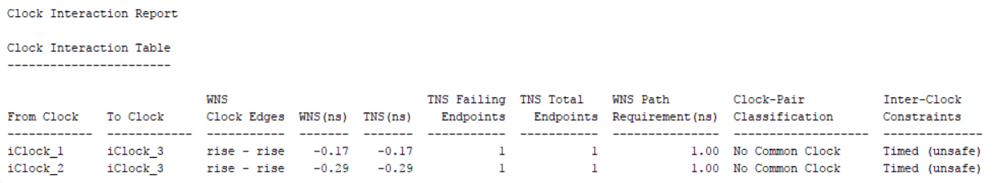
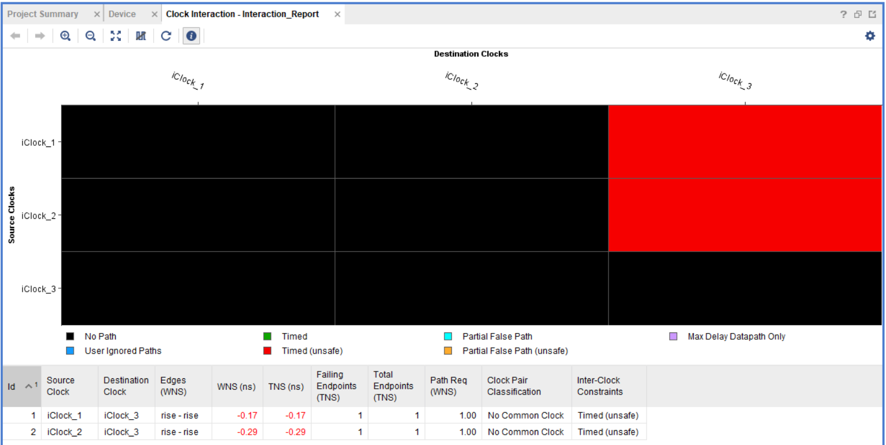
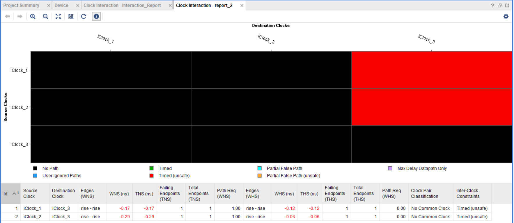

## Синтаксис

```tcl 
report_clock_interaction [-delay_type <arg>] [-setup] [-hold] [-significant_digits <arg>] [-no_header] [-file <arg>] [-append] [-name <arg>] [-return_string] [-quiet]  [-verbose]
```

## Возвращаемое значение

Нет

## Категории

Report, Timing

 

## Описание

Генерирование отчёта о пересечении тактовых сигналов и простых сигналов, которые лежат на пересечении тактовых доменов, для обнаружения потенциальных проблем таких как метастабильноть, не когерентность данных, потеря данных, а также для видимости путей, которые лежат на пересечении тактовых доменов. Команда требует открытого синтезированного или имплементированного проекта.

 

> Примечание: по умолчанию команда выдаёт отчёт в TCL консоль или стандартное устройство ввода/вывода. Однако результаты также могут быть записаны в файл или возвращены в виде строки.

 

## Аргументы

`-delay_type <arg>` - (опционально) Определяет тип задержки, для которой буде выполняться анализ. Допустимые значения `min`, `max`, `min_max`. По умолчанию установлено значение `max`.

`-setup` –(опционально) Проверка нарушений по времени установления. Аналогично `–delay_type max`.

`-hold` –(опционально) Проверка нарушений по времени удержания. Аналогично `–delay_type min`

>Примечание: опции `–setup` и `–hold` могут быть использованы вместе, отчёт будет аналогичен `–delay_type min_max`

`-significant_digits` –(опционально) количество цифр после запятой, которое будет отображаться в отчёте. Допустимые значения от  0 до 3. Значение по умолчанию 2

`-no_header` –(опционально) Не формировать заголовок отчёта.

`-file <arg>` - (опционально) Записать отчёт в файл. Если файл существует, он будет перезаписан или же информация будет добавлена в файл, если использована опция `–append`

>Примечание: если путь не указан в имени файла, то файл будет записан в текущую рабочую директорию или в директорию, из которой запущена среда.

`-append` – (опционально) добавить выходные данные команды в файл, вместо того, что бы его перезаписать.

>Примечание: опция –append может быть использована только с опцией `‑file`

`-name <arg>` - (опционально) задаёт имя отчёта и отображает отчёт в  графическом интерфейсе. Если отчёт  c таким именем уже сформирован, то он будет закрыт, а новый будет отображён.

`-return_string` – (опционально) Сформировать выход команды в TCL строку, вместо того, что бы отобразить её  в стандартном устройстве ввода/вывода. TCL строка может быть определена как переменная и в последующем обработана.

`-quiet` – (опционально) Команда выполняется в «тихом» режиме, сообщения команды не отображаются. Команда возвращает TCL_OK независимо от каких-либо ошибок её выполнения.

>Примечание: Если ошибка обнаружена в командной строке при вводе команды, то ошибка будет отображена. Не отображается ошибки, которые появляются во время выполнения команды.

`-verbose` – (опционально) Временное переопределение ограничений на количество выводимых сообщений команды.

>Примечание: количество выводимых сообщений может регулироваться с помощью команды `set_msg_config`.


**!ВАЖНО!**: отчёт будет сформирован корректно только в том случае, если Vivado будет "видеть" все тактовые сигналы Вашего проекта. Если по каким-то причинам имеются _Unconstrained_ или _Undefined_ тактовые сигналы, отчёт будет некорректным, и в нем будет отсутствовать информация о пересечениях соответствующих тактовых доменов. Убедиться в том, что все тактовые сигналы "обозначены" для Vivado можно запустив команду `report_clock_network`.

## Примеры

Рассмотрим модуль, у которого имеется три тактовых сигнала (домена) `iClock_1`,  `iClock_2` и `iClock_3`:
```vhdl
entity top is
    port (
        iClock_1 : in STD_LOGIC;
        iClock_2 : in STD_LOGIC;
        iClock_3 : in STD_LOGIC;
        iData_1: in STD_LOGIC;
        iData_2: in STD_LOGIC;
        oOut : out STD_LOGIC
    );
end top;
```
C частотами 100МГц, 200МГц и 300МГц соответственно:
```tcl
create_clock -period 10.000 -name iClock_1 -waveform {0.000 5.000} [get_ports iClock_1]
create_clock -period 5.000 -name iClock_2 -waveform {0.000 2.500} [get_ports iClock_2]
create_clock -period 3.000 -name iClock_3 -waveform {0.000 1.500} [get_ports iClock_3]
```
Предположим, что между тактовыми доменами есть пересечение через промежуточный сигнал. Код, реализующий эти условия:

```vhdl
achitecture rtl of top is
    signal data_1 : std_logic;
    signal data_2 : std_logic;
begin
    process(iClock_1)
    begin
        if rising_edge(iClock_1) then
            data_1 <= iData_1;
        end if;
    end process;

    process(iClock_2)
    begin
        if rising_edge(iClock_2) then
            data_2 <= iData_2;
        end if;
    end process;

    process(iClock_3)
    begin
        if rising_edge(iClock_3) then
            data_3 <= iData_3;
        end if;
    end process;
end rtl;
```

1. Выполним синтез. Netlist выглядит следующим образом



2. Запустим `report_clock_interaction`:



Как видим из отчёта, у нас имеется два пересечения между `iClock_1`  и `iClock_3`, `iClock_2` и `iClock_3`. Последняя графа говорит нам о типе, к которому может принадлежать пересечение тактовых доменов. В данном случае требуются дополнительные ограничения на соответствующие пути и тактовые группы.

Как правило, пересечение тактовых доменов тема довольно обширная и требует применение целого ряда ограничений на соответствующие пути и тактовые группы (см. UG906 Design Analysis and Closure Techniques).

3. Отчёт может быть отображён в виде цветовой матрицы пересечений. Чтобы это сделать необходимо выполнить команду с опцией `–name`:
```tcl
report_clock_interaction -name Interaction_Report
```

Vivado будет сформирован графический отчёт:



В таком виде отчёт более наглядно показывает имеющиеся пересечения и их характеристики.

4. Для сохранения отчёта в отдельный файл, воспользуемся опцией `‑file`:
```tcl
report_clock_interaction -file\ "report_interactions_between_clock_domains.txt"
```
Содержимое отчёта в текстовом файле  аналогично тому, что выводится в консоль.

Чтобы узнать текущий каталог для сохранения по умолчанию, воспользуйтесь командой `pwd`

5. Для компактного вывода отчёта, не задержащего заголовок справочной информации VIvado воспользуемся опцией `–no_header`:
```tcl
report_clock_interaction -no_header
```

6. Для вывода более полной информации, включающей анализ по hold и setup воспользуемся опцией `–delay_type` с ключом `min_max`:
```tcl
report_clock_interaction -no_header -delay_type min_max –name report_2
```
В отчёт будет добавлена соответствующая информация:



Также посмотрите:

- `create_clock`
- `create_generated_clock`
- `report_clocks`
- `set_delay_model`
- `set_speed_grade`
 

## Литература

UG835 Vivado Design Suite Tcl Command Reference Guide

UG906 Design Analysis and Closure Techniques


