# Основы статического временного анализа. Часть 3: Source Synchronous Input Delay Constraint.

*О найденных опечатках и замечаниях просим сообщить в чате сообщества.*

## Введение
В статье представлен временной анализ передачи сигналов в FPGA из внешнего устройства. Рассмотрены теоретические основы анализа для трех различных вариантов выравнивания данных относительно тактового сигнала. Также разобраны два практических примера создания временных ограничений.

## 1. Передача данных для случая Source Synchronous
Данная статья частично опирается на материал, рассмотренный в предыдущих работах [1-3]. Предполагается, что читатель уже знаком с такими понятиями, как ограничение на максимальное (Setup) и минимальное (Hold) время распространения сигнала, запас (Slack) и т.д. 

Ранее в [2] был представлен временной анализ передачи данных в FPGA из внешнего устройства в случае, когда тактовый сигнал формируется генератором, расположенным на плате (см. рисунок 1). Такой способ передачи называется System Synchronous. 


_Рисунок 1. Соединение устройств на плате для случая System Synchronous._

В текущей статье будет рассмотрен другой способ, называемый Source Synchronous, при котором источник помимо данных также формирует тактовый сигнал (см. рисунок 2). В дальнейшем для краткости устройство, из которого в FPGA передаются данные и тактовый сигнал, будем иногда называть Device.


Рисунок 2. Соединение устройств на плате для случая Source Synchronous.

Будем считать, что в FPGA загружен простой проект, состоящий из единственного триггера (см. рисунок 3). Этого вполне достаточно для демонстрации того, как в Vivado проводится временной анализ для входных сигналов. Ниже показано описание проекта на System Verilog:

```verilog
module top (
    input  logic ICLK,
    input  logic IDATA,
    output logic ODATA
);    
   always_ff@(posedge ICLK)
       ODATA <= IDATA;                  
endmodule
```

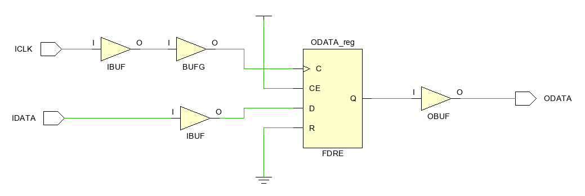

_Рисунок 3. Схема FPGA проекта._

## 2. Задержки при временном анализе для входных сигналов 
При передаче данных между Device и FPGA запускающий триггер располагается во внешнем устройстве, а защелкивающий – в FPGA. На рисунке 4 показан анализируемый путь, на который нанесены задержки сигналов. В случае Source Synchronous источник данных также формирует тактовый сигнал, поэтому на рисунке тактовый генератор (OSC) внесен внутрь Device.


Рисунок 4. Путь с задержками для входных данных и тактового сигнала.

Ниже даны определения задержек, представленных на рисунке 4. 

- $T_{dbd}$ (_Data Board Delay_) – задержка распространения данных по дорожкам платы от Device до FPGA;
- $T_{cbd}$ (_Clock Board Delay_) – задержка распространения тактового сигнала по дорожкам платы от Device до FPGA;
- $T_{dcd}$ (_Device Clock Delay_) – задержка тактового сигнала от генератора OSC до тактового входа запускающего триггера;
- $T_{co}$ (_Clock to Output_) – интервал времени между приходом фронта на тактовый вход триггера и появлением данных на его выходе Q;
- $T_{ddd}$ (_Device Data Delay_) – задержка распространения данных от запускающего триггера до ножки ODATA Device;
- $T_{cpd}$ (_Clock to Pin Delay_) – задержка тактового сигнала от генератора OSC до ножки OCLK Device;
- $T_{ecd}$ (_Edge Clock Delay_) – дополнительная задержка тактового сигнала, зависящая от способа выравнивания фронта относительно данных;
- $T_{fcd}$ (_FPGA Clock Delay_) – задержка тактового сигнала от ножки ICLK FPGA до тактового входа защелкивающего триггера;
- $T_{fdd}$ (_FPGA Data Delay_) – задержка распространения данных от ножки IDATA FPGA до защелкивающего триггера;
- $T_{su}$ (_SetUp time_) – время установки защелкивающего триггера; 
- $T_{h}$ (_Hold time_) – время удержания защелкивающего триггера. 

Период тактового сигнала будем обозначать $T_{clk}$. Оранжевым и зеленым цветом на рисунке 4 представлены задержки для участков пути, которые располагаются вне FPGA. Эти задержки необходимо указать временному анализатору Vivado.

Результат временного анализа представляется в виде разницы (Slack) между требуемым и фактическим временем прибытия данных к защелкивающему триггеру. Отрицательное значение Slack указывает на нарушение временных ограничений. Формулы расчета Slack для анализа по Setup и Hold представлены ниже [1]:

\begin{equation}
Slack\_setup = T_{dr\_setup} - T_{da\_setup}
\tag{1}
\label{eq:1}
\end{equation}

$$
Slack\_hold = T_{da\_hold} - T_{dr\_hold}
$$

где $T_{dr}$ (**D**ata **R**equired time) – требуемое время прибытия данных, $T_{da}$ (**D**ata **A**rrival time) – фактическое время прибытия данных. 

Фактическое время прибытия данных, вычисляется как сумма задержек распространения тактового сигнала от генератора до запускающего триггера и задержек распространения данных от запускающего триггера до защелкивающего. Из рисунка 4 получаем следующие уравнения:

\begin{equation}
T_{da\_setup} = T_{dco\_max} + T_{dbd\_max} + T_{fdd\_max}
\tag{2}
\label{eq:2}
\end{equation}

$$
T_{da\_hold} = T_{dco\_min} + T_{dbd\_min} + T_{fdd\_min}
$$

где введены обозначения ($T_{dco}$ – **D**evice **C**lock to **O**utput time):

$$
T_{dco\_max} = T_{dcd\_max} + T_{co\_max} + T_{ddd\_max}
$$

$$
T_{dco\_max} = T_{dcd\_min} + T_{co\_min} + T_{ddd\_min}
$$

Так как временной анализ проводится для самого пессимистичного случая, выше в одних уравнениях используются максимальные задержки, а в других – минимальные. 

Как будет показано, расчет требуемого времени прибытия данных $T_{dr}$ для случая Source Synchronous проводится с некоторыми особенностями. Поэтому прежде, чем двигаться дальше, рассмотрим обобщения, применимые к временному анализу сигналов.  

## 3. Обобщение результатов для временного анализа сигналов
Для начала рассмотрим анализ по Setup. Передача данных между двумя триггерами начинается по запускающему фронту тактового сигнала. Спустя один период, равный $T_{clk}$, и задержку распространения следующий фронт защелкивает данные на входе приемного триггера. Чтобы удовлетворить требованиям по времени установки, данные на входе защелкивающего триггера должны быть стабильны в течении времени $T_{su}$ до прихода фронта тактового сигнала. Таким образом, для требуемого времени прибытия данных имеем:

$$
T_{dr\_setup} = T_{clk} + T_{clk\_delay\_min} - T_{su}
$$

где $T_{clk\_delay\_min}$ – задержка распространения тактового сигнала от генератора до входа защелкивающего триггера. Подставив этот результат в уравнение \(\ref{eq:1}\), получим

$$
Slack\_setup = T_{clk} + T_{clk\_delay\_min} - T_{su}
$$

В общем случае задержки тактового сигнала и данных можно разделить на две части, которые соответствуют распространению по участкам пути внутри и вне FPGA. Перегруппировав слагаемые из предыдущего уравнения, выражение для Slack можно записать в виде:

\begin{equation}
Slack\_setup = T_{clk} + \sum{}{}T_{fpga\_ext} + \sum{}{}T_{fpga\_int}
\tag{3}
\label{eq:3}
\end{equation}

где $\sum{}{}T_{fpga\_ext}$ и $\sum{}{}T_{fpga\_int}$ – алгебраические суммы задержек для участков пути вне и внутри FPGA. 

Если передача данных осуществляется между триггерами внутри FPGA, то значение суммы $\sum{}{}T_{fpga\_ext}$ равно нулю. При анализе выходных сигналов слагаемое $T_{su} относится к защелкивающему триггеру, расположенному вне FPGA, и поэтому входит в сумму $\sum{}{}T_{fpga\_ext}$. При анализе входных и внутренних для FPGA сигналов слагаемое $T_{su}$ содержится в сумме $\sum{}{}T_{fpga\_int}$.   

В [2] для случая System Synchronous было получено следующее выражение для Slack: 

$$
Slack\_setup = T_{clk} -input\_delay\_max + T_{fcd\_min} - T_{fdd\_max} - T_{su}
$$

Сравнивая с уравнением \(\ref{eq:3}\), очевидны следующие равенства:

$$
\sum{}{}T_{fpga\_ext} = -input\_delay\_max
$$

$$
\sum{}{}T_{fpga\_int} = T_{fcd\_min} - T_{fdd\_max} - T_{su}
$$

Все задержки вне FPGA собраны в сумме $\sum{}{}T_{fpga\_ext}$ и передаются временному анализатору Vivado в виде единственного значения $input\_delay\_max$. 

Важно обратить внимание на слагаемое $T_{clk}$ в уравнении \(\ref{eq:3}\), которое появляется из-за того, что данные запускаются по одному фронту, а защелкиваются – по следующему. Анализатор Vivado считает, что передача данных осуществляется именно таким образом.

Проведем аналогичные рассуждения для анализа по _Hold_. Требуемое время прибытия данных рассчитывается по формуле:

$$
T_{dr\_hold} = T_{clk\_delay\_max} + T_h
$$

где, как и ранее, $T_{clk\_delay\_max}$ - задержка распространения тактового сигнала от генератора до входа защелкивающего триггера.

Так как защелкивающий фронт для предыдущих данных появляется в тот же момент времени, что и запускающий фронт для следующих данных, в представленном выше выражении отсутствует слагаемое $T_{clk}$. Напомним, что слагаемое $T_h$ учитывает, что после защелкивающего фронта данные не должны изменяться в течении времени удержания триггера. Подставим выражение для $T_{dr\_hold}$ в уравнение \(\ref{eq:1}\) и получим

$$
Slack\_hold = T_{da\_hold} - T_{clk\_delay} - T_h
$$

Если перегруппировать задержки, которые входят в состав слагаемых $T_{clk\_delay\_max}$ и $T_{da\_hold}$, то уравнение для Slack можно переписать в виде:

\begin{equation}
Slack\_hold = \sum{}{}T_{fpga\_ext} + \sum{}{}T_{fpga\_int}
\tag{4}
\label{eq:4}
\end{equation}

В [2] для случая System Synchronous было получено следующее выражение для Slack: 

$$
Slack\_hold = input\_delay\_min + T_{fdd\_min} - T_{fcd\_max} - T_h
$$

В данном случае имеем:

$$
\sum{}{}T_{fpga\_ext} = -input\_delay\_min
$$

$$
\sum{}{}T_{fpga\_int} = T_{fdd\_min} - T_{fcd\_max} - T_{h}
$$

При анализе по Hold все задержки вне FPGA передаются Vivado в виде единственного значения $input\_delay\_min$. Закончив всю подготовительную работу, перейдем, наконец, непосредственно к рассмотрению временного анализа для входных сигналов для случая Source Synchronous. 

## 4. Source Synchronous **Center Aligned**
Введем важное определение. Будем называть окном валидных данных (_data valid window_) промежуток времени, в течении которого предназначенные для передачи данные удерживаются на выходе Device. 

Начнем с рассмотрения случая, когда тактовый сигнал выравнивается относительно середины окна данных. Такой вариант называется **Center Aligned** и реализуется с помощь дополнительной задержки Tecd, значение которой соответствует половине периода тактового сигнала ($T_{ecd} = T_{clk}/2$).

На рисунке 5 представлены временные диаграммы сигналов внутри Device: выход тактового генератора (OSC); тактовый вход запускающего триггера (FF1/C); выходы Device OCLK и ODATA. Для большей наглядности на диаграмму нанесены задержки распространения сигналов. Номерами _№1_ и _№2_ обозначены события для двух следующих друг за другом фронтов. Окно валидных данных для фронта _№1_ соответствует промежутку времени **NEW DATA**. Также для определённости в дальнейшем будем считать, что фронт _№1_ формируется на выходе OSC в нулевой момент времени.

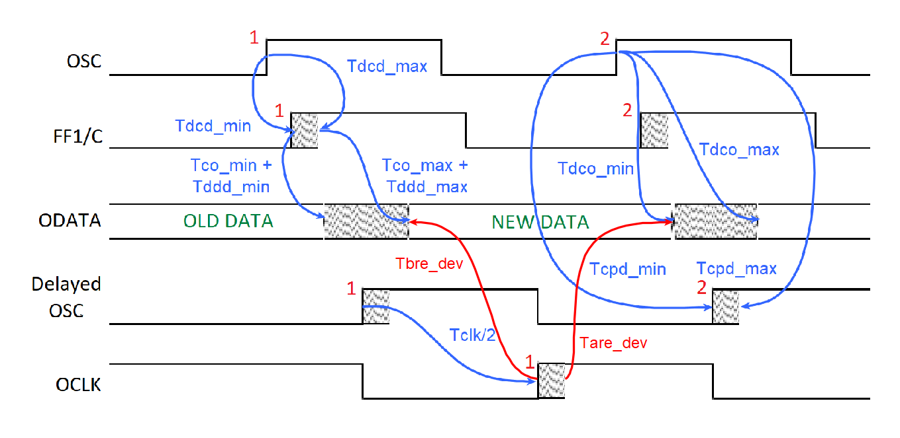

_Рисунок 5. Временная диаграмма сигналов внутри Device._

Как можно увидеть, по фронту _№1_ начинается передача данных от запускающего триггера FF1. Тот же самый фронт спустя некоторую задержку появляется на выход OCLK, распространяется до FPGA и используется для защелкивания данных. Таким образом, данные запускаются и защелкиваются тем же самым фронтом. Это отличается от случая System Synchronous, где данные защелкивались следующим фронтом тактового сигнала. 

При анализе по Hold рассматриваются временные соотношения между текущий запускающим и предыдущим защелкивающим фронтами [1]. В нашем случае запускающий фронт _№1_ для данных NEW DATA одновременно является и защелкивающим. Тогда, если текущий защелкивающий фронт появляется в нулевой момент времени, то предыдущий – на один период раньше, то есть в момент времени $-T_{clk}$.

Учитывая все вышесказанное, запишем уравнения для Slack при выравнивании Center Aligned. Фактическое время прибытия данных Tda вычисляется с помощью рассмотренных ранее уравнений \(\ref{eq:2}\). Требуемое время прибытия данных $T_{dr}$ рассчитывается следующим образом:       

- Время прибытия фронта к защелкивающему триггеру внутри FPGA (**D**estination **C**lock **A**rrival time):

$$
T_{dca\_setup} = T_{cpd\_min} + T_{cbd\_min} + T_{fcd\_min} + T_{ecd}
$$

$$
T_{dca\_hold} = -T_{clk} + T_{cpd\_ma} + T_{cbd\_max} + T_{fcd\_max} + T_{ecd}
$$

- Требуемое время прибытия данных (**D**ata **R**equired time):

$$
T_{dr\_setup} = T_{dca\_setup} - T_{su}
$$

$$
T_{dr\_hold} = T_{dca\_hold} + T_h
$$

Подставив полученные результаты в уравнения \(\ref{eq:1}\) и учитывая уравнения \(\ref{eq:2}\), запишем выражения для Slack в следующем виде:  

\begin{equation}
Slack\_setup = T_{ecd} + T_{cpd\_min} + T_{cbd\_min} + T_{fcd\_min} - T_{dco\_max} - T_{dbd\_max} - T_{fdd\_max} - T_{su}
\tag{5}
\label{eq:5}
\end{equation}

$$
Slack\_hold = T_{clk} - T_{ecd} + T_{dco\_min} + T_{dbd\_min} + T_{fdd\_min} - T_{cpd\_max} - T_{cbd\_max} - T_{fcd\_max} - T_h
$$

Обратите внимание, что в отличие от уравнения \(\ref{eq:3}\) в $Slack\_setup$ отсутствует слагаемое $T_{clk}$. В выражении для $Slack\_hold$ слагаемое $T_{clk}$ наоборот присутствует, что не соответствует уравнению \(\ref{eq:4}\). Важно отметить это расхождение, так как Vivado при проведении временного анализа использует именно уравнения \(\ref{eq:3}\) и \(\ref{eq:4}\).

В представленных выше выражениях оранжевым цветом обозначены задержки, обусловленные распространением сигналов внутри Device. Обычно производители микросхем не приводят значения этих задержек в datasheet. Вместо этого чаще всего указываются соотношения между границей окна валидных данных и фронтом тактового сигнала на выходе микросхемы. Например, на рисунке 5 красным цветом обозначены временные интервалы между левой границей окна и тактовым фронтом ($T_{bre\_dev}$ – **B**efore **R**ising **E**dge) и между правой границей окна и тактовым фронтом ($T_{are\_dev}$ – **A**fter **R**ising **E**dge). Глядя на рисунок 5, можно получить, что 

$$
T_{bre\_dev} = T_{cpd\_min} + T_{ecd} - T_{dco\_max}
$$

$$
T_{are\_dev} = T_{clk} + T_{dco\_min} - T_{cpd\_max} - T_{ecd}
$$

Также давайте пересчитаем эти соотношения относительно входов FPGA, учитывая задержки распространения по дорожкам печатной платы:

\begin{equation}
T_{bre\_fpga} = T_{cpd\_min} + T_{cbd\_min} + T_{ecd} - T_{dco\_max} - T_{dbd\_max}
\tag{6}
\label{eq:6}
\end{equation}

$$
T_{are\_fpga} = T_{clk} + T_{dco\_min} + T_{dbd\_min} - T_{cpd\_max} - T_{cbd\_max} - T_{ecd}
$$

Подставим в уравнения \(\ref{eq:6}\) значения $T_{bre\_dev}$ и $T_{are\_dev}$ и получим следующие равенства:

$$
T_{bre\_fpga} = T_{bre\_dev} + T_{cbd\_min} - T_{dbd\_max}
$$

$$
T_{are\_fpga} = T_{are\_dev} + T_{dbd\_min} - T_{cbd\_max}
$$

Также с учетом уравнений \(\ref{eq:6}\) можно записать выражения для Slack в ином виде: 

$$
Slack\_setup = T_{bre\_fpga} + T_{fcd\_min} - T_{fdd\_max} - T_{su}
$$

$$
Slack\_hold = T_{are\_fpga} + T_{fdd\_min} - T_{fcd\_max} - T_h
$$

Сопоставляя соотношение для Slack_hold с уравнением \(\ref{eq:4}\), получаем

\begin{equation}
T_{are\_fpga} = \sum{}{}T_{fpga\_ext} = input\_delay\_min
\tag{7}
\label{eq:7}
\end{equation}

Если сравнить выражение для Slack_setup с уравнением \(\ref{eq:3}\), то можно увидеть, что в нем отсутствует слагаемое Tclk. Чтобы исправить данное несоответствие, добавим и вычтем это слагаемое: 

$$
Slack\_setup = T_{clk} - T_{clk} + T_{bre\_fpga} + T_{fcd\_min} - T_{fdd\_max} - T_{su}
$$

Теперь можно записать очевидное равенство:

\begin{equation}
T_{clk} - T_{bre\_fpga} = -\sum{}{}T_{fpga\_ext} = input\_delay\_max
\tag{8}
\label{eq:8}
\end{equation}

Полученные соотношения для $input\_delay$ можно обнаружить в Vivado Language Templates, если открыть вкладку XDC:
```tcl
# Center-Aligned Rising Edge Source Synchronous Inputs 
#
# For a center-aligned Source Synchronous interface, the clock
# transition is aligned with the center of the data valid window.
# The same clock edge is used for launching and capturing the
# data. The constraints below rely on the default timing
# analysis (setup = 1 cycle, hold = 0 cycle).
#
# input    ____           __________    
# clock        |_________|          |_____
#                        |                 
#                 dv_bre | dv_are    
#                <------>|<------>  
#          __    ________|________    __
# data     __XXXX____Rise_Data____XXXX__

set input_clock         <clock_name>;      # Name of input clock
set input_clock_period  <period_value>;    # Period of input clock
set dv_bre              0.000;             # Data valid before the rising clock edge
set dv_are              0.000;             # Data valid after the rising clock edge
set input_ports         <input_ports>;     # List of input ports
# Input Delay Constraint
set_input_delay -clock $input_clock -max [expr $input_clock_period - $dv_bre] 
[get_ports $input_ports];
set_input_delay -clock $input_clock -min $dv_are                              
[get_ports $input_ports];
```
В данном случае значение `input_delay_max` задается в виде разности периода тактового сигнала `input_clock_period` ($T_{clk}$) и временного интервала `dv_bre` ($T_{bre\_fpga}$). Значение `input_delay_min` равно `dv_are` ($T_{are\_fpga}$). Это точно согласуется с уравнениями \(\ref{eq:7}\) и \(\ref{eq:8}\). Также в комментариях к шаблону можно увидеть, что при Center-Aligned данные действительно запускаются и защелкиваются одним и тем же фронтом тактового сигнала.  

## 5. Source Synchronous **Edge Aligned**
Далее рассмотрим второй вариант выравнивания тактового сигнала относительно данных, который называется **Edge Aligned**. В этом случае запускающий фронт выравнивается относительно левой границы окна валидных данных, что соответствует дополнительной задержке $T_{ecd} = 0$. Временные диаграммы сигналов внутри Device при Edge Aligned представлены на рисунке 6.

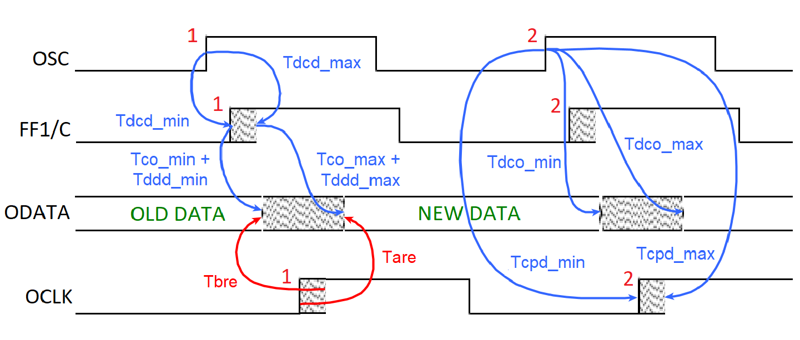

_Рисунок 6. Временная диаграмма сигналов внутри Device._

Как при Center Aligned, данные запускаются и защелкиваются по одному и тому же фронту тактового сигнала. С помощью рисунка 6 и уравнений \(\ref{eq:2}\), можно получить следующий выражения для Slack:

$$
Slack\_setup = T_{cpd\_min} + T_{cbd\_min} + T_{fcd\_min} - T_{dco\_max} - T_{dbd\_max} - T_{fdd\_max} - T_{su}
$$

$$
Slack\_hold = T_{clk} + T_{dco\_min} + T_{dbd\_min} + T_{fdd\_min} - T_{cpd\_max} - T_{cbd\_max} - T_{fcd\_max} - T_h
$$

Рассмотрим два временных интервала $T_{bre\_dev}$ и $T_{are\_dev}$, которые обозначены на рисунке 6 красным цветом. Значение Tbre_dev равно разности между моментом появления тактового фронта и моментом, когда старые данные пропадут с выхода Device. В свою очередь $T_{are\_dev}$ соответствует промежутку времени между установкой на выходе Device новых данных и появлением тактового фронта.  

Из рисунка 6 легко получить следующие уравнения для самого пессимистичного случая:

\begin{equation}
T_{bre\_dev} = T_{cpd\_max} - T_{dco\_min}
\tag{9}
\label{eq:9}
\end{equation}

$$
T_{are\_dev} = T_{dco\_max} - T_{cpd\_min}
$$

Также пересчитаем эти соотношения относительно входов FPGA, учитывая задержки распространения по дорожка печатной платы:

\begin{equation}
T_{bre\_fpga} = T_{cpd\_max} + T_{cbd\_max} - T_{dco\_min} - T_{dbd\_min}
\tag{10}
\label{eq:10}
\end{equation}

$$
T_{are\_fpga} =  T_{dco\_max} T_{dbd\_max} - T_{cpd\_min} - T_{dbd\_min}
$$

Подставим уравнения \(\ref{eq:10}\) в выражения для Slack и получим: 

$$
Slack\_setup = T_{clk} - T_{clk} - T_{are\_fpga} + T_{fcd\_min} - T_{fdd\_max} - T_{su}
$$

$$
Slack\_hold = T_{clk} - T_{bre\_fpga} + T_{fdd\_min} - T_{fcd\_max} - T_h
$$

Как и при Center Aligned в уравнение для Slack_setup дополнительно добавлены слагаемые $T_{clk}$ с положительным и отрицательным знаком. Сопоставив найденные выражения для Slack с уравнениями \(\ref{eq:3}\) и \(\ref{eq:4}\), можно записать следующие равенства:

\begin{equation}
input\_delay\_max = T_{clk} + T_{are\_fpga}
\tag{11}
\label{eq:11}
\end{equation}

$$
input\_delay\_min = T_{clk} - T_{bre\_fpga}
$$

Данный результат совпадает с Vivado Language Templates, который описывает входные ограничения для случая Source Synchronous Edge Aligned и представлен ниже:
```tcl
# Edge-Aligned Rising Edge Source Synchronous Inputs 
# (Using a direct FF connection)
#
# For an edge-aligned Source Synchronous interface, the clock
# transition occurs at the same time as the data transitions.
# In this template, the clock is aligned with the beginning of the
# data. The constraints below rely on the default timing
# analysis (setup = 1 cycle, hold = 0 cycle).
#
# input    __________                  ________________
# clock              |________________|                |__________
#                                     |
#                             skew_bre|skew_are 
#                             <------>|<------> 
#             ________________        |        ________________
# data     XXX________________XXXXXXXXXXXXXXXXX____Rise_Data___XXX
#
set input_clock         <clock_name>;     # Name of input clock
set input_clock_period  <period_value>;   # Period of input clock
set skew_bre            0.000;            # Data invalid before the rising clock edge
set skew_are            0.000;            # Data invalid after the rising clock edge
set input_ports         <input_ports>;    # List of input ports

# Input Delay Constraint
set_input_delay -clock $input_clock -max [expr $input_clock_period + $skew_are] 
[get_ports $input_ports];
set_input_delay -clock $input_clock -min [expr $input_clock_period - $skew_bre] 
[get_ports $input_ports];  
```
## 6. Source Synchronous Edge Aligned MMCM
В заключении рассмотрим еще один вариант передачи данных, который в Vivado называется Edge Aligned MMCM. При этом способе передачи тактовый сигнал выравнивается относительно правой границы окна валидных данных, что соответствует дополнительной задержке $T_{ecd} = T_{clk}$. Тактовый фронт, задержанный на один период, совпадает по времени с появлением следующего фронта. Таким образом при Edge Aligned MMCM данные запускаются текущим фронтом, а защелкиваются – следующим. 

Временные диаграммы сигналов внутри Device совпадают с представленными на рисунке 6, однако теперь запускающему фронту соответствует фронт _№1_, а защелкивающему – фронт _№2_. Если считать, что фронт №1 появляется в нулевой момент времени, то уравнения для Slack примут вид: 

$$
Slack\_setup = T_{clk} + T_{cpd\_min} + T_{cbd\_min} + T_{fcd\_min} - T_{dco\_max} - T_{dbd\_max} - T_{fdd\_max} - T_{su}
$$

$$
Slack\_hold = T_{dco\_min} + T_{dbd\_min} + T_{fdd\_min} - T_{cpd\_max} - T_{cbd\_max} - T_{fcd\_max} - T_h
$$

Временные интервалы $T_{bre\_dev}$, $T_{are\_dev}$, $T_{bre\_fpga}$ и $T_{are\_fpga}$ задаются тем же способом, что и для случая Edge Aligned, и удовлетворяют уравнениям \(\ref{eq:9}\) и \(\ref{eq:10}\). Подставив выражения для $T_{bre\_fpga}$ и $T_{are\_fpga}$ в уравнения для Slack, получим:

$$
Slack\_setup = T_{clk} - T_{are\_fpga} + T_{fcd\_min} - T_{fdd\_max} - T_{su}
$$


$$
Slack\_hold = - T_{bre\_fpga} + T_{fdd\_min} - T_{fcd\_max} - T_h
$$

Сравнивая данные результаты с уравнениями \(\ref{eq:3}\) и \(\ref{eq:4}\), можем записать следующие соотношения:

\begin{equation}
input\_delay\_max = T_{are\_fpga}
\tag{12}
\label{eq:12}
\end{equation}

$$
input\_delay\_min = T_{bre\_fpga}
$$

Пример из Vivado Language Templates, соответствующий Source Synchronous Edge Aligned (MMCM), представлен ниже:
```tcl
 # Edge-Aligned Rising Edge Source Synchronous Inputs 
# (Using an MMCM/PLL)
#
# For an edge-aligned Source Synchronous interface, the clock
# transition occurs at the same time as the data transitions.
# In this template, the clock is aligned with the end of the
# data. The constraints below rely on the default timing
# analysis (setup = 1 cycle, hold = 0 cycle).
#
# input    __________                  ________________
# clock              |________________|                |__________
#                                     |
#                             skew_bre|skew_are 
#                             <------>|<------> 
#            _________________        |        _________________
# data     XX____Rise_Data____XXXXXXXXXXXXXXXXX_________________XX

set input_clock         <clock_name>;     # Name of input clock
set skew_bre            0.000;            # Data invalid before the rising clock edge
set skew_are            0.000;            # Data invalid after the rising clock edge
set input_ports         <input_ports>;    # List of input ports

# Input Delay Constraint
set_input_delay -clock $input_clock -max $skew_are  [get_ports $input_ports];
set_input_delay -clock $input_clock -min -$skew_bre [get_ports $input_ports];     
```
Приведем некоторые соображения относительно, того почему в названии данного способа выравнивания тактового сигнала присутствует слово MMCM. Пусть Device формирует тактовый сигнал, который выровнен по левому краю окна (случай Edge Aligned), а данные запускаются и защелкиваются одним и тем же фронтом. Также пусть перед тем, как поступить на защелкивающий триггер, тактовый сигнал проходит через MMCM или PLL. При такой конфигурации весьма вероятно нарушение ограничений при анализе по Setup. 

Причина возможных проблем в следующем. Если MMCM (или PLL) тактирует триггер, на который поступает сигнал с ножки FPGA, то для данного MMCM Vivado автоматически устанавливает компенсацию в режим ZHOLD [4]. В этом режиме MMCM формирует для тактового сигнала “отрицательную” задержку, чтобы гарантировать отсутствие проблем для анализа по Hold. Это мотивируется тем, что их исправление возможно потребует увеличить длину дорожек данных на печатной плате, что трудоемко и нежелательно. Можно сказать, что с помощью отрицательной задержки MMCM “ускоряет” распространение тактового сигнала.

Однако быстрое прибытие тактового сигнала приводит к проблеме при анализе по Setup, так как данные не успевают дойти до защелкивающего триггера. Возможное решение – защелкивать данные не текущим, а следующим фронтом, что соответствует Edge Aligned MMCM. В качестве альтернативы можно вручную установить MMCM в режим компенсации INTERNAL, но Xilinx не рекомендует данный способ.

## 7. Простой пример для ADS4249
В качестве первого практического примера создадим временные ограничения на входные сигналы, поступающие в FPGA из АЦП ADS4249 [5]. На рисунке 7 приведены таблица со значениями задержек и временная диаграмма сигналов из datasheet на ADS4249. Для краткости ограничения будут продемонстрированы для одного входного порта FPGA. 

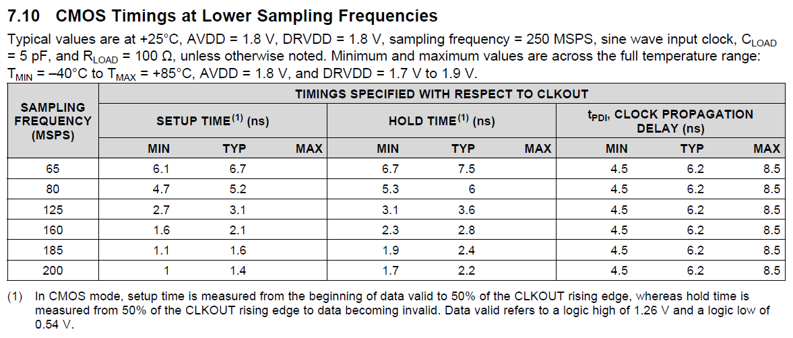

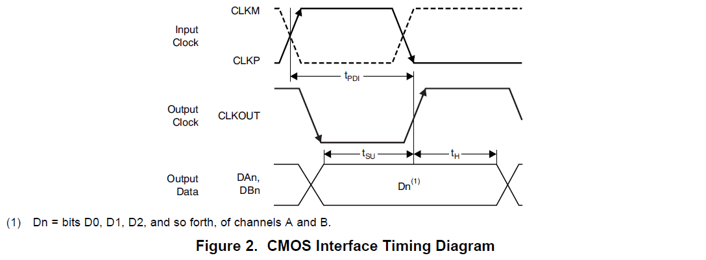

_Рисунок 7. Задержки и временные диаграммы для ADS4249._

Будем считать, что минимальные и максимальные задержки распространения данных и тактового сигнала по дорожкам печатной платы известны. В качестве примера примем следующие значения в наносекундах: $T_{dbd\_max} = 0.15$, $T_{dbd\_min} = 0.1$, $T_{cbd\_max} = 0.12$ и $T_{cbd\_min} = 0.07$. Эти значения заносятся в файл с временными ограничениями (xdc-файл):
```tcl
# минимальное и максимальное время распространения данных по дорожкам платы
set Tdbd_max 0.15
set Tdbd_min 0.1

# минимальное и максимальное время распространения тактового 
# сигнала по дорожкам платы
set Tcbd_max 0.12
set Tcbd_min 0.07
Пусть требуется, чтобы данные передавались на максимальной частоте дискретизации, которая для ADS4249 равна 200 МГц. В этом случае ограничение на период тактового сигнала можно записать в виде: 

# период тактового сигнала CLKOUT
set Tclk 5

# ограничение на период тактового сигнала
create_clock -period $Tclk -name ICLK [get_ports ICLK]
```
Глядя на рисунок 7, становится очевидно, то мы имеем дело c Center Aligned. Также сопоставляя диаграммы для ADS4249 с рисунком 5 получаем, что $T_{bre\_dev} = T_{su}$ и $T_{are\_dev} = T_h$. Будем рассматривать самый пессимистичный случай, которому соответствует минимальная ширина окна валидных данных, то есть $T_{su} = 1.7 нс$ и $T_h = 1 нс$. Эти значения также внесем в xdc-файл:
```tcl
# время удержания данных после тактового сигнала на выходе ADS4249 
set Tare_dev 1.7

# время между появлением данных и тактовым сигналом на выходе ADS4249  
set Tbre_dev 1        
```
На этом этапе у нас достаточно информации для расчета $T_{bre\_fpga}$ и $T_{are\_fpga}$, а также создания временных ограничений для входного сигнала IDATA. Для этого используем уравнения \(\ref{eq:7}\) и \(\ref{eq:8}\) и внесем следующие команды в xdc-файл (более подробно о назначении команд и их параметров можно прочитать в [2]): 
```tcl
# время удержания данных после тактового сигнала на входе FPGA 
set Tare_fpga [expr $Tare_dev + $Tdbd_min - $Tcbd_max]

# время между появлением данных и тактовым сигналом на входе FPGA  
set Tbre_fpga [expr $Tbre_dev + $Tcbd_min - $Tdbd_max]

# временные ограничение для входного сигнала IDATA
set_input_delay -clock ICLK -max [expr $Tclk - $Tbre_fpga] [get_ports IDATA]
set_input_delay -clock ICLK -min $Tare_fpga [get_ports IDATA]
```
Рассмотрим, как введенные ограничения будут отражены во временных отчетах, полученных после размещения и трассировки проекта. На рисунке 8 показаны расчеты фактического и требуемого времени прибытия данных для анализа по Setup.

Представленные результаты можно интерпретировать следующим образом. Из раздела Destination Clock Path можно увидеть, что защелкивающий фронт поступает на вход FPGA в момент времени 5 нс. С учетом задержки распространения по дорожкам платы (`Tcbd_min`) это означает, что на тактовом выходе ADS4249 этот фронт формируется в момент времени 5 – 0.07 = 4.93 нс. 

Данные на выходе ADS4249 появляются на `Tsu` нс раньше тактового фронта, после чего распространяются по плате в течении Tdbd_max нс. Таким образом до ножки IDATA FPGA данные дойдут в момент времени 4.93 – 1 + 0.15 = 4.08 нс. Это соответствует значению задержки входных данных (input delay) из раздела Data Path, так как Vivado считает, что запускающий фронт начинает передачу на один период раньше, то есть в нулевой момент времени.   

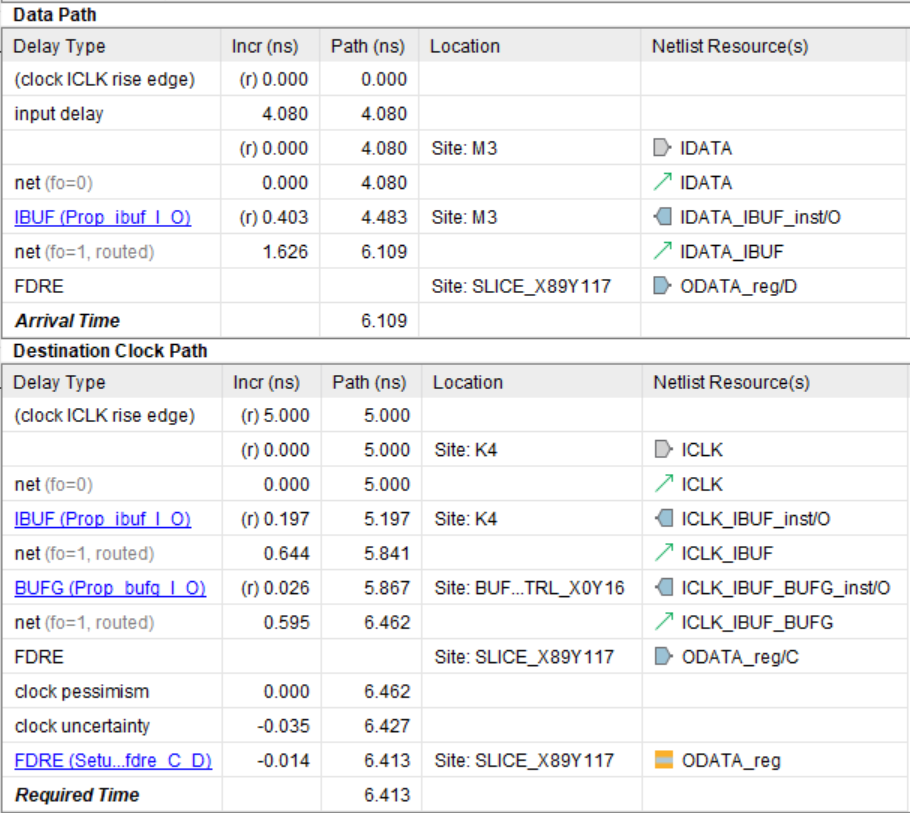

_Рисунок 8. Результаты временного анализа по Setup._

Можно предложить и другую интерпретацию. Зная задержки вне и внутри FPGA можно рассчитать окно валидных данных относительно входа защелкивающего триггера. Данные будут приняты правильно, если защелкивающий фронт попадет в это окно с учетом времени удержания и установки приемного триггера. Анализ по Setup проводится для случая, когда данные распространяются максимально медленно, а защелкивающий фронт – максимально быстро. Если фиксировать окно валидных данных во времени и увеличивать скорость распространения тактового сигнала, то это будет соответствовать смещению защелкивающего фронта к левой границе окна (см. рисунок 5). 

Величина $T_{bre\_fpga}$ позволяет рассчитать, насколько тактовый сигнал может сдвинуться относительно данных внутри FPGA, чтобы все еще попасть в окно валидных данных. Для нашего примера значение $T_{bre\_fpga}$ равно 1 + 0.07 – 0.15 = 0.92 нс. Если учесть издержки на время установки триггера, а также джиттер и неопределенность для тактового сигнала, то максимально допустимый сдвиг фронта относительно данных внутри FPGA составит 0.92 – 0.035 – 0.014 = 0.871 нс.

Из рисунка 8 можно увидеть, что тактовый сигнал внутри FPGA получает суммарную задержку в 1.462 нс, а данные – в 0.403 +1.626 = 2.029 нс. Фактическая задержка данных относительно такового сигнала равна 2.029 – 1.462 = 0.567 нс, что меньше максимально допустимой задержки в 0.871 нс. Величина запаса 0.871 – 0.567 = 0.305 нс совпадает с рассчитанным с помощью рисунка 8 значением Slack = 6.413 – 6.109 = 0.304 нс.

Аналогичным образом рассмотрим результаты анализа по Hold, представленные на рисунке 9. Анализ по Hold проводится для случая, когда данные распространяются максимально быстро, а защелкивающий фронт – максимально медленно. Если зафиксировать во времени окно валидных данных и уменьшать скорость распространения тактового сигнала, то защелкивающий фронт будет смещаться к правой границе окна (см. рисунок 5).

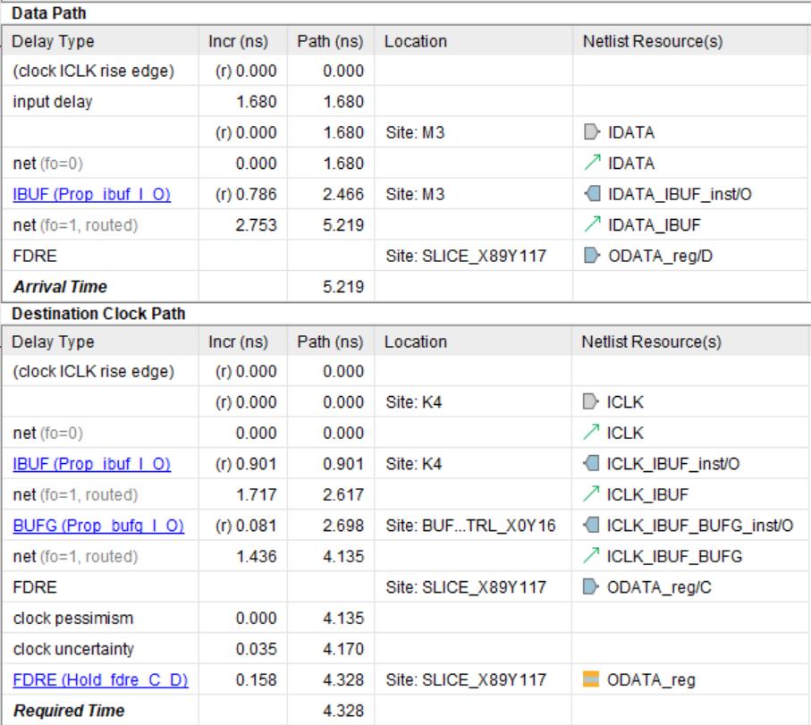

_Рисунок 9. Результаты временного анализа по Hold._

Для расчета максимально допустимого сдвига тактового сигнала относительно данных внутри FPGA временному анализатору требуется значение `Tare_fpga`, которое в нашем примере равно 1.7 + 0.1 – 0.12 = 1.68 нс. Тогда с учетом времени удержания триггера и неопределенности тактового сигнала получим, что максимально допустимый сдвига фронта относительно данных составляет 1.68 – 0.035 – 0.158 = 1.487 нс. 

Как видно из рисунка 9 суммарная задержка данных внутри FPGA равна 0.786 + 2.753 = 3.539 нс, а задержка тактового сигнала – 4.135 нс. Фактическая задержка данных относительно такового сигнала равна разности 4.135 – 3.539 = 0.596 нс. Это значение меньше максимально допустимой задержки в 1.487 нс. Величина запаса составляет 1.487 – 0.596 = 0.891 нс. При расчете с помощью рисунка 9 получаем тот же результат для Slack = 5.219 – 4.328 = 0.891 нс.      

Из представленных выше рассуждений можно увидеть, что для интерпретации временных отчетов требуется приложить определенные усилия. Это связано с тем, что при Center Aligned данные запускаются и защелкиваются одним и тем же фронтом тактового сигнала, в то время как Vivado считает, что данные принимаются по следующему фронту.

## 8. Более сложный пример для LAN8740A
В предыдущем примере для ADS4249 было очевидно, что требуется создавать временные ограничения с использованием шаблона для Center Aligned. Такая ситуация бывает не всегда.

Предположим, что требуется по MII принимать данные от микросхемы Ethernet PHY LAN8740A [6]. На рисунке 10 приведены таблица со значениями задержек и временная диаграмма сигналов из datasheet на LAN8740A. Для удобства на временную диаграмму добавлены номера фронтов тактового сигнала. Также данные, которые требуется принять, отмечены цветом. 

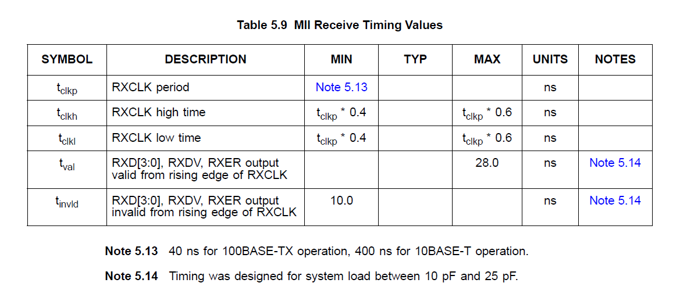

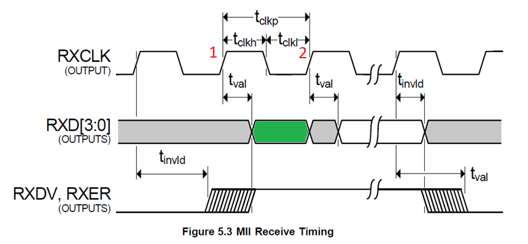

_Рисунок 10. Задержки и временные диаграммы для LAN8740A._

Из таблицы задержек получаем, что старые данные удерживаются на шине RXD в течении Тinvld = 10 нс после фронта №1. Также видно, что после того же фронта нужные данные появляются на выходе LAN8740A спустя Тval = 28 нс. Будем считать, что LAN8740A работает режиме 100BASE-TX, и зададим те же, что и в предыдущем примере, значения задержек распространения сигналов по дорожкам платы. В этом случае в xdc-файл следует занести следующие команды: 
```tcl
# период тактового сигнала 
set Tclk 40

# ограничение на период тактового сигнала
create_clock -period $Tclk -name ICLK [get_ports ICLK]

# минимальное и максимальное время распространения данных по дорожкам платы
set Tdbd_max 0.15
set Tdbd_min 0.1

# минимальное и максимальное время распространения тактового сигнала 
# по дорожкам платы
set Tcbd_max 0.12
set Tcbd_min 0.07

# время удержания старых данных после тактового сигнала на выходе LAN8740A
set Tinvld 10

# время между появлением тактового сигнала и данных на выходе LAN8740A
set Tval 28
```
Если перерисовать временные диаграммы, соблюдая масштабы задержек, то способ выравнивания тактового сигнала относительно данных станет более очевидным. Однако давайте просто последовательно разберем все три возможных шаблона создания временных ограничений.

Сначала попробуем защелкнуть интересующие нас данные по тактовому фронту №1, что соответствует случаю Edge Aligned. Если сопоставить временные диаграммы для LAN8740A с рисунком 6, то становится очевидно равенство Tare_dev = Тval. На рисунке 6 предполагается, что старые данные пропадают с выхода Device до появления защелкивающего фронта, а на диаграммах для LAN8740A – после. Это расхождение можно учесть с помощью знака задержки, то есть Tbre_dev = -Тinvld. Тогда, если вспомнить уравнения \(\ref{eq:11}\), то оставшаяся часть xdc-файла примет вид: 
```tcl
# исчезновения старых данных до тактового сигнала на выходе Device 
set Tbre_dev -$Tinvld 

# появления новых данных после тактового сигнала на выходе Device 
set Tare_dev $Tval

# исчезновения старых данных до тактового сигнала на входе FPGA 
set Tbre_fpga [expr $Tbre_dev + $Tcbd_max - $Tdbd_min]

# появления новых данных после тактового сигнала на входе FPGA  
set Tare_fpga [expr $Tare_dev + $Tdbd_max - $Tcbd_min]

# временные ограничение для входного сигнала IDATA
set_input_delay -clock ICLK -max [expr $Tclk + $Tare_fpga] [get_ports IDATA]
set_input_delay -clock ICLK -min [expr $Tclk - $Tbre_fpga] [get_ports IDATA]
```
В дальнейшем для краткости будем рассматривать только анализ по Setup. На рисунке 11 показан раздел Summary временного отчета, в котором отрицательное значение Slack указывает на нарушение временных ограничений. Если считать, что фронт №1 формируется на выходе генератора в нулевой момент времени, то на входе FPGA он появится спустя Tcbd_min = 0.07 нс. Передаваемые данные дойдут до FPGA в момент времени Тval + Tdbd_max = 28.15 нс. Такой большой разброс между временем прихода защелкивающего фронта и данных является причиной отрицательного значения Slack = – 27.199 нс.   


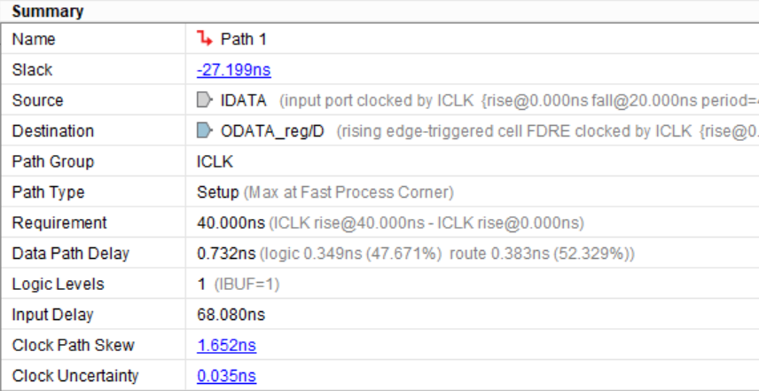

_Рисунок 11. Результаты временного анализа (Edge Aligned)._

С этой проблемой можно справиться, если защелкивать данный по фронту №2, что соответствует случаю Edge Aligned MMCM. Для создания ограничений теперь необходимо использовать уравнения \(\ref{eq:12}\). Содержимое xdc-файла почти полностью совпадает с ограничениями для Edge Aligned и представлено ниже:
```tcl
# исчезновения старых данных до тактового сигнала на выходе Device 
set Tbre_dev -$Tinvld 

# появления новых данных после тактового сигнала на выходе Device 
set Tare_dev $Tval

# исчезновения старых данных до тактового сигнала на входе FPGA 
set Tbre_fpga [expr $Tbre_dev + $Tcbd_max - $Tdbd_min]

# появления новых данных после тактового сигнала на входе FPGA  
set Tare_fpga [expr $Tare_dev + $Tdbd_max - $Tcbd_min]

# временные ограничение для входного сигнала IDATA
set_input_delay -clock ICLK -max $Tare_fpga [get_ports IDATA]
set_input_delay -clock ICLK -min -$Tbre_fpga [get_ports IDATA]
```
На рисунке 12 показан раздел Summary временного отчета для случая Edge Aligned MMCM. Можно увидеть, что теперь Slack имеет положительное значение, а значит временные ограничения выполнены.

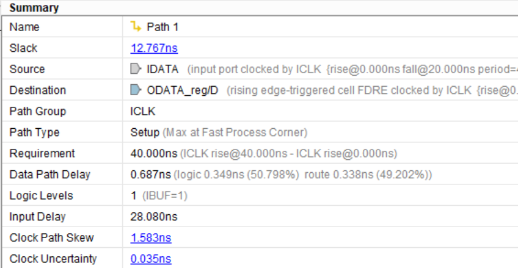

_Рисунок 12. Результаты временного анализа (Edge Aligned MMCM)._

Если подставить в уравнения \(\ref{eq:12}\) числовые значения всех задержек, то получим следующий результат:

$$
input\_delay\_max = T_{are\_fpga} = 28 + 0.15 - 0.07 = 28.08 нс
$$

$$
input\_delay\_min = -T_{bre\_fpga} = -(-10 + 0.12 - 0.1) = 9.98 нс
$$

В качестве последнего примера рассмотрим, что произойдет, если попытаться защелкнуть данные по тактовому фронту _№2_, но задать ограничения как Center Aligned. Из временных диаграмм видно, что после появления фронта _№2_ данные будут удерживаться на выход LAN8740A в течении $Т_{invld}$ нс, то есть $T_{are\_dev} = Т_{invld}$. С помощью рисунка 5 также легко получить равенство $T_{bre\_dev} = Т_{clk} – Т_{val}$. С учетом уравнений \(\ref{eq:7}\) и \(\ref{eq:8}\) внесем следующие команды в файл временных ограничений:
```tcl
# время удержания данных после тактового сигнала на выходе Device 
set Tare_dev $Tinvld 

# время между появлением данных и тактовым сигналом на выходе Device 
set Tbre_dev [expr $Tclk - $Tval] 

# время удержания данных после тактового сигнала на входе FPGA 
set Tbre_fpga [expr $Tbre_dev + $Tcbd_min - $Tdbd_max]

# время между появлением тактового сигнала и данных на входе FPGA  
set Tare_fpga [expr $Tare_dev + $Tdbd_min - $Tcbd_max]

# временные ограничение для входного сигнала IDATA
set_input_delay -clock ICLK -max [expr $Tclk - $Tbre_fpga] [get_ports IDATA]
set_input_delay -clock ICLK -min $Tare_fpga [get_ports IDATA]
```
Если изучить раздел Summary временного отчета для выравнивания Center Aligned, то можно увидеть, что он полностью совпадает с рисунком 12.  Далее подставив в уравнения \(\ref{eq:7}\) и \(\ref{eq:8}\) числовые значения всех задержек, получим, что

$$
input\_delay\_max = 40 - (40 - 28 + 0.07 - 0.15) = 28.18 нс
$$

$$
input\_delay\_min = 10 + 0.12 - 0.1 = 9.98 нс
$$

Те же самые значения были получены ранее для при Edge Aligned MMCM. Это не удивительно, так как в обоих случаях одни и те же данные защелкивались по одному и тому же фронту. Этот пример показывает, что временные диаграммы можно рассматривать с различных точек зрения и выбирать вариант наиболее удобный для создания временных ограничений и интерпретации результатов.  

## Заключение
В статье был рассмотрен временной анализ при Source Synchronous передаче сигналов в FPGA из внешнего устройства. Показан вывод уравнений статического временного анализа для трех различных вариантов выравнивания данных относительно тактового сигнала. Разобраны два практических примера создания временных ограничений.

## Ссылки

1. [Основы статического временного анализа. Часть 1: Period Constraint](timings1_intro.md)

2. [Основы статического временного анализа. Часть 2.1: System Synchronous Input Delay Constraint](timings2_input_delay.md)

3. [Основы статического временного анализа. Часть 2.2: System Synchronous Output Delay Constraint](timings2_output_delay.md)

4. [7 Series FPGAs Clocking Resources (UG 472)](https://www.xilinx.com/support/documentation/user_guides/ug472_7Series_Clocking.pdf)

5. [Datasheet ADS4249](https://www.ti.com/lit/ds/symlink/ads4249.pdf?ts=1647862853770&ref_url=https%253A%252F%252Fwww.google.com%252F)

6. [Datasheet LAN8740A](http://www.datasheet.es/PDF/1021686/LAN8740A-pdf.html)