# Основы статического временного анализа. Часть 4: Source Synchronous Output Delay Constraint

*О найденных опечатках и замечаниях просим сообщить в чате сообщества.*

## Введение

В статье представлен временной анализ передачи сигналов из FPGA во внешнее устройство. Рассмотрены теоретические основы анализа для двух возможных случаев приема данных: по текущему и следующему фронту тактового сигнала. Разобраны практические примеры создания временных ограничений. Показан способ решения проблемы с временными ограничениями по Setup за счет инвертирования тактового сигнала и использования ODDR триггера.

## 1. Передача данных для случая Source Synchronous.
Данная статья частично опирается на материал, рассмотренный в предыдущих работах [1-2]. Предполагается, что читатель уже знаком с такими понятиями, как ограничение на максимальное (Setup) и минимальное (Hold) время распространения сигнала, запас (Slack) и т.д.

Ранее в [2] был представлен временной анализ передачи данных из FPGA во внешнее устройство в случае, когда тактовый сигнал формируется генератором, расположенным на плате (см. рисунок 1). Такой способ передачи называется System Synchronous.

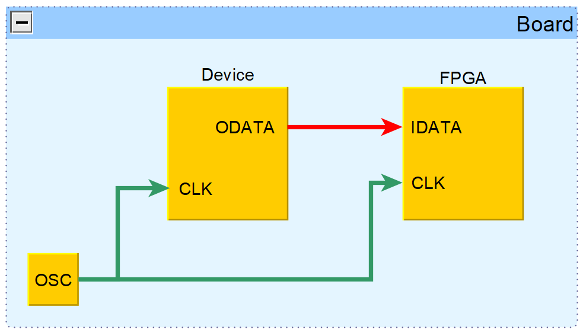

_Рисунок 1. Соединение устройств на плате для случая System Synchronous._

В текущей статье будет рассмотрен другой способ, называемый Source Synchronous, при котором источник помимо данных также формирует тактовый сигнал (см. рисунок 2). В дальнейшем для краткости устройство, в которое из FPGA передаются данные и тактовый сигнал, будем иногда называть Device.


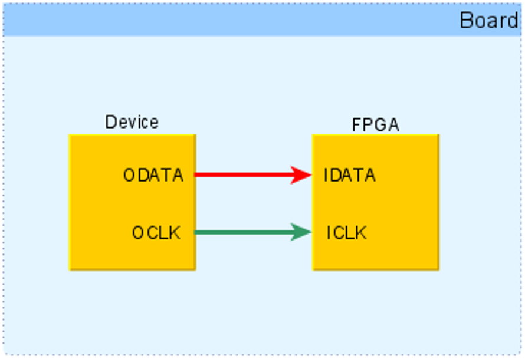

_Рисунок 2. Соединение устройств на плате для случая Source Synchronous._

При передаче данных между FPGA и Device запускающий триггер располагается в FPGA, а защелкивающий – во внешнем устройстве. На рисунке 3 показан анализируемый путь, на который нанесены задержки сигналов. Тактовый сигнал, передаваемый вместе с данными, тем или иным способом создается внутри FPGA, и его источник обозначен, как CLK Source. 

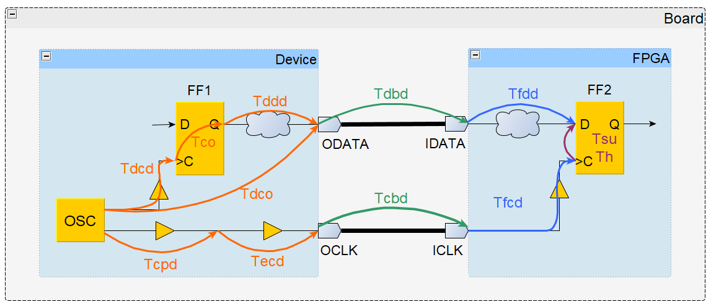

_Рисунок 3. Путь с задержками для выходных данных и тактового сигнала._

Ниже даны определения задержек, представленных на рисунке 3. 

- $T_{dbd}$ (_Data Board Delay_) – задержка распространения данных по дорожкам платы от Device до FPGA;
- $T_{cbd}$ (_Clock Board Delay_) – задержка распространения тактового сигнала по дорожкам платы от Device до FPGA;
- $T_{dcd}$ (_Device Clock Delay_) – задержка тактового сигнала от генератора OSC до тактового входа запускающего триггера;
- $T_{co}$ (_Clock to Output_) – интервал времени между приходом фронта на тактовый вход триггера и появлением данных на его выходе Q;
- $T_{ddd}$ (_Device Data Delay_) – задержка распространения данных от запускающего триггера до ножки ODATA Device;
- $T_{cpd}$ (_Clock to Pin Delay_) – задержка тактового сигнала от генератора OSC до ножки OCLK Device;
- $T_{ecd}$ (_Edge Clock Delay_) – дополнительная задержка тактового сигнала, зависящая от способа выравнивания фронта относительно данных;
- $T_{fcd}$ (_FPGA Clock Delay_) – задержка тактового сигнала от ножки ICLK FPGA до тактового входа защелкивающего триггера;
- $T_{fdd}$ (_FPGA Data Delay_) – задержка распространения данных от ножки IDATA FPGA до защелкивающего триггера;
- $T_{su}$ (_SetUp time_) – время установки защелкивающего триггера; 
- $T_{h}$ (_Hold time_) – время удержания защелкивающего триггера. 

Период тактового сигнала будем обозначать Tclk. Оранжевым и зеленым цветом на рисунке 3 представлены задержки для участков пути, которые располагаются вне FPGA. Эти задержки необходимо указать временному анализатору Vivado.

2. Максимальное время распространения.
Для начала рассмотрим ограничения на максимальное время распространения (Setup). Напомним, что временной анализ по Setup всегда проводится для самого пессимистичного случая, которому соответствует максимально задержанный запускающий фронт, максимально медленное распространение данных и максимально быстро распространяющийся защелкивающий фронт.

Глядя на рисунок 3, найдем фактическое время прибытия данных, как сумму задержек распространения запускающего фронта и данных: 

$$
T_{da\_setup} = T_{fco\_max} + T_{dbd\_max} + T_{ddd\_max}
$$

\begin{equation}
T_{fco\_max} = T_{fcd\_max} + T_{co\_max} + T_{fdd\_max}
\tag{1}
\label{eq:1}
\end{equation}

где $T_{fco\_max}$ (_**F**PGA **C**lock to **O**utput time_) – временной интервал между формированием запускающего фронта и появлением данных на выходе FPGA.

В дальнейшем будут рассмотрены два варианта передачи данных между FPGA и Device. В первом случае данные будет запускаться из FPGA по одному фронту, а защелкиваться в Device – по следующему. Во втором случае данные будут запускаться и защелкиваться одним и тем же фронтом тактового сигнала. Чтобы описать оба этих варианта, введем дополнительную переменную $T_{ccd\_setup}$ (_**C**apture **C**lock **D**elay_), которая задает задержку между появлением запускающего и защелкивающего фронтов. До того, как к защелкивающему триггеру придет фронт, данные уже должны быть стабильны на его входе в течение времени $T_{su}$. Поэтому требуемое время прибытия данных равно разнице между суммарной задержкой защелкивающего фронта и временем установки триггера:


$$
T_{dr\_setup} = T_{ccd\_setup} + T_{clk\_delay\_min} - T_{su}
$$

\begin{equation}
T_{clk\_delay\_min} = T_{cpd\_min} + T_{cbd\_min} + T_{dcd\_min}
\tag{2}
\label{eq:2}
\end{equation}

где $T_{clk\_delay\_min}$ – задержка распространения защелкивающего фронта от его источника в FPGA до триггера в Device (см. рисунок 3). Уравнение для Slack при анализе по Setup имеет вид [1]:

$$
Slack\_setup = T_{dr\_setup} - T_{da\_setup}
$$

Подставим в него выражения \(\ref{eq:1}\) и \(\ref{eq:2}\) и получим:

$$
Slack\_setup = T_{ccd\_setup} + T_{cpd\_min} - T_{fco\_max} + T_{cpd\_min} - T_{dsu} - T_{dbd\_max}
$$

$$
T_{dsu} = T_{ddd\_max} + T_{su} - T_{dcd\_min}
$$


где $T_{dsu}$ (Device SetUp) – время установки для данных на входе IDATA Device относительно тактового входа `ICLK` (см. рисунок 3).

Объединим все слагаемые, описывающие задержки вне FPGA, в одну переменную и получим выражение для Slack при анализе по Setup:

$$
Slack\_setup = T_{ccd\_setup} - T_{fco\_max} - T_{fpga\_ext\_setup}
$$

\begin{equation}
T_{fpga\_ext\_setup} = T_{dsu} + T_{dbd\_max} - T_{cbd\_min}
\tag{3}
\label{eq:3}
\end{equation}

## 3. Минимальное время распространения.
Теперь изучим, как выполняется проверка ограничения на минимальное время распространения (Hold). При анализе по Hold рассматриваются соотношения между текущим запускающим и предыдущим защелкивающим фронтами. При этом считается, что задержки для запускающего фронта и данных имеют минимальное значение, а для защелкивающего фронта – максимальное. По аналогии с рассмотренным ранее анализом по Setup запишем уравнение для фактического времени прибытия данных:

$$
T_{da\_hold} = T_{fco\_min} + T_{dbd\_min} + T_{ddd\_min}
$$

$$
T_{fco\_min} = T_{fcd\_min} + T_{co\_min} + T_{fdd\_min}
$$

Далее найдем требуемое время прибытия данных. Для этого нужно рассчитать максимальную задержку для защелкивающего фронта и добавить к ней время удержания триггера [1]:  

$$
T_{dr\_hold} = T_{ccd\_hold} + T_{clk\_delay\_max} + T_{h}
$$

$$
T_{clk\_delay\_max} = T_{cpd\_max} + T_{cbd\_max} + T_{dcd\_max}
$$

где $T_{ccd\_hold}$ – временной интервал между появлением текущего запускающего и предыдущего защелкивающего фронтов тактового сигнала. Уравнение для Slack при анализе по Hold имеет вид [1]:

$$
Slack\_hold = T_{da\_hold} - T_{dr\_hold}
$$

С учетом полученных ранее результатов имеем:

$$
Slack\_hold = T_{fco\_min} - T_{cpd\_max} - T_{ccd\_hold} + T_{dbd\_min} - T_{cbd\_max} - T_{dh}
$$

$$
T_{dh} = T_{ddd\_min} + T_h - T_{dcd\_max}
$$

где $T_{dh}$ (Device Hold) – время удержания для данных на входе `IDATA` Device относительно тактового входа `ICLK` (см. рисунок 3).

Объединим все задержки вне FPGA в одну переменную и получим окончательное выражение для Slack при анализе по Hold:

$$
Slack\_hold = T_{fco\_min} - T_{cpd\_max} - T_{ccd\_hold} - T_{fpga\_ext\_hold}
$$

\begin{equation}
T_{fpga\_ext\_hold} = T_{dh} + T_{cbd\_max} - T_{dbd\_min}
\tag{4}
\label{eq:4}
\end{equation}

## 4. Пример с защелкиванием данных по следующему фронту.
Для начала разберем ситуацию, когда данные запускаются из FPGA одним фронтом тактового сигнала, а защелкиваются – следующим. В этом случае значение $T_{ccd\_setup}$ будет равно периоду тактового сигнала $T_{clk}$, а $T_{ccd\_hold}$ – нулю, так как текущий запускающий и предыдущий защелкивающий фронты появляются в один и тот же момент времени. С учетом этого для уравнений \(\ref{eq:3}\) и \(\ref{eq:4}\) получим:

$$
Slack\_setup = T_{clk} + T_{cpd\_min} - T_{fco\_max} - T_{fpga\_ext\_setup}
$$

\begin{equation}
Slack\_hold = T_{fco\_min} - T_{cpd\_max} - T_{fpga\_ext\_hold}
\tag{5}
\label{eq:5}
\end{equation}

Все задержки вне FPGA объединены в слагаемых $T_{fpga\_ext\_setup}$ и $T_{fpga\_ext\_hold}$. Их необходимо указать Vivado в виде следующих временных ограничений:

$$
output\_delay\_max = T_{fpga\_ext\_setup} = T_{dsu} + T_{dbd\_max} - T_cbd\_min
$$

\begin{equation}
output\_delay\_min = -T_{fpga\_ext\_hold} = T_{dbd\_min} - T_{dh} - T_{cbd\_max}
\tag{6}
\label{eq:6}
\end{equation}

В качестве практического примера рассмотрим передачу данных по RMII из FPGA в микросхему Ethernet PHY LAN8740A [3]. На рисунке 4 приведены таблица со значениями задержек и временная диаграмма сигналов из datasheet на LAN8740A. Для краткости ограничения будут продемонстрированы для одного выходного сигнала FPGA, который подключен к ножке `TXD[0]` микросхемы LAN8740A.


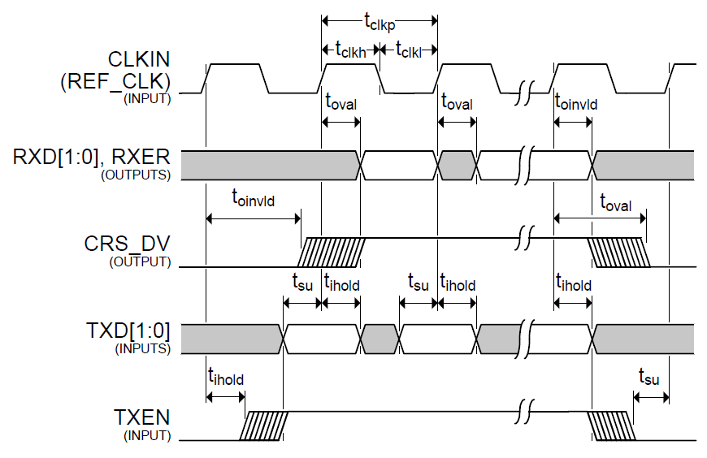

_Рисунок 4. Задержки и временные диаграммы для LAN8740A._

В FPGA загрузим простой проект, состоящий из единственного триггера (см. рисунок 5). Этого вполне достаточно для демонстрации того, как в Vivado проводится временной анализ для выходных сигналов. Ниже показано описание проекта на System Verilog:
```verilog
module top (
    input  logic i_clk,
    input  logic i_data,
    output logic o_clk,
    output logic o_data
);
    always_ff @(posedge i_clk)
        o_data <= i_data;        
    assign o_clk = i_clk;
endmodule
```

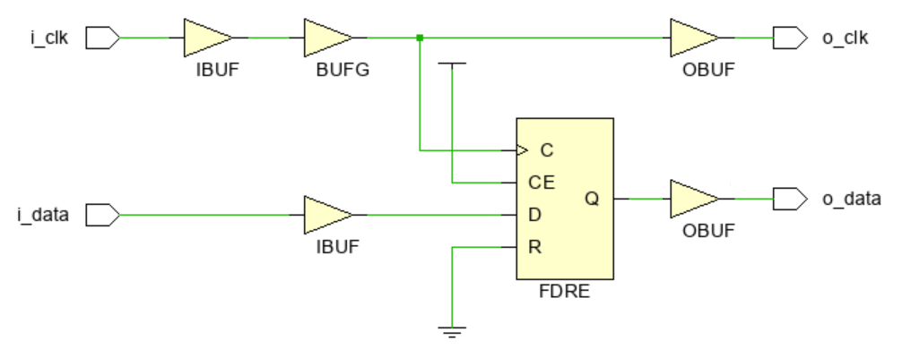

_Рисунок 5. Схема FPGA проекта._

Будем считать, что минимальные и максимальные задержки распространения данных и тактового сигнала по дорожкам печатной платы известны. В качестве примера примем следующие значения в наносекундах: $T_{dbd\_max} = 0.15$, $T_{dbd\_min} = 0.1$, $T_{cbd\_max} = 0.12$ и $T_{cbd\_min} = 0.07$. Эти значения заносятся в файл с временными ограничениями (xdc-файл):
```tcl
# минимальное и максимальное время распространения данных по дорожкам платы
set Tdbd_max 0.15
set Tdbd_min 0.1

# минимальное и максимальное время распространения тактового 
# сигнала по дорожкам платы
set Tcbd_max 0.12
set Tcbd_min 0.07
```
Выходной тактовый сигнал на ножке `o_clk` является копией сигнала, поступающего из вне на ножку `i_clk`, поэтому их периоды совпадают и равны $T_{clk}$. Из рисунка 4 находим период этих сигналов, а также время установки $T_{dsu}$ и удержания $T_{dh}$ для LAN8740A. Эти значения также внесем в xdc-файл и сразу создадим ограничение на период тактового сигнала `i_clk`:
```tcl
# период тактового сигнала 
set Tclk 20

# время установки и удержания для микросхемы LAN8740A
set Tdsu 4.0
set Tdh 1.5

# ограничение на период входного тактового сигнала
create_clock -period $Tclk -name i_clk [get_ports i_clk]
```
Внутри FPGA новый тактовый сигнал всегда создается из уже существующего (опорного), например, с помощью PLL или деления частоты на основе счетчика. Несмотря на то, что для тактирования микросхемы LAN8740A мы фактически используем входной сигнал `i_clk`, Vivado считает, что из `i_clk` создается новый тактовый сигнал `o_clk`. Его параметры нужно указать в xdc-файле, чтобы он мог учувствовать во временном анализе. Для создания временных ограничений на тактовые сигналы, формируемые внутри FPGA, используется команда `create_generated_clock`: 
```tcl
# ограничение на период выходного тактового сигнала
create_generated_clock -name o_clk -source [get_ports i_clk] -divide_by 1 [get_ports o_clk]
```
С помощью ключа `-source` задается источник опорного сигнала. а ключ `-divide_by` указывает, на сколько делится его частота. В нашем случае опорный сигнал появляется на ножке FPGA `i_clk`, поэтому для флага -source задается конструкция `[get_ports i_clk]`. Так как периоды опорного (`i_clk`) и создаваемого (`o_clk`) сигналов совпадают, значение флага `-divide_by` равно единице. С помощью флага `-name` указывается имя формируемого тактового сигнала, а конструкция `[get_ports o_clk]` определяет место, которое считается его источником.

Теперь осталось создать ограничения на максимальное и минимальное время распространения выходного сигнала o_data. Для этого воспользуемся формулами \(\ref{eq:6}\) и запишем в xdc-файл следующие команды:
```tcl
# временные ограничения для выходного сигнала o_data
set_output_delay -clock o_clk -max [expr $Tdbd_max - $Tcbd_min + $Tdsu] [get_ports o_data]
set_output_delay -clock o_clk -min [expr $Tdbd_min - $Tcbd_max - $Tdh]  [get_ports o_data]
```
Обратите внимание, что флагу `-clock` присвоено имя тактового сигнала `o_clk`, созданного ранее с помощью команды `create_generated_clock`. Более подробно о назначении других флагов можно прочитать в [2]. Полное содержимое xdc-файла представлено ниже:

```tcl
# период тактового сигнала 
set Tclk 20

# время установки и удержания для микросхемы LAN8740A
set Tdsu 4.0
set Tdh 1.5

# минимальное и максимальное время распространения данных по дорожкам платы
set Tdbd_max 0.15
set Tdbd_min 0.1

# минимальное и максимальное время распространения тактового сигнала 
# по дорожкам платы
set Tcbd_max 0.12
set Tcbd_min 0.07

# ограничение на период входного тактового сигнала
create_clock -period $Tclk -name i_clk [get_ports i_clk]

# ограничение на период выходного тактового сигнала
create_generated_clock -name o_clk -source [get_ports i_clk] -divide_by 1 [get_ports o_clk]

# временные ограничения для выходного сигнала o_data
set_output_delay -clock o_clk -max [expr $Tdbd_max - $Tcbd_min + $Tdsu] [get_ports o_data]
set_output_delay -clock o_clk -min [expr $Tdbd_min - $Tcbd_max - $Tdh]  [get_ports o_data]
```
Рассмотрим, как введенные ограничения будут отражены во временных отчетах, полученных после размещения и трассировки проекта. Для краткости в дальнейшем будет рассмотрено только ограничение по Setup. 

На рисунке 6 представлен раздел Summary временного отчета. Из строки с именем Source можно увидеть, что путь внутри FPGA начинается на входе триггера `o_data_reg`, при этом запускающим является тактовый сигнал `i_clk`. Строка Destination указывает, что данные выдаются через выходную ножку `o_data` и защелкиваются по сигналу `o_clk`. Положительное значение Slack, равное 10.763 нс, означает, что временные ограничения выполнены.

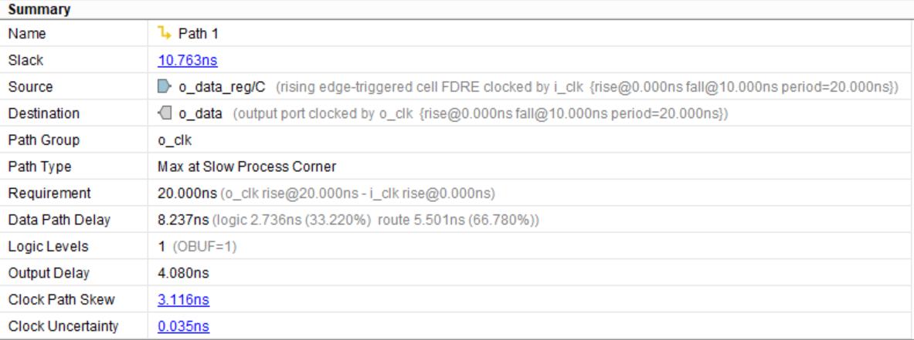

_Рисунок 6. Раздел **Summary** для анализа по Setup._

На рисунке 7 показаны задержки распространения для запускающего фронта и данных. Можно увидеть, что фронт сигнала `i_clk` появляется в нулевой момент времени и проходит через входной и тактовый буферы. Через 4.392 нс он достигает тактовой ножки триггера и запускает передачу данных. В свою очередь данные распространяются через выходной буфер и попадают на выход `o_data` в момент времени 12.628 нс.

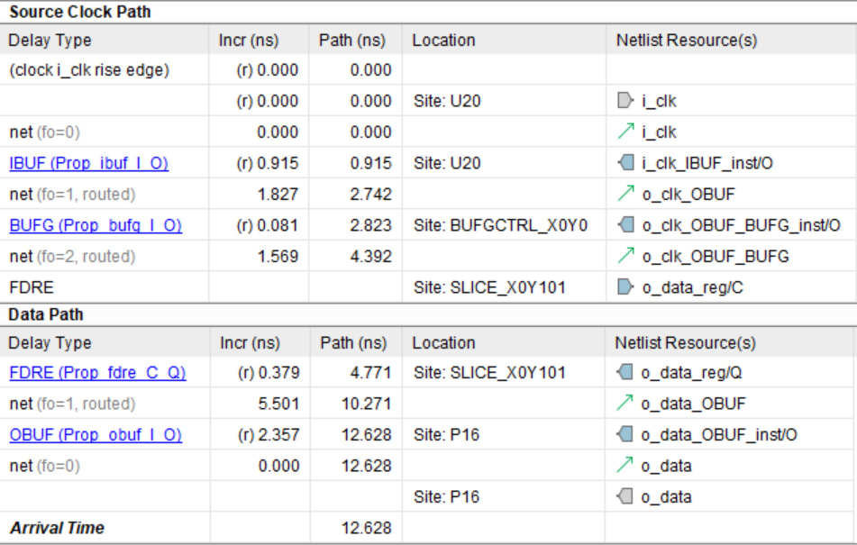

_Рисунок 7. Задержки запускающего фронта и данных._

Как видно из рисунка 8, защелкивающий фронт `o_clk` формируется из фронта опорного сигнала `i_clk`, который появляется в момент времени 20 нс. Этот фронт распространяется через входной, тактовый и выходной буферы и появляется на ножке FPGA, когда время равно 27.214 нс. 

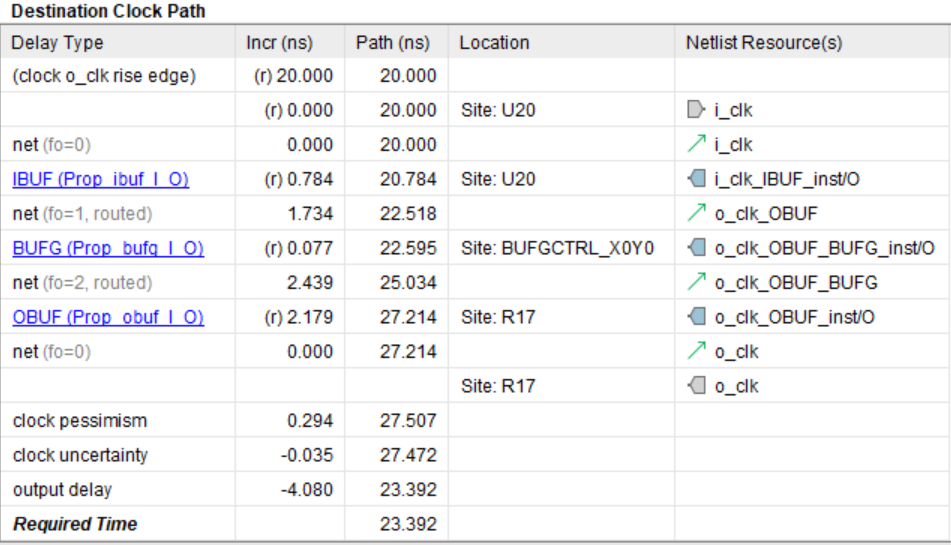

_Рисунок 8. Задержки защелкивающего фронта._

Задержки распространения данных и тактового сигнала по дорожкам платы, а также время установки для LAN8740A учитываются с помощью слагаемого `output delay`, значение которого в соответствии с \(\ref{eq:6}\) равно 4.0+0.15–0.07=4.08 нс. Добавляя неопределенность и пессимизм для тактового сигнала [1], получаем, что данные должны появиться на ножке `o_data` FPGA не позже, чем через 23.392 нс после запускающего фронта `i_clk`. Вычитая из этого значения фактическое время прибытия данных на выход FPGA, получаем 23.392–12.628=10.764 нс, что соответствует величине Slack из рисунка 6.

В предыдущем примере все задержки вне FPGA были объединены в одно слагаемое, что может усложнить создание ограничений. Часть задержек вносятся с положительными знаками, а часть – с отрицательными. За этим нужно внимательно следить, чтобы не перепутать и не совершить ошибку. Можно немного упростить себе жизнь, если задержки распространения тактового сигнала указывать отдельно с помощью команды `clock_latency`. Для нашего примера в xdc-файл следует внести следующие команды:
```tcl
# задержки распространения тактового сигнала от FPGA до LAN8740A
set_clock_latency -min $Tcbd_min [get_clocks o_clk]
set_clock_latency -max $Tcbd_max [get_clocks o_clk]
```
С помощью флагов `-max` и `-min` задаются минимальная ($T_{cbd\_min}$) и максимальная ($T_{cbd\_max}$) задержки распространения тактового сигнала от выхода FPGA до микросхемы LAN8740A. Так как эти задержки указываются отдельно, их нужно убрать из уравнений \(\ref{eq:6}\), которые теперь примут вид:

$$
output\_delay\_max = T_{dbd\_max} + T_{dsu}
$$

\begin{equation}
output\_delay\_min = T_{dbd\_min} - T_{dh}
\tag{7}
\label{eq:7}
\end{equation}

Полное содержимое обновленного xdc-файла представлено ниже:

```tcl
# период тактового сигнала 
set Tclk 20

# время установки и удержания для микросхемы LAN8740A
set Tdsu 4.0
set Tdh 1.5

# минимальное и максимальное время распространения данных по дорожкам платы
set Tdbd_max 0.15
set Tdbd_min 0.1

# минимальное и максимальное время распространения тактового сигнала по 
# дорожкам платы
set Tcbd_max 0.12
set Tcbd_min 0.07

# ограничение на период входного тактового сигнала
create_clock -period $Tclk -name i_clk [get_ports i_clk]

# ограничение на период выходного тактового сигнала
create_generated_clock -name o_clk -source [get_ports i_clk] -divide_by 1 [get_ports o_clk]

# задержки распространения тактового сигнала от FPGA до LAN8740A
set_clock_latency -min $Tcbd_min [get_clocks o_clk]
set_clock_latency -max $Tcbd_max [get_clocks o_clk]

# временные ограничения для выходного сигнала o_data
set_output_delay -clock o_clk -max [expr $Tdbd_max + $Tdsu] [get_ports o_data]
set_output_delay -clock o_clk -min [expr $Tdbd_min - $Tdh]  [get_ports o_data]
```
Задержки для защелкивающего фронта представлены на рисунке 9. Можно увидеть, что в отчете появилась дополнительная строка _ideal clock network latency_, соответствующая времени распространения тактового сигнала от FPGA до LAN8740A. Все остальные задержки останутся теми же, что и на рисунках 6-8.

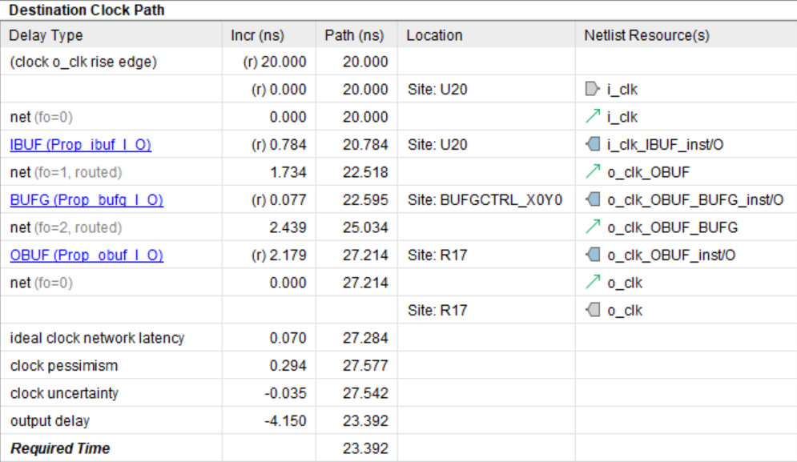

_Рисунок 9. Задержки защелкивающего фронта._

Заметим также, что соотношения \(\ref{eq:7}\) можно обнаружить в Vivado Language Templates, если открыть вкладку XDC:
```tcl
#  Rising Edge Source Synchronous Outputs 
#
#  Setup and hold requirements for the destination device and board 
#  trace delays are known.
#  
# forwarded         ____                      ___________________ 
# clock                 |____________________|                   |____________ 
#                                            |
#                                     tsu    |    thd
#                                <---------->|<--------->
#                                ____________|___________
# data @ destination    XXXXXXXXX________________________XXXXX
set fwclk        <clock-name>;     # forwarded clock name 
set tsu          0.000;            # destination device setup time requirement
set thd          0.000;            # destination device hold time requirement
set trce_dly_max 0.000;            # maximum board trace delay
set trce_dly_min 0.000;            # minimum board trace delay
set output_ports <output_ports>;   # list of output ports

# Output Delay Constraints
set_output_delay -clock $fwclk -max [expr $trce_dly_max + $tsu] [get_ports $output_ports];
set_output_delay -clock $fwclk -min [expr $trce_dly_min - $thd] [get_ports $output_ports];
```

Выходной тактовый сигнал FPGA, который в наших обозначениях имеет имя `o_clk`, здесь называется `fwclk` (forwarded clock). Максимальные ($T_{dbd\_max}$) и минимальные ($T_{dbd\_min}$) задержки распространения данных по дорожкам платы указаны, как `trce_dly_max` и `trce_dly_min`. Задержки `tsu` и `thd` соответствуют времени установки и удержания для микросхемы LAN8740A.

## 5. Пример с защелкиванием данных по текущему фронту.

Рассмотрим второй вариант, при котором данные запускаются и защелкиваются одним и тем же тактовым фронтом. В этом случае защёлкивающий и запускающий фронты появляются одновременно, поэтому значение $T_{ccd\_setup}$ равно нулю. В свою очередь предыдущий защелкивающий фронт появляется на один период раньше текущего запускающего фронта, а значит задержка между ними равна $T_{ccd\_hold} = –T_{clk}$. С учетом всего вышесказанного уравнения \(\ref{eq:3}\) и \(\ref{eq:4}\) примут вид: 

$$
Slack\_setup = T_{cpd\_min} - T_{fco\_max} - T_{fpga\_ext\_setup}
$$

\begin{equation}
Slack\_hold = T_{clk} + T_{fco\_min} - T_{cpd\_max} - T_{fpga\_ext\_hold}
\tag{8}
\label{eq:8}
\end{equation}

Важно отметить, что во время проведения временного анализа Vivado считает, что данные запускаются одним тактовым фронтом, а защелкиваются – следующим. По этой причине при расчете значения Slack Vivado будет использовать формулы \(\ref{eq:5}\) из предыдущего раздела.

Уравнение \(\ref{eq:8}\) для анализа по Hold отличается от \(\ref{eq:5}\) только наличием дополнительного слагаемого $T_{clk}$. В уравнении для Setup это слагаемое наоборот отсутствует. Если в него добавить и вычесть $T_{clk}$, то получим:

$$
Slack\_setup = T_{clk} - T_{clk} + T_{cpd\_min} - T_{fco\_max} - T_{fpga\_ext\_setup}
$$

Введем новые переменные и представим уравнения \(\ref{eq:8}\) в следующем виде:

$$
T_{fpga\_ext\_setup\_2} = T_{fpga\_ext\_setup} + T_{clk}
$$

$$
T_{fpga\_ext\_hold\_2} = T_{fpga\_ext\_hold} - T_{clk}
$$

$$
Slack\_setup = T_{clk} + T_{cpd\_min} - T_{fco\_max} - T_{fpga\_ext\_setup\_2}
$$

$$
Slack\_hold = T_{fco\_min} - T_{cpd\_max} - T_{fpga\_ext\_hold\_2}
$$


Полученные результаты с точностью до обозначений совпадают с уравнениями \(\ref{eq:5}\). Теперь с учетом предыдущего раздела можем записать временные ограничения для выходных данных:

$$
output\_delay\_max = T_{fpga\_ext\_setup\_2} = T_{clk} + T_{dsu} + T_{dbd\_max} - T_{cbd\_min}
$$

\begin{equation}
output\_delay\_min =  T_{fpga\_ext\_hold\_2} = T_{clk}+ T_{dbd\_min} - T_{dh}  - T_{cbd\_max}
\tag{9}
\label{eq:9}
\end{equation}

В качестве примера опять рассмотрим передачу данных из FPGA в микросхему LAN8740A по RMII. Будем использовать те же самые значения задержек для данных и тактового сигнала. xdc-файл почти не изменится по сравнению с предыдущим случаем за исключением команды `set_output_delay`. Его содержимое представлено ниже: 
```tcl
# период тактового сигнала 
set Tclk 20

# время установки и удержания для микросхемы LAN8740A
set Tdsu 4.0
set Tdh 1.5

# минимальное и максимальное время распространения данных по дорожкам платы
set Tdbd_max 0.15
set Tdbd_min 0.1

# минимальное и максимальное время распространения тактового сигнала 
# по дорожкам платы
set Tcbd_max 0.12
set Tcbd_min 0.07

# ограничение на период входного тактового сигнала
create_clock -period $Tclk -name i_clk [get_ports i_clk]

# ограничение на период выходного тактового сигнала
create_generated_clock -name o_clk -source [get_ports i_clk] -divide_by 1 [get_ports o_clk]

# задержки распространения тактового сигнала от FPGA до LAN8740A
set_clock_latency -min $Tcbd_min [get_clocks o_clk]
set_clock_latency -max $Tcbd_max [get_clocks o_clk]

# временные ограничения для выходного сигнала o_data
set_output_delay -clock o_clk -max [expr $Tclk + $Tdbd_max + $Tdsu] [get_ports o_data]
set_output_delay -clock o_clk -min [expr $Tclk + $Tdbd_min - $Tdh] [get_ports o_data]
```
Проведем размещение и трассировку проекта и рассмотрим результаты для анализа по Setup. На рисунке 10 представлен раздел Summary. Отрицательное значение Slack указывает на нарушение временных ограничений. Чтобы выяснить источник проблемы, изучим задержки распространения данных и тактового сигнала, показанные на рисунках 11 и 12.

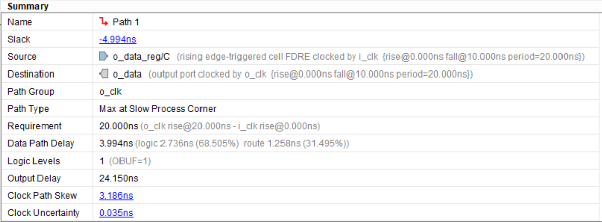

_Рисунок 10. Раздел **Summary** для анализа по Setup._

Из рисунка 11 видно, что фронт сигнала `i_clk` появляется в нулевой момент времени, распространяется до триггера `o_data_reg` и запускает передачу данных, которые спустя 8.363 нс достигают выходной ножки FPGA. 

Теперь взглянем на рисунок 12. Фронт сигнала `i_clk`, из которого в дальнейшем будет сформирован защелкивающий фронт на выходе `o_clk`, появляется через 20 нс, то есть спустя один период. Как уже упоминалось, это связано с тем, что Vivado при проведении временного анализа считает, что данные запускаются одним фронтом, а защелкиваются – следующим. 

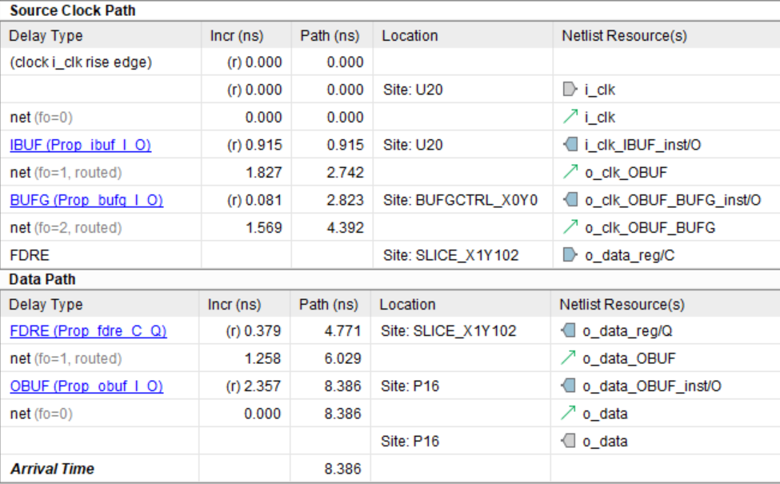

_Рисунок 11. Задержки запускающего фронта и данных._

Если сравнить значение `output delay`, равное -24.15 нс, со значением на рисунке 9, то увидим, что они различаются как раз на 20 нс. За счет этой разницы компенсируется задержка появления фронта `i_clk` в первой строке рисунка 12. С учетом неопределённости и пессимизма тактового сигнала получаем, что данные должны достигнуть ножки `o_data` FPGA в момент времени 3.392 нс. Фактическое же время прибытия данных равно 8.386 нс. Это на 4.994 нс позже, чем требуется, а значит данные распространяются слишком медленно.

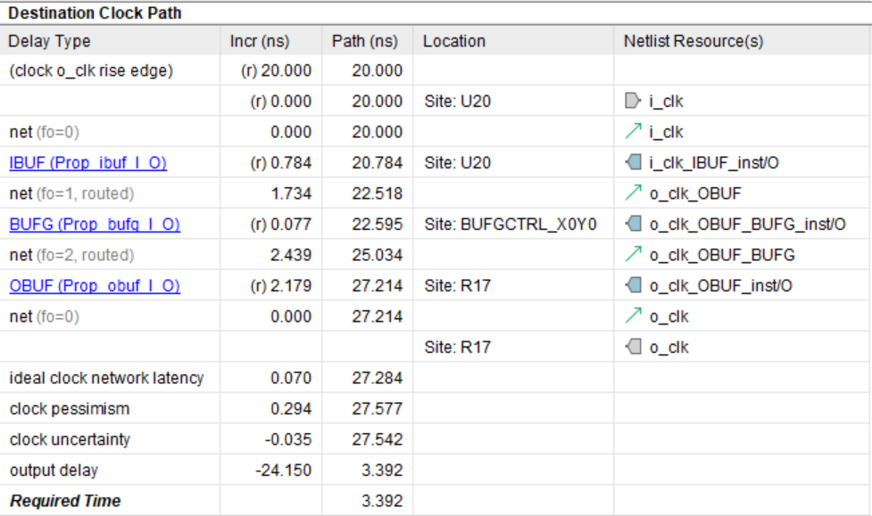

_Рисунок 12. Задержки защелкивающего фронта._

Решение этой проблемы будет представлено в следующем разделе, а пока давайте рассмотрим еще один способ создания временных ограничений на выходные сигналы FPGA. Иногда бывает удобно вводить ограничения в виде задержек между данными и тактовым сигналом, которые измерены непосредственно на ножках FPGA. Такой подход называется FPGA Centric. При анализе по Setup считается, что тактовый сигнал распространяется максимально быстро, а данные – максимально медленно, поэтому будем предполагать, что данные появляются позже тактового фронта. Введем переменную $T_{are\_skew}$ (After Rising Edge) и из рисунка 3 получим:

$$
T_{are\_skew} = T_{fco\_max} - T_{cpd\_min}
$$

Возвращаясь к уравнениям \(\ref{eq:8}\), запишем выражение для $Slack\_setup$ в виде:

$$
Slack\_setup = - T_{are\_skew} - T_{fpga\_ext\_setup}
$$

Значение $T_{fpga\_ext\_setup}$ задается конфигурацией печатной платы и внешними микросхемами и с его помощью можно оценить предельно допустимую величину $T_{are\_skew}$, при которой временные ограничения все еще будут выполнены. Это соответствует ситуации, когда значение $Slack\_setup$ равно нулю, откуда получаем:

$$
T_{fpga\_ext\_setup} = - T_{are\_skew}
$$

$$
T_{are\_skew} = -T_{dsu} -  T_{dbd\_max} + T_{cpd\_min}
$$

Теперь рассмотрим задержки для анализа по Hold. Будем считать, что тактовый сигнал распространяется максимально медленно, а данные – максимально быстро, и введем переменную $T_{bre\_skew}$ (Before Rising Edge):

$$
T_{bre\_skew} = T_{cpd\_max} - T_{fco\_min}
$$

Если провести аналогичные рассуждения и приравнять значение Slack_hold в формуле \(\ref{eq:8}\) к нулю, то получим: 

$$
Slack\_hold = T_{clk} - T_{bre\_skew} - T_{fpga\_ext\_hold}
$$

$$
T_{fpga\_ext\_hold} = T_{clk} - T_{bre\_skew}
$$

$$
T_{bre\_skew} = T_{clk} + T_{dbd\_min} - T_{dh} - T_{cbd\_max}
$$

В итоге, если подставить полученные результаты в уравнения \(\ref{eq:9}\), то ограничения на выходной сигнал FPGA можно записать виде:

$$
output\_delay\_max = T_{clk} - T_{are\_skew}
$$

$$
output\_delay\_min = T_{bre\_skew}
$$

Эти соотношения также присутствуют в Vivado Language Templates:
```tcl
#  Rising Edge Source Synchronous Outputs 
#
#  Source synchronous output interfaces can be constrained either by the
# max data skew relative to the generated clock or by the destination 
# device setup/hold requirements.
##
# forwarded                _____________        
# clock        ___________|             |_________
#                         |                        
#                 bre_skew|are_skew          
#                 <------>|<------>        
#           ______        |        ____________    
# data      ______XXXXXXXXXXXXXXXXX____________XXXXX
#
set fwclk           <clock_name>;   # forwarded clock name 
set fwclk_period    <period_value>; # forwarded clock period
set bre_skew        0.000;          # skew requirement before rising edge
set are_skew        0.000;          # skew requirement after rising edge
set output_ports    <output_ports>; # list of output ports
# Output Delay Constraints
set_output_delay -clock $fwclk -max [expr $fwclk_period - $are_skew] [get_ports $output_ports];
set_output_delay -clock $fwclk -min $bre_skew [get_ports $output_ports];
```

## 6. Инвертирование тактового сигнала.

Рассмотрим один из возможных вариантов решения проблемы с нарушением временных ограничений из предыдущего раздела. Отрицательное значение $Slack\_setup$ указывает, что данные распространяются слишком медленно. Чтобы они успели достичь защелкивающего триггера, можно ввести дополнительную задержку для тактового сигнала. Для этого выполним инверсию сигнала `i_clk` перед его выдачей на выход FPGA.

После инвертора фронты такового сигнала превратятся в спады, а спады – во фронты. По отношению к текущему фронту ближайший спад появляется спустя половину периода. Далее после инверсии он превращается во фронт и попадает на выходную ножку FPGA. Если считать, что период тактового сигнала равен 20 нс, то с помощью таких преобразований мы фактически дополнительно задерживаем защелкивающий фронт на 10 нс.

Код проекта для FPGA с внесенными изменениями представлен ниже. На рисунке 13 показана его схема. Можно увидеть, что в схеме появился дополнительный LUT, выполняющий инверсию сигнала `i_clk`.

```verilog
 module top_2 (
    input  logic i_clk,
    input  logic i_data,
    output logic o_clk,
    output logic o_data
);
    always_ff @(posedge i_clk)
        o_data <= i_data;   
    assign o_clk = ~i_clk;      
endmodule
```

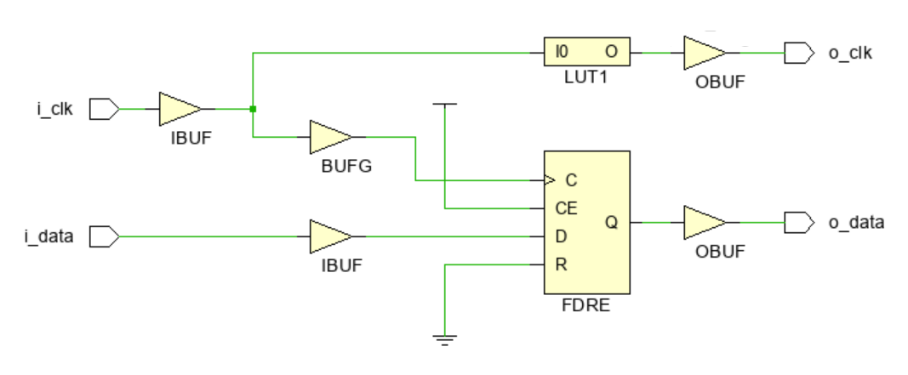

_Рисунок 13. Обновленная схема FPGA проекта._

Обо всех действиях, которые выполняются при формировании выходного тактового сигнала `o_clk`, необходимо сообщить Vivado. Для этого в команду `create_generated_clock` нужно добавить флаг `-invert`. Полное содержимое xdc-файла представлено ниже: 
```tcl
# период тактового сигнала 
set Tclk 20

# время установки и удержания для микросхемы LAN8740A
set Tdsu 4.0
set Tdh 1.5

# минимальное и максимальное время распространения данных по дорожкам платы
set Tdbd_max 0.15
set Tdbd_min 0.1

# минимальное и максимальное время распространения тактового сигнала 
set Tcbd_max 0.12
set Tcbd_min 0.07

# ограничение на период входного тактового сигнала
create_clock -period $Tclk -name i_clk [get_ports i_clk]

# ограничение на период выходного тактового сигнала
create_generated_clock -name o_clk -source [get_ports i_clk] -invert -divide_by 1 [get_ports o_clk]

# задержки распространения тактового сигнала от FPGA до LAN8740A
set_clock_latency -min $Tcbd_min [get_clocks o_clk]
set_clock_latency -max $Tcbd_max [get_clocks o_clk]

# временные ограничения для выходного сигнала o_data
set_output_delay -clock o_clk -max [expr $Tdbd_max + $Tdsu] [get_ports o_data]
set_output_delay -clock o_clk -min [expr $Tdbd_min - $Tdh]  [get_ports o_data]
```
На рисунке 14 представлены задержки распространения защелкивающего фронта при анализе по Setup. Из первой строки можно увидеть, что теперь дополнительная задержка перед появлением фронта составляет 10 нс, то есть половину периода тактового сигнала. 

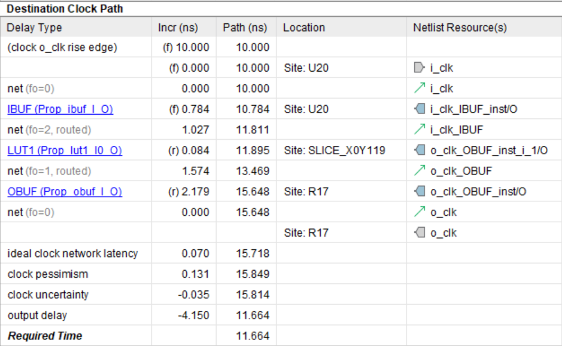

_Рисунок 14. Задержки защелкивающего фронта._

Также обратите внимание, что, несмотря на то, что мы защелкиваем данные текущим фронтом, в xdc-файле в командах `set_output_delay` отсутствуют слагаемые $T_{clk}$ (см. уравнения 9). Напомним, что они вводились для компенсации задержки, которую Vivado автоматически добавлял для защелкивающего фронта. В данном случае эта задержка отсутствует. Как видно из рисунка 15, теперь Slack имеет положительное значение, а значит временные ограничения выполнены, и проблема решена.

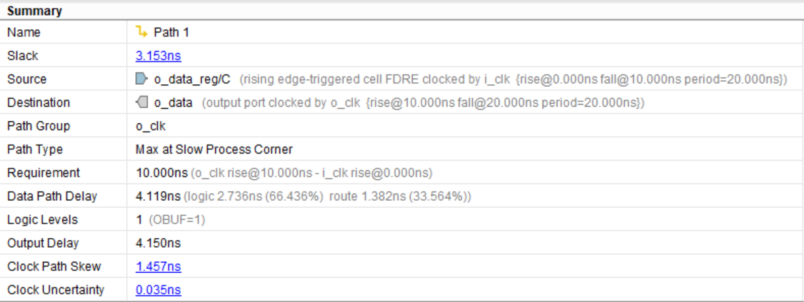

_Рисунок 15. Раздел Summary для анализа по Setup._

## 7. Использование ODDR триггера.

Рассмотренный ранее способ инвертирования тактового сигнала с использованием LUT по некоторым причинам не является лучшим решением. Для формирования выходного тактового сигнала рекомендуется использовать **DDR триггер**. В кристаллах фирмы Xilinx такой триггер находится в _IO Block_, и его можно задействовать в своем проекте с помощью примитива ODDR [4]. Ниже представлен код и схема FPGA проекта, в котором используется ODDR. 
```verilog
 module top_3 (
    input  logic i_clk,
    input  logic i_data,
    output logic o_clk,
    output logic o_data
);
    always_ff @(posedge i_clk)
        o_data <= i_data;
        
    ODDR ODDR_reg (
        .C(i_clk),
        .D1(1'b0),
        .D2(1'b1),
        .Q(o_clk),
        .CE(1'b1),
        .R((1'b0),
        .S((1'b0)
    );    
endmodule
```

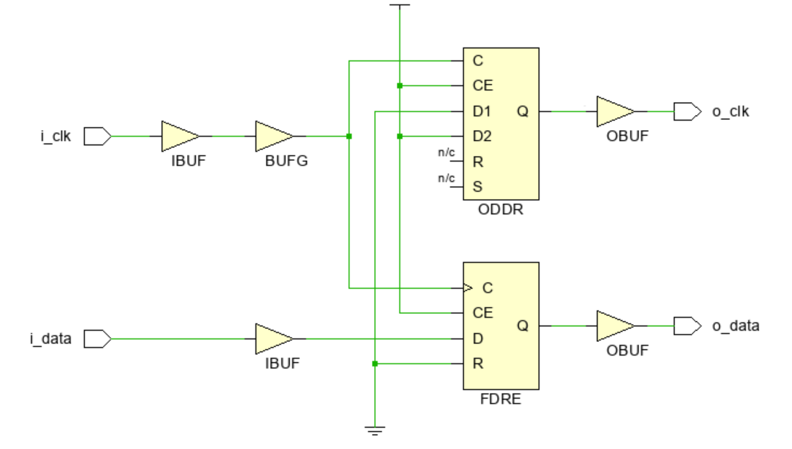

_Рисунок 16. Схема FPGA проекта с ODDR._

Отметим ряд моментов, на которые следует обратить внимание. На тактовый вход `C` ODDR поступает сигнал `i_clk`. В качестве источника для ножки `o_clk` FPGA теперь выступает сигнал с выхода `Q` ODDR. По каждому фронту на входе `C` ODDR сигнал со его входа D1 передается на выход `Q`. В свою очередь значение на входе `D2` попадает на выход `Q` по каждому спаду тактового сигнала.

По коду и на схеме можно увидеть, что на вход `D1` ODDR постоянно подается нулевой сигнал, а на вход `D2` – единичный. Таким образом, по фронту сигнала `i_clk` значение выхода `Q` ODDR изменяется с единицы в ноль, и появляется спад. По каждому спаду `i_clk` прошлое нулевое значение на выходе `Q` изменяется на единичное, и формируется фронт. В результате на выходе `Q` ODDR получается инвертированная копия сигнала i_clk.

Для проведения временного анализа можно использовать xdc-файл из предыдущего раздела без каких-либо изменений. На рисунке 17 представлен раздел Summary временного отчета, который показывает, что ограничения выполнены, причем запас, равный 4.251 нс, оказался даже больше, чем при инвертировании тактового сигнала с помощью LUT. 

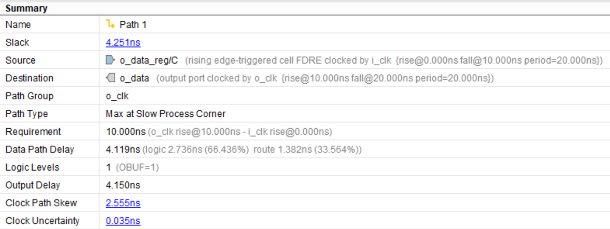

_Рисунок 17. Раздел Summary для анализа по Setup._

Помимо возможности инвертировать сигнал, использование ODDR имеет еще несколько преимуществ [5]. Во-первых, как можно увидеть из рисунка 13, тактовый сигнал перед поступлением на LUT не проходит через тактовый буфер (BUFG), то есть он передается по обычным трассировочным линиям FPGA. В случае с ODDR сигнал все время распространяется по специальным тактовым линиям. Во-вторых, наличие ODDR гарантирует сохранение _duty cycle_ тактового сигнала, что может быть критично при выдаче данных из FPGA в DDR режиме.  

Также в Vivado есть специальный помощник – **Constraints Wizard**, который анализирует проект и подсказывает, на какие его части требуется добавить ограничения. Он находит в _netlist_ элементы, отвечающие за выдачу тактового сигнала с помощью ODDR, и предоставляет удобный способ задания флагов для команды `create_generated_clock`.

Использование DDR триггера никак не скажется на увеличении ресурсов проекта, так как он всегда присутствует в IO Block и в противном случае просто останется незадействованным. Даже наоборот, при инвертировании тактового сигнала можно сэкономить один LUT. 

Исходя и всего выше сказанного, для выдачи тактового сигнала из FPGA крайне рекомендуется всегда использовать DDR триггер, хотя это и не строго обязательно. 

## Заключение

В статье был рассмотрен временной анализ при Source Synchronous передаче сигналов из FPGA во внешнее устройство. Показан вывод уравнений статического временного анализа для двух способов приема данных: по текущему и по следующему фронту тактового сигнала. Приведены аргументы в пользу применения DDR триггера для выдачи тактового сигнала из FPGA.

## Ссылки
1. [Часть 1](./timings1_intro.md)
2. [Часть 2.2](./timings2_output_delay.md)
3. [Datasheet LAN8740A](http://www.datasheet.es/PDF/1021686/LAN8740A-pdf.html)
4. [Xilinx Libraries Guide for HDL Designs (UG 768)](https://www.xilinx.com/htmldocs/xilinx14_7/7series_hdl.pdf)
5. [Xilinx Forum](https://support.xilinx.com/s/question/0D52E00006hpcgDSAQ/why-oddr-for-forwarded-clock?language=en_US)