# Основы статического временного анализа. Часть 6: Multicycle Path Constraint

>О найденных опечатках и замечаниях просим сообщить в чате сообщества.

## Введение

Данная работа завершает серию статей по временным ограничениям в FPGA. В статье продемонстрирована возможность изменения положения запускающих и защёлкивающих фронтов при передаче данных между тактовыми доменами. Показаны несколько практических примеров использования команды `set_multicycle_path`.   

## 1. Пересечение тактовых доменов.

В предыдущей статье [1] был представлен временной анализ передачи данных при пересечении тактовых доменов (Clock Domain Cross) и рассмотрено применение команды `set_false_path`. Так как временные соотношения между фронтами асинхронных тактовых сигналов неизвестны, для них невозможно корректно провести временной анализ. Единственный способ избежать проблем, связанных с метастабильностью – исключить пути между доменами из временного анализа и добавить синхронизаторы.

В случае синхронных доменов все задержки детерминированы и известны, поэтому анализатор может провести точные расчеты. Если все временные ограничения будут выполнены, то можно гарантировать корректность передачи данных. Однако, бывают ситуации, когда из-за определенного соотношения между частотами и фазами тактовых сигналов ограничения оказываются трудновыполнимыми, что приводит к их дальнейшему нарушению.

В этом случае можно, как и для асинхронных доменов, добавить синхронизатор и исключить путь из временного анализа. Этот способ требует дополнительных ресурсов, которые будут потрачены на реализацию синхронизатора. Другим решением является изменение правил выполнения временного анализа. Можно модифицировать способ сопоставления запускающих и защелкивающих фронтов между собой, тем самым ослабляя временные ограничения. Рассмотрим, как это можно сделать. 

На рисунке 1 показан путь, на который нанесены задержки для данных и тактовых сигналов. Чтобы гарантировать синхронность тактовых сигналов, они формируются внутри FPGA с помощью PLL. Передающий триггер `FF1` тактируется сигналом `clk_1`, а приёмный триггер `FF2` – сигналом `clk_2`.

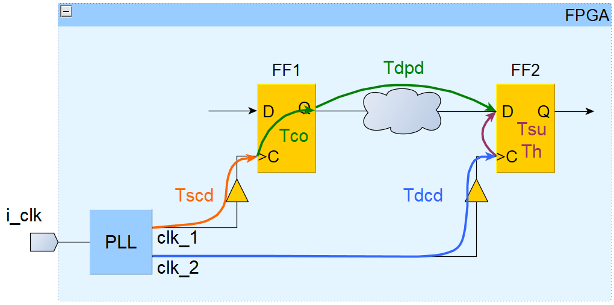

_Рисунок 1. Путь с задержками для данных и тактовых сигналов._

Ниже даны определения задержек, представленных на рисунке 1. 

- $T_{scd}$ (_Source Clock Delay_) – задержка запускающего тактового сигнала от ножки CLK_1 FPGA до тактового входа триггера FF1;
- $T_{dcd}$ (_Destination Clock Delay_) – задержка защелкивающего тактового сигнала от ножки CLK_2 FPGA до тактового входа триггера FF2;
- $T_{co}$ (_Clock to Output_) – интервал времени между приходом фронта на тактовый вход триггера и появлением данных на его выходе Q;
- $T_{dpd}$ (_Data Propagation Delay_) – задержка распространения данных по соединениям и через комбинационную логику;
- $T_{su}$ (_SetUp time_) – время установки защелкивающего триггера; 
- $T_{h}$ (_Hold time_) – время удержания защелкивающего триггера.

Временной анализ для пути на рисунке 1 проводится тем же способом, что и в [1], поэтому сразу запишем уравнения для Slack: 

$$
Slack\_su = \Delta T_{su} + T_{dcd\_min} - T_{scd\_max} - T_{co\_max} - T_{dpd\_max} - T_{su}
$$

$$
Slack\_h = T_{scd\_min} + T_{co\_min} + T_{dpd\_min} - \Delta T_h - T_{dcd\_max} - T_h
$$

где $\Delta T_{su}$ и $\Delta T_h$ – интервалы времени между появлением запускающего фронта `clk_1` и защелкивающего фронта `clk_2` на выходе PLL при анализе по Setup и Hold соответственно:

$$
\Delta T_{su} = T_{clk\_2\_su} - T_{clk\_1\_su}
$$

\begin{equation}
\Delta T_{h} = T_{clk\_2\_h} - T_{clk\_1\_h}
\tag{1}
\label{eq:1}
\end{equation}

В уравнениях для $Slack$ величины слагаемых $\Delta T_{su}$ и $\Delta T_h$ должны рассчитываться исходя из взаимного расположения фронтов тактовых сигналов `clk_1` и `clk_2`. Напомним, каким образом анализатор получает эти значения [2]. В качестве примера будем считать, что период сигнала `clk_1` равен 3 нс, а период `clk_2` – 4 нс. Также пусть в нулевой момент времени формируются фронты обоих тактовых сигналов (см. рисунок 2).

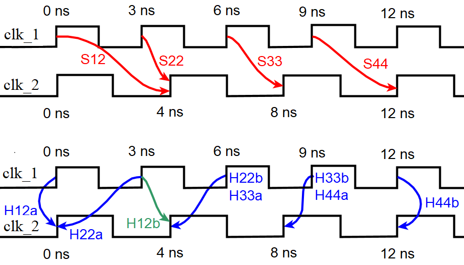

_Рисунок 2. Диаграммы сигналов для временного анализа._

Для начала каждый фронт сигнала `clk_1` рассматривается в качестве запускающего, и ему сопоставляется соответствующий защелкивающий фронт сигнала `clk_2`. По умолчанию выбирается ближайший фронт `clk_2`, который следует после запускающего фронта `clk_1`. На рисунке 2 полученные пары фронтов обозначены как `S12`, `S22`, `S33` и `S44`. Для каждой пары по формуле \(\ref{eq:1}\)  рассчитывается величина $\Delta T_{su}$. В уравнение для $Slack$ слагаемое $\Delta T_{su}$ входит с положительным знаком, поэтому в дальнейшем для временного анализа выбирается пара фронтов с минимальным значение $\Delta T_{su}$, что соответствует самому пессимистичному случаю. В нашем примере это пара `S22`, для которой $\Delta T_{su} = 1 нс$.

Далее временной анализатор вычисляет значение $\Delta T_h$. Для этого для каждой пары фронтов, полученной при расчете $\Delta T_{su}$, проверяются два условия [2]:

- данные, которые передаются по запускающему фронту `clk_1` не должны быть приняты фронтом `clk_2`, который является предыдущим по отношению к текущему защелкивающему фронту `clk_2`;

- данные, которые передаются фронтом `clk_1`, следующим после запускающего, не должны быть приняты текущим защелкивающим фронтом `clk_2`.

Для нашего примера эти условия изображены на рисунке 2 в виде синих стрелок. Например, для пары `S22` первому условию соответствует стрелка `H22a`. Запускающий фронт `clk_1` начинает передачу данных в момент времени 3 нс. Эти данные не должны быть защелкнуты предыдущим фронтом `clk_2`, который появляется также в нулевой момент времени. Второму условию для пары `S22` соответствует стрелка `H22b`. Следующий фронт `clk_1` после запускающего появляется в момент времени 6 нс и начинает новую передачу данных. Эти данные не должны быть приняты текущим защелкивающим фронтом из пары `S22`. 

Для каждого условия по формуле \(\ref{eq:1}\)  вычисляется значение $\Delta T_h$. Например, рассматривая пару фронтов `S22`, для условия `H22а` получаем, что $\Delta T_h = –3 нс$, а для `H22b` – $\Delta T_h = –2 нс$. Временной анализатор рассчитывает величины $\Delta T_h$ для всех условий, показанных синими стрелками на рисунке 2. Самому пессимистичному случаю при анализе по Hold соответствует максимальное значение $\Delta T_h$, так как в уравнение для $Slack$ это слагаемое входит с отрицательным знаком. Для нашего примера значение $\Delta T_h$ равно нулю, что соответствует условию `H12a`.

Обратите внимание, что на рисунке 2 условие `H12b` для пары `S12` обозначено зеленым цветом. Данные запущенные фронтом `clk_1` в момент времени 3 нс не должны быть приняты фронтом `clk_2`, который появляется в момент времени 4 нс. Для этого условия получаем, что $\Delta T_h = 4 – 3 = 1 нс$, что является максимальными значением и соответствует самому пессимистичному случаю. Однако, условие `H12b` не согласуется с условием `S22`, которое говорит, что в момент времени 4 нс данные как раз должны быть приняты фронтом `clk_2`. Из-за этого противоречия временной анализатор в дальнейшем не рассматривает условие `H12b` и использует значение $\Delta T_h$, равное нулю.

Проверим проведенные выше рассуждения на практике и рассмотрим простой проект, в котором присутствует два тактовых домена. Для простоты пусть каждый домен состоит всего из одного триггера. На рисунке 3 показаны настройки PLL, а на рисунке 4 – схема проекта.

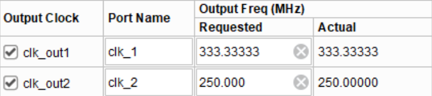

_Рисунок 3. Настройки PLL._

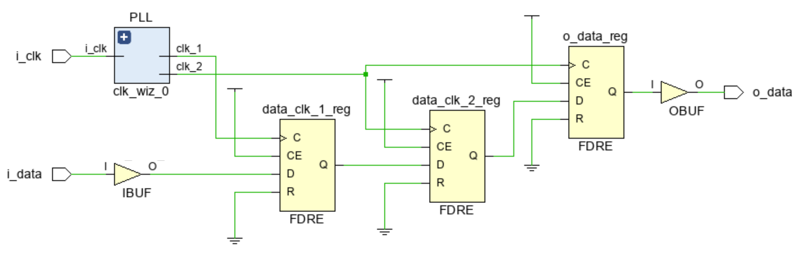

_Рисунок 4. Схема проекта._

Описание на SystemVerilog представлено ниже:
```verilog
module top (
    input  logic i_clk,
    input  logic i_data,
    output logic o_data
);
    logic clk_1, clk_2;
    logic data_clk_1, data_clk_2;
    // PLL для формирования синхронных сигналов
    clk_wiz_0 PLL (
        .i_clk(i_clk),
        .clk_1(clk_1),
        .clk_2(clk_2)
    );
    // передающий домен
    always_ff @(posedge clk_1) begin
        data_clk_1 <= i_data;
    end
    // приемный домен
    always_ff @(posedge clk_2) begin
        data_clk_2 <= data_clk_1;
        o_data <= data_clk_2;
    end 
endmodule
```
На ножку FPGA приходит тактовый сигнал `i_clk` с периодом 10 нс, из которого с помощью PLL формируются два сигнала `clk_1` и `clk_2`. Добавим в xdc-файл следующие команды:
```tcl
# период входного тактового сигнала
create_clock -period 10.0 -name i_clk [get_ports i_clk]
# объявление переменных, которые указывают места формирования тактовых сигналов
set pll_input    [get_pins PLL/inst/mmcm_adv_inst/CLKIN1] 
set pll_output_1 [get_pins PLL/inst/mmcm_adv_inst/CLKOUT0]
set pll_output_2 [get_pins PLL/inst/mmcm_adv_inst/CLKOUT1]
# обновление имен сгенерированных с помощью PLL тактовых сигналов
create_generated_clock -name clk_1 -source $pll_input -master_clock [get_clocks i_clk] $pll_output_1
create_generated_clock -name clk_2 -source $pll_input -master_clock [get_clocks i_clk] $pll_output_2
```

Временному анализатору с помощью команды `create_clock` необходимо указать период сигнала `i_clk`. Зная его, а также учитывая настройки PLL, анализатор самостоятельно определит периоды сигналов `clk_1` и `clk_2`. Как и в [1], используя команду `create_generated_clock` с ключом `-name`, заменим автоматически сгенерированные имена сигналов на выходе PLL на более простые.

На рисунке 5 показан раздел Summary временного отчета для пути между тактовыми доменами при анализе по Setup. Из строки Requirement можно увидеть, что запускающий фронт появляется в момент времени 3 нс, а защелкивающий – в 4 нс. Значение $\Delta T_{su}$ равно 1 нс, что соответствует паре фронтов `S22` на рисунке 2.

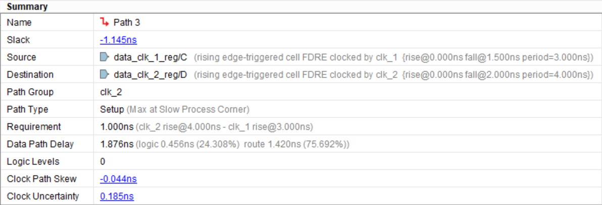

_Рисунок 5. Раздел Summary временного отчета для анализа по Setup._

На рисунке 6 представлен раздел Summary для анализа по Hold. Из строки Requirement получаем, что и запускающий, и защелкивающий фронты формируются в нулевой момент времени. На рисунке 2 это соответствует условию `H12a`. 

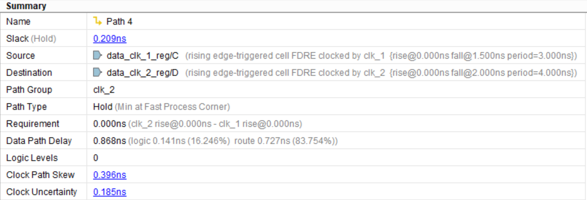

_Рисунок 6. Раздел Summary временного отчета для анализа по Hold._

Из-за того, что интервал времени между появлением фронтов из пары `S22` равен всего 1 нс, мы получили трудновыполнимое ограничение при анализе по Setup. Как можно увидеть из рисунка 5, оно нарушается, и данные опаздывают на 1.145 нс. 

## 2. Изменение положения защелкивающего фронта.

Как отмечалось ранее, при формировании пар фронтов тактовых сигналов для анализа по Setup каждому запускающему фронту сигнала `clk_1` сопоставляется ближайший по времени защелкивающий фронт сигнала `clk_2`. Для временного анализатора это правило обозначается, как `Setup = 1`. Его можно модифицировать для конкретного пути с помощью команды `set_multicycle_path`. Например, можно сдвинуть положение защелкивающего фронта на один период сигнала `clk_2`. Добавим в xdc-файл следующую команду:
```tcl
# сдвиг защелкивающего фронта вправо для анализа по Setup
set_multicycle_path 2 -setup -end -from [get_pins data_clk_1_reg/C] -to [get_pins data_clk_2_reg/D]
```
С помощью ключей `-from` и `-to` задается путь, для которого изменяются правила временного анализа. Ключ `-setup` говорит, что модификации вносятся в анализ по Setup, а ключ `-end` – что изменяется положение защелкивающего фронта. Число 2 обозначает, что новое правило для анализа выглядит, как `Setup = 2`. 

Начало и конец пути можно также задавать через триггеры с помощью команды get_cells или через тактовые сигналы, используя команду `get_clocks`:
```tcl
# другие способы задания начала и конца пути 
set_multicycle_path 2 -setup -end -from [get_cells data_clk_1_reg] -to [get_cells data_clk_2_reg]

set_multicycle_path 2 -setup -end -from [get_clocks clk_1] -to [get_clocks clk_2]
```

Временная диаграмма с обновленным положением фронтов представлена на рисунке 7. Позиции всех защелкивающих фронтов сдвинулись вправо на один период по сравнению со случаем без команды `set_multicycle_path` (см. рисунок 2). Самым пессимистичная ситуация по-прежнему соответствует паре фронтов `S22`, но теперь $\Delta T_{su}$ равно 8 – 3 = 5 нс.

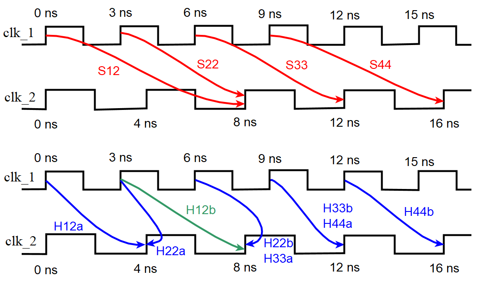

_Рисунок 7. Диаграммы сигналов для временного анализа._

Так как условия для анализа по Hold привязаны к парам фронтов, полученным на этапе вычисления $\Delta T_{su}$, их защелкивающие фронты также смещаются. Например, условие `H12a` обозначает, что данные запущенные в нулевой момент времени не должны быть приняты фронтом `clk_2`, который предшествует защелкивающему. Это соответствует моменту времени 4 нс, так как защелкивающий фронт для пары `S12` теперь появляется в 8 нс.

Для анализа по Hold будет использоваться условие `H12a`, для которого $\Delta T_h = 4 – 0 = 4 нс$. Условие `H12b` игнорируется из-за конфликта с требованиями для пары `S22` при анализе по Setup. 

Ниже показаны обновленные разделы Summary временного отчета. На рисунке 8 можно увидеть, что при анализе по Setup (_Requirement_) защелкивающий фронт сигнала `clk_2` появляется в момент времени 8 нс, а запускающий фронт сигнала clk_1 – в 3 нс. Это полностью согласуется с фронтами `S22` на рисунке 7. 

Также обратите внимание на строку Timing Exceptions, которая указывает, что правила временного анализа были изменены с помощью команды `set_multicycle_path`.

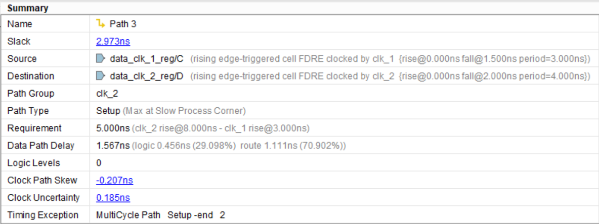

_Рисунок 8. Раздел Summary временного отчета для анализа по Setup._

При анализе по Hold рассматривается условие `H12a`, для которого $\Delta T_h = 4 нс$ (см. Requirement на рисунке 9). Это ограничение оказалось слишком сложным, что привело к его нарушению. Данные поступают на вход защелкивающего триггера на 3.926 нс раньше, чем требуется. 

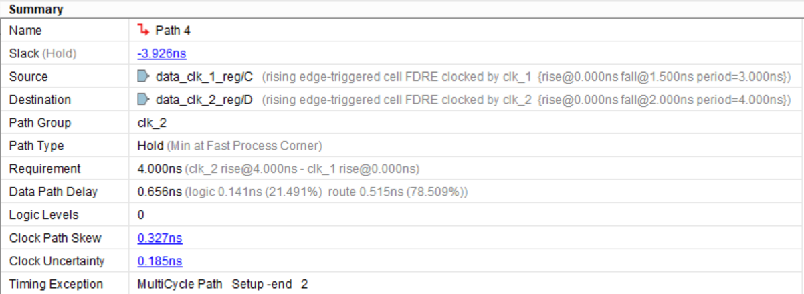

_Рисунок 9. Раздел Summary временного отчета для анализа по Hold._

Чтобы исправить новые нарушения временных ограничений, можно сдвинуть положение защелкивающих фронтов для анализа по Hold. Для этого добавим в xdc-файл следующую команду:
```tcl
# сдвиг защелкивающего фронта влево для анализа по Hold
set_multicycle_path 1 -hold -end -from [get_pins data_clk_1_reg/C] -to [get_pins data_clk_2_reg/D]
```
Ключ `-hold` говорит, что модификации вносятся в анализ по Hold. Напомним, что при данном анализе проверяются ограничения для текущего запускающего фронта относительно предыдущего защелкивающего [3]. Для временного анализатора это правило обозначается, как `Hold = 0`. Число 1 в команде `set_multicycle_path` изменяет это правило на `Hold = 1`. Это приводит к смещению положения защелкивающих фронтов на один период влево. Обновленная временная диаграмма для тактовых сигналов представлена на рисунке 10. 

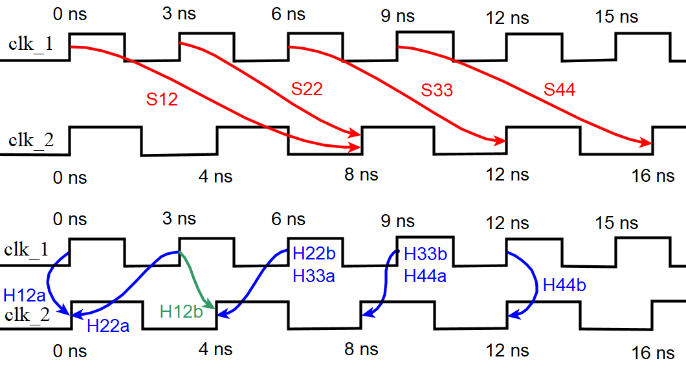

_Рисунок 10. Диаграммы сигналов для временного анализа._

Изучим, что изменилось во временных отчетах. Для анализа по Setup по-прежнему самым критичным случаем является пара фронтов `S22` (см. рисунок 11). При анализе по Hold рассматривается условие `H12a`, для которого после изменения положения защелкивающего фронта получаем $\Delta T_h = 0 нс$ (см. Requirement на рисунке 12). Это условие не такое сложное, и теперь временные ограничения выполнены. 

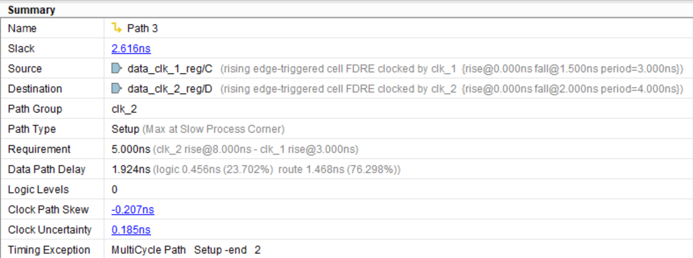

_Рисунок 11. Раздел Summary временного отчета для анализа по Setup._

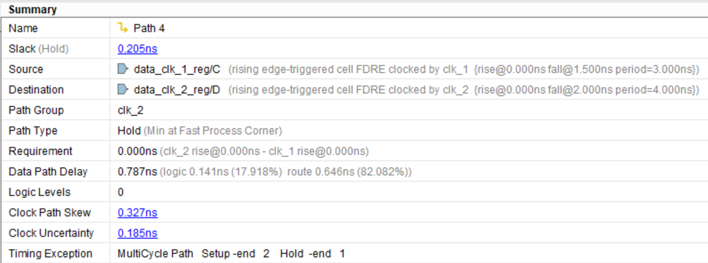

_Рисунок 12. Раздел Summary временного отчета для анализа по Hold._

К сожалению, радоваться пока рано. Из рисунка 10 видно, что, несмотря на тот, что условие `H12b` больше ни с кем не конфликтует, оно по-прежнему игнорируется при временном анализе. Это приводит к следующей проблеме. 

Данные запущенные в момент времени 3 нс, точно не будут защелкнуты фронтом `clk_2`, который появляется в нулевой момент времени (H22a). Также эти данные точно будут приняты фронтом `clk_2` в момент времени 8 нс (S22). Вспоминая, что анализ проводится для $\Delta T_h$ = 0 нс$, получаем, что данные на входе защелкивающего триггера изменятся в интервале между 3 и 8 нс. Может случится так, что это изменение произойдет в момент времени 4 нс, как раз, когда появляется фронт `clk_2`. Это в свою очередь может привести к тому, что защёлкивающий триггер перейдет в метастабильное состояние.

Таким образом, изменения, внесенные нами в правила анализа, убрали временные нарушения, но не гарантируют полной защиты от метастабильности. По этой причине важно понимать, как именно проводится временной анализ и какие выводы можно сделать на его основе.

## 3. Изменение положения запускающего фронта.

С помощью команды `set_multicycle_path` можно также изменять положение запускающего фронта. Для этого нужно добавить ключ `-start`. Уберем из xdc-файл все ранее записанные команды `set_multicycle_path` и внесем следующее:
```tcl
# сдвиг запускающего фронта влево для анализа по Setup
set_multicycle_path 2 -setup -start -from [get_pins data_clk_1_reg/C] -to [get_pins data_clk_2_reg/D]
```

Для анализа по Setup запускающий фронт перемещается влево на одну позицию, что можно увидеть на рисунке 13. Так для пары `S22` запускающий фронт появляется в нулевой момент времени. Значение $\Delta T_{su}$ теперь равно 4 нс. Для анализа по Hold фронты также изменяют свое положение. Самым сложным является условие `H12a`, для которого $\Delta T_h = 0 – (–3) = 3 нс$. 

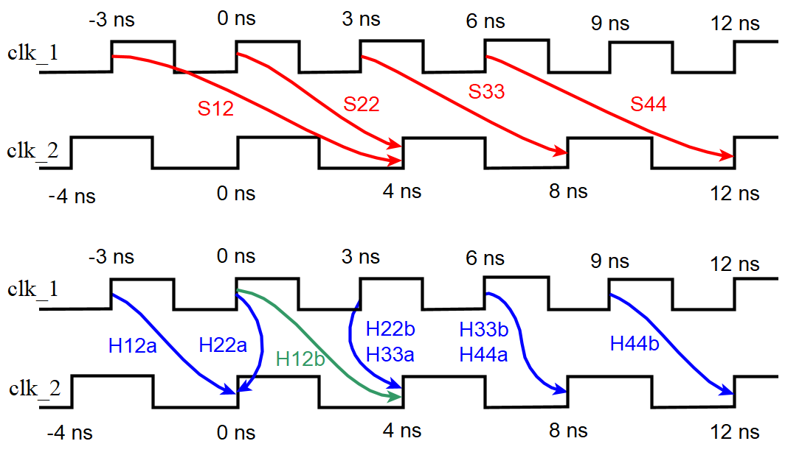

_Рисунок 13. Диаграммы сигналов для временного анализа._

Рассмотрим, что изменилось во временных отчетах. Для анализа по Setup, представленного на рисунке 14, получаем, что ситуация только еще сильнее ухудшилась. Значение $Slack$ равно –4.028 нс, хотя до использования команды `set_multicycle_path` оно было равно –1.145 нс. Причиной является очень большое время распространения данных, равное 7.568 нс (см. строку отчета Data Path Delay). При этом 94% задержки связано с распространением данных через трассировочные линии.   

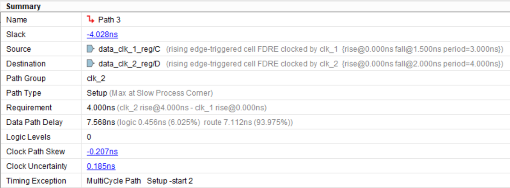

_Рисунок 14. Раздел Summary временного отчета для анализа по Setup._

Чтобы понять, откуда взялась такая большая задержка, нужно рассмотреть результаты анализа по Hold, представленные на рисунке 15. Из строки _Requirement_ можно увидеть, что проверяется условие `H12a`, для которого $\Delta T_h = 3 нс$. Чтобы выполнить временные ограничения, необходимо увеличить время распространения данных между триггерами.  Это делается за счет увеличения длины трассировочных линий.

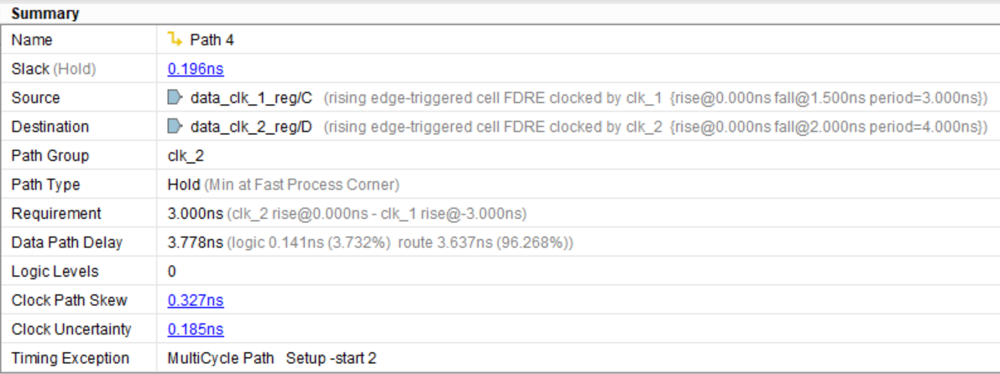

_Рисунок 15. Раздел Summary временного отчета для анализа по Hold._

В этом также можно убедиться, если рассмотреть результаты размещения и трассировки проекта, показанные на рисунке 16. Путь между триггерами выделен белым цветом. 

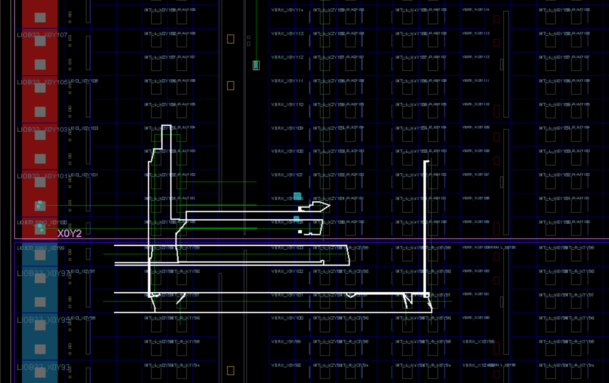

_Рисунок 16. Результат размещения и трассировки проекта._

Чтобы ослабить такие сложные ограничения, можно изменить положение запускающих фронтов при анализе по Hold. Для этого добавим в xdc-файл команду `set_multicycle_path` с ключами `-hold` и `-start`: 
```tcl
# сдвиг запускающего фронта вправо для анализа по Hold
set_multicycle_path 1 -hold -start -from [get_pins data_clk_1_reg/C] -to [get_pins data_clk_2_reg/D]
```

Запускающие фронты для анализа по Hold при этом будут сдвинуты на одну позицию вправо, что можно увидеть на рисунке 17.

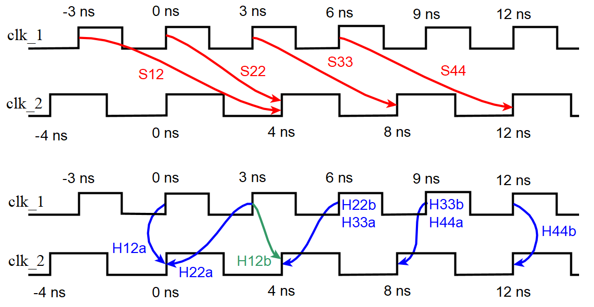

_Рисунок 17. Диаграммы сигналов для временного анализа._

Требования по Setup при этом не изменяются, и самое сложное ограничение по-прежнему соответствует паре фронтов S22 (см. рисунок 18).

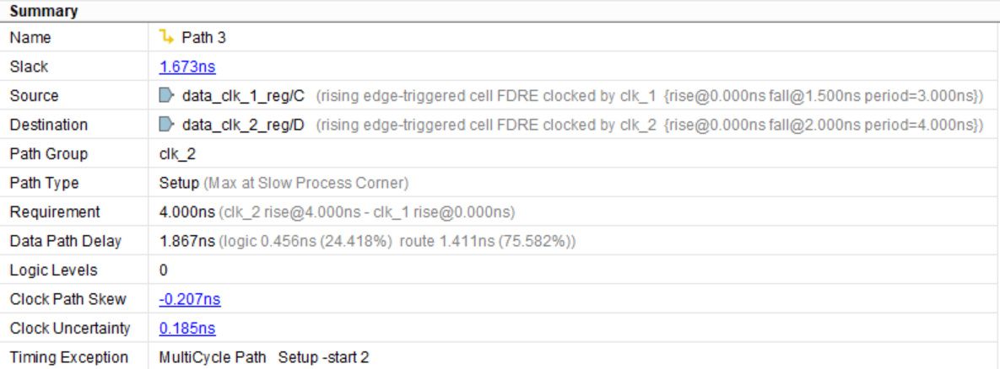

_Рисунок 18. Раздел Summary временного отчета для анализа по Setup._

Анализ по Hold проводится при условии `H12a`, для которого значение $\Delta T_h$ теперь равно 0 нс, что можно увидеть из строки Requirement на рисунке 19. Как и раньше, несмотря на тот, что условие `H12b` больше ни с кем не конфликтует, оно игнорируется при временном анализе.

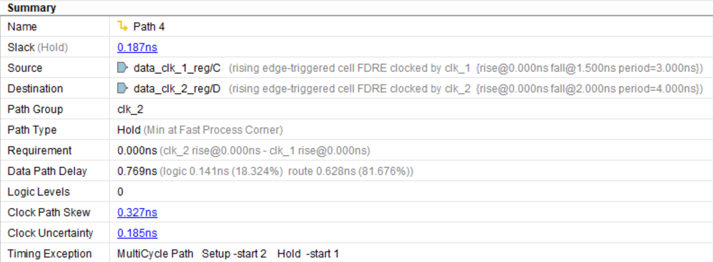

_Рисунок 19. Раздел Summary временного отчета для анализа по Hold._

Требования по Hold стали проще, и задержку распространения данных можно сделать меньше. Из рисунка 20 можно увидеть, что длина трассировочных линий теперь намного короче. Исходя из результатов отчетов, получаем, что все временные ограничения выполнены. 

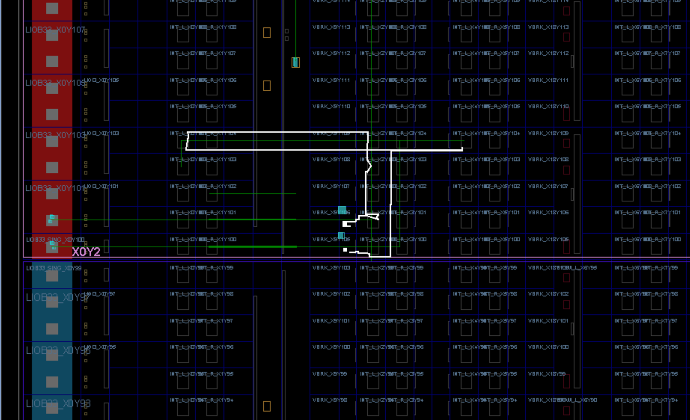

_Рисунок 20. Результат размещения и трассировки проекта._

Однако, как и в предыдущем разделе, из-за игнорирования условия `H12b` мы не можем гарантировать отсутствие проблем с метастабильностью. Например, данные запущенные в нулевой момент времени точно будут приняты фронтом `clk_2` через 4 нс (пара `S22` на рисунке 17). В свою очередь данные передаваемые следующим фронтом будут приняты в момент времени 8 нс (пара фронтов `S33`). Из-за того, что условие `H12b` не учитывается, данные, запущенные фронтом из `S33`, могут начать изменяться на входе защелкивающего триггера в момент прихода защелкивающего фронта из `S22`. Такая ситуация может приводить к тому, что триггер будет попадать в метастабильное состояние.

Рассмотренный выше пример передачи данных между тактовыми доменами иллюстрирует возможности и способы применения команды `set_multicycle_path`. Однако, конкретно для этого примера изменений положения фронтов с помощью `set_multicycle_path` недостаточно, чтобы гарантировать корректность передачи данных. Единственный способ решения проблемы – это добавить между доменами синхронизатор и исключить путь из временного анализа. Несколько ситуаций, где применение команды `set_multicycle_path` является крайне полезным, рассмотрены в следующих разделах.

## 4. Сдвиг фазы тактового сигнала.

В качестве первого практического примера разберем ситуацию, когда требуется передать данные между двумя доменами, которые тактируются сигналами, сдвинутыми по фазе. Рассмотрим тот же проект, что и в предыдущих разделах. Его схема представлена на рисунке 4.

На ножку FPGA приходит тактовый сигнал `i_clk` с периодом 10 нс, из которого с помощью PLL формируются два сигнала `clk_1` и `clk_2` с периодом 4 нс. Пусть также сигнал `clk_2` задержан относительно `clk_1` на 90 градусов (1 нс). Настройки PLL представление на рисунке 21.  

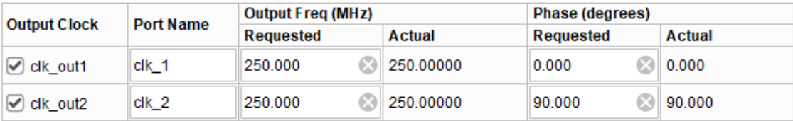

_Рисунок 21. Настройки PLL._

Добавим в xdc-файл команды, задающие период входного тактового сигнала и изменяющие имена выходных сигналов PLL:
```tcl
# период входного тактового сигнала
create_clock -period 10.0 -name i_clk [get_ports i_clk]

# объявление переменных, которые указывают места формирования тактовых сигналов
set pll_input    [get_pins PLL/inst/mmcm_adv_inst/CLKIN1] 
set pll_output_1 [get_pins PLL/inst/mmcm_adv_inst/CLKOUT0]
set pll_output_2 [get_pins PLL/inst/mmcm_adv_inst/CLKOUT1]

# обновление имен сгенерированных с помощью PLL тактовых сигналов
create_generated_clock -name clk_1 -source $pll_input -master_clock [get_clocks i_clk] $pll_output_1
create_generated_clock -name clk_2 -source $pll_input -master_clock [get_clocks i_clk] $pll_output_2
```

Временная диаграмма сигналов показана на рисунке 22. Для каждой пары запускающих и защелкивающих фронтов находим, что $\Delta T_{su} = 1 нс$. Для всех условий для анализа по Hold также получаем одинаковые значения $\Delta T_h = –3 нс$.

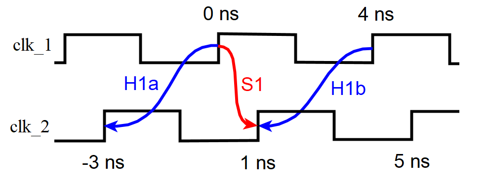

_Рисунок 22. Диаграммы сигналов для временного анализа._

Это подтверждается временными отчетами, представленными на рисунках 23 и 24. Можно увидеть, что анализ по Setup проводится для пары фронтов `S1`, а анализ по Hold – для условия `H1b`. Требование для анализа по Setup ($\Delta T_{su} = 1 нс$) слишком сложное, что приводит к нарушению временных ограничений. Данные опаздывают на 0.215 нс.

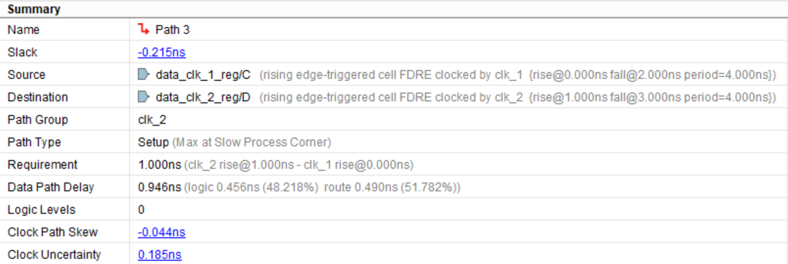

_Рисунок 23. Раздел Summary временного отчета для анализа по Setup._

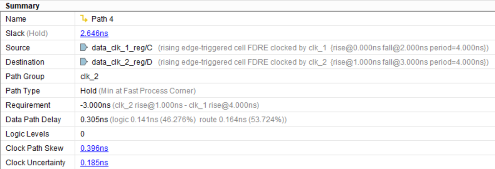

_Рисунок 24. Раздел Summary временного отчета для анализа по Hold._

Ограничения по Setup можно упростить, если защелкивать данные не ближайшим фронтом `clk_2`, а следующим через один период. То есть сдвинуть защелкивающий фронт на одну позицию вправо. Для этого добавим в xdc-файл команду `set_multicycle_path`: 
```tcl
# сдвиг защелкивающего фронта вправо для анализа по Setup
set_multicycle_path 2 -setup -end -from [get_pins data_clk_1_reg/C] -to [get_pins data_clk_2_reg/D]
```

Обновленная временная диаграмма для тактовых сигналов показана на рисунке 25. Для анализа по Setup получаем, что $\Delta T_{su} = 5 нс$. Защелкивающие фронты для анализа по Hold также смещаются, и теперь значение $\Delta T_h$ равно 1 нс. 

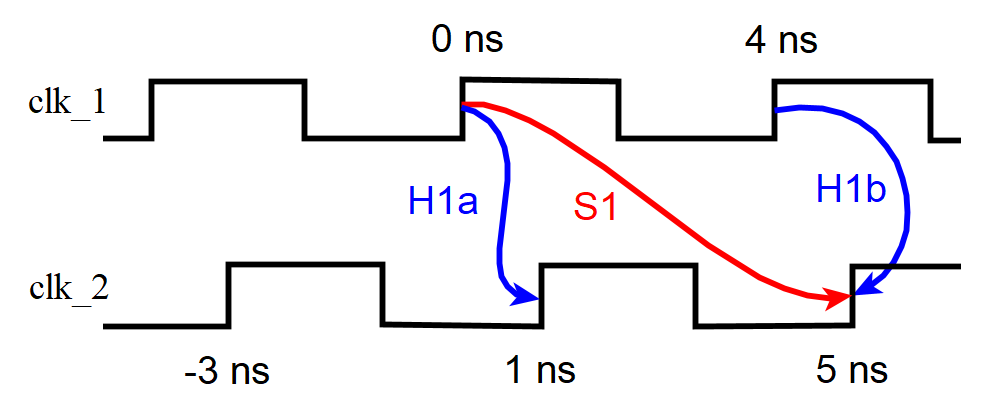

_Рисунок 25. Диаграммы сигналов для временного анализа._

Временные отчеты после внесения изменений представлены на рисунках 26 и 27. Можно увидеть, что теперь ограничения выполнены. 


_Рисунок 26. Раздел Summary временного отчета для анализа по Setup._

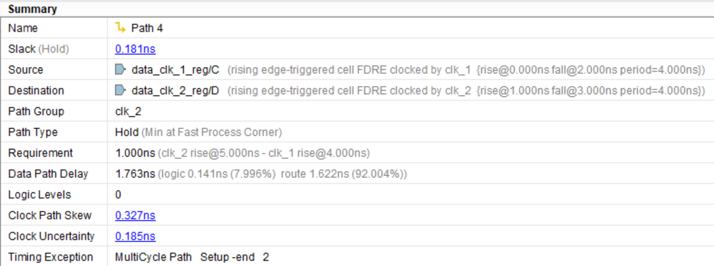

_Рисунок 27. Раздел Summary временного отчета для анализа по Hold._

## 5. Работа модуля по строб-сигналу.

Команда `set_multicycle_path` может оказаться очень полезной при изменении правил временного анализа для модулей, которые имеют управляющий строб-сигнал. Рассмотрим проект, описание которого представлено ниже:   
```verilog
module top_2 (
    input  logic        clk,
    input  logic        reset,
    output logic [31:0] q
);
    // строб-сигнал для счетчика
    logic counter_ce;
    // формирование строб-сигнала
    always_ff @(posedge clk)
        if (reset)
            counter_ce <= 1'b0;
        else
            counter_ce <= ~counter_ce;    
    // счетчик
    always_ff @(posedge clk)
        if (reset)
            q <= '0;
        else if (counter_ce)   
            q <= q + 1'b1;    
endmodule
```

Проект состоит из 32-битного счетчика и формирователя строб-сигнала. Строб-сигнал `counter_ce` инвертирует свое значение по каждому фронту тактового сигнала `clk`. Этот сигнал поступает на входы clock enable (`CE`) триггеров, которые входят в состав счетчика. Счетчик изменяет свое состояние по фронту `clk` только при условии, что значение строб-сигнала `counter_ce` равно единице, то есть каждый второй такт.

Пусть требуется, чтобы счетчик тактировался сигналом с периодом 2.5 нс. В xdc-файл с ограничениями добавим следующую команду:  
```tcl
# период входного тактового сигнала
create_clock -period 2.5 -name clk [get_ports clk]
```

Диаграмма сигналов, используемая при временном анализе показана на рисунке 28. По умолчанию данные должны быть приняты ближайшим фронтом тактового сигнала, который поступает на защелкивающий триггер. Таким образом, данные запущенные в нулевой момент времени должны быть приняты спустя 2.5 нс (пара фронтов `S1`, $\Delta T_{su} = 2.5 нс$). При анализе по Hold для всех условий получаем, что $\Delta T_h = 0 нс$.     

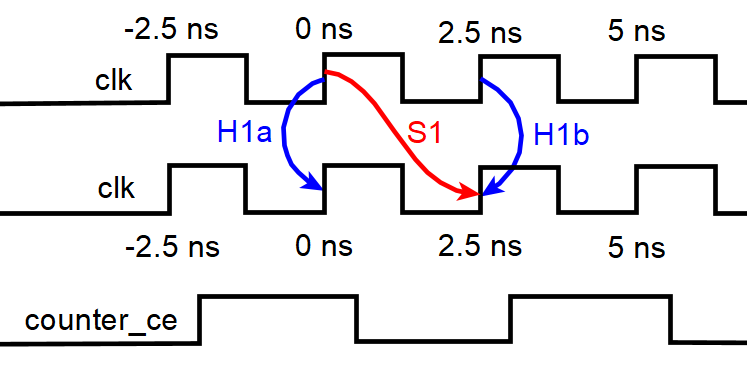

_Рисунок 28. Диаграммы сигналов для временного анализа._

Результаты временного анализа показаны ниже (см. рисунок 29). Временные ограничения при анализе по Setup не выполняются для шести путей внутри счетчика. Однако, эти ограничения не отражают реальной ситуации, так как для защелкивающего фронта из пары `S1` строб-сигнал counter_ce имеет неактивный уровень. То есть, триггеры счетчика не будут реагировать на этот защелкивающий фронт.

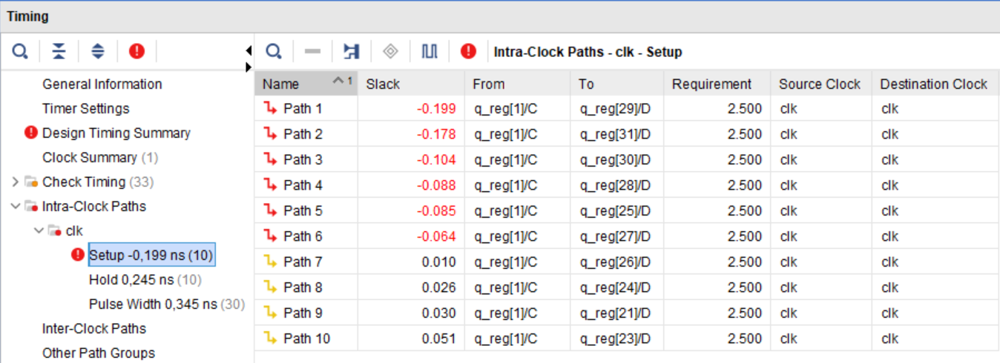

_Рисунок 29. Результаты временного анализа._

Данные запущенные в нулевой момент времени должны быть приняты ближайшим фронтом, для которого сигнал counter_ce имеет единичное значение. Этот фронт формируется в момент времени 5 нс. Глядя на рисунок 29, можно увидеть, что худшее значение Slack равно –0.199 нс, то есть фронт, появляющийся спустя 2.5 нс после защелкивающего фронта из пары `S1`, корректно примет данные (–0.199 + 2.5 > 0). Таким образом, несмотря на наличие нарушений во временных ограничениях, триггеры счетчика не будут попадать в метастабильное состояние. 

Чтобы каждый раз не проводить вручную подобные рассуждения, можно модифицировать правила выполнения временного анализа. Добавим в xdc-файл следующие команды:
```tcl
# получение триггеров счетчика по имени ячеек netlist
set counter_flops [get_cells q_reg[*]]

# добавление multicycle path
set_multicycle_path 2 -setup -end -from $counter_flops -to $counter_flops
set_multicycle_path 1 -hold  -end -from $counter_flops -to $counter_flops
```
С помощью команды `get_cells` находим все примитивы с именем `q_reg[*]`, что соответствует поиску всех триггеров счетчика. Результат записывается в переменную `counter_flops`, которая в дальнейшем используется для указания начала и конца путей с измененными правилами временного анализа. Далее, первая команда `set_multicycle_path` сдвигает защелкивающий фронт при анализе по Setup на одну позицию вправо. Это приводит к соответствующему сдвигу защелкивающих фронтов для анализа по Hold. Вторая команда `set_multicycle_path` возвращает эти фронты на прежнее место. Обновленная диаграмма сигналов, используемая для временного анализа, показана на рисунке 30.

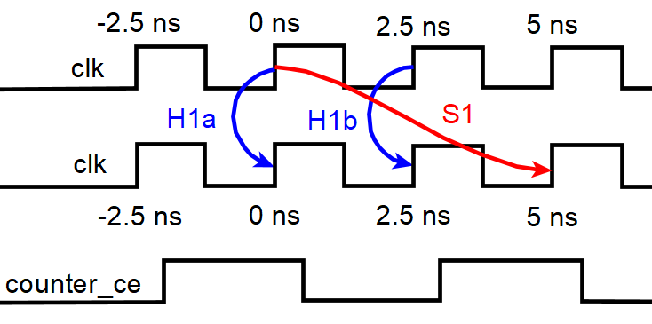

_Рисунок 30. Диаграммы сигналов для временного анализа._

Отчет с результатами анализа представлен на рисунке 31. Можно увидеть, что временные ограничения выполняются. Теперь для путей между триггерами счетчика значение $\Delta T_{su}$ равно 5 нс. Правила временного анализа для путей между формирователем строб-сигнала counter_ce и счетчиком не модифицировались, и для них по-прежнему $\Delta T_{su} = 2.5 нс$.

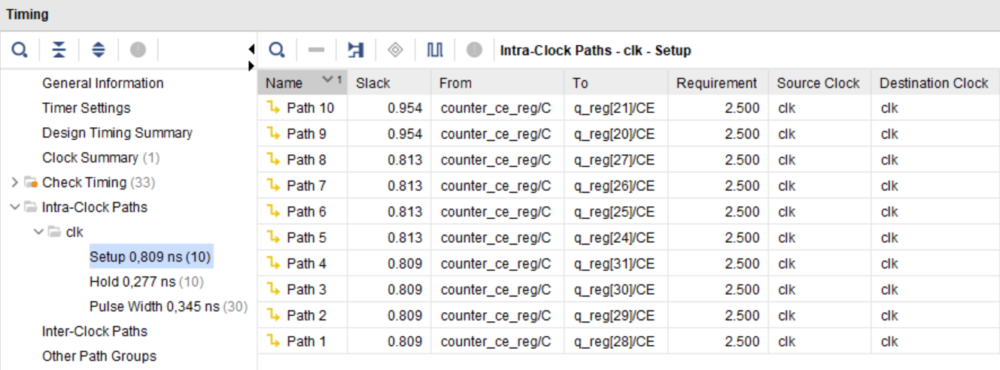

_Рисунок 31. Результаты временного анализа._

Дополнительно рассмотрим еще пару способов указания начала и конца путей, на которые должна воздействовать команда `set_multicycle_path`. После проведения оптимизаций при синтезе и имплементации к именам триггеров могут добавляться дополнительные суффиксы, поэтому иногда удобно выполнять поиск следующим образом: 
```tcl
# получение триггеров счетчика по имени переменной и типу
set counter_flops [get_cells q* -filter {PRIMITIVE_TYPE =~ FLOP_LATCH.flop.*}]
```

С помощью команды `get_cells` находим все примитивы проекта, имена которых начинается с символа `q`. Это могут быть и триггеры, и LUT счетчика. Далее с помощью ключа `-filter` удаляем все примитивы, которые не являются триггерами.

В качестве еще одного варианта можно постараться найти все триггеры, на вход `CE` которых поступает строб-сигнал `counter_ce`. Для этого воспользуемся следующими командами:  
```tcl
# получение триггеров счетчика по сигналу counter_ce
set ce_net [get_nets counter_ce]
set flops_ce_pins [get_pins -of_objects $ce_net -filter {NAME =~ "*CE"}]
set counter_flops [get_cells -of_objects $flops_ce_pins]
```

С помощью команды `get_nets` получаем строб-сигнал `counter_ce`. Далее используем команду `get_pins` для поиска входных пинов, на которые приходит строб-сигнал и имя которых заканчивается на `CE`. Наконец, командой `get_cells` получаем все примитивы, которым принадлежат найденные ранее пины. 

## 6. Ограничения для входных и выходных сигналов.

В завершение рассмотрим, как можно использовать команду `set_multicycle_path` для изменения правил временного анализа для входных и выходных сигналов.

В [4] был рассмотрен временной анализ при передаче данных из FPGA во внешнее устройство для случая Source Synchronous. На рисунке 32 показан анализируемый путь, на который нанесены задержки сигналов. Более подробно о введенных обозначениях можно прочитать в [4].

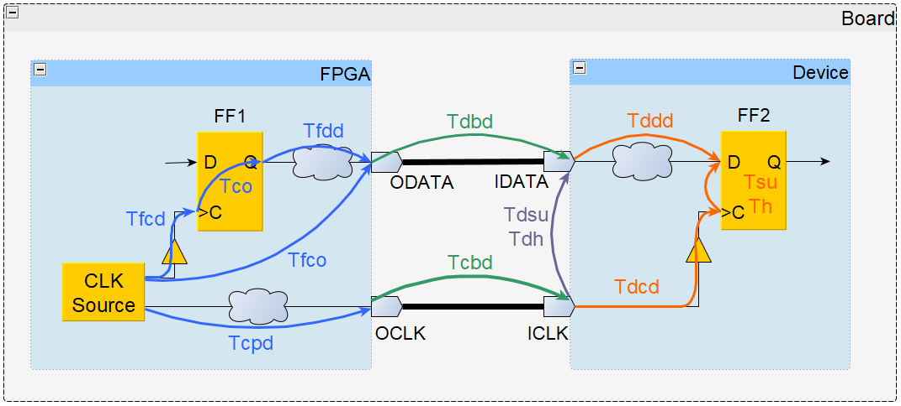

_Рисунок 32. Путь с задержками для данных и тактовых сигналов._

В качестве примера, пусть в FPGA загружен простой проект, состоящий всего из одного триггера. Его описание на SystemVerilog представлено ниже: 
```verilog
module top_3 (
    input  logic i_clk,
    input  logic i_data,
    output logic o_clk,
    output logic o_data
);

    always_ff @(posedge i_clk)
        o_data <= i_data;
        
    assign o_clk = i_clk;
        
endmodule
```

В качестве внешнего устройства рассмотрим в микросхему _Ethernet PHY LAN8740A_ [5]. На рисунке 33 приведены таблица со значениями задержек и временная диаграмма сигналов из datasheet на LAN8740A. Для краткости временные ограничения будут продемонстрированы для одного выходного сигнала FPGA, который подключен к ножке TXD[0] микросхемы LAN8740A.


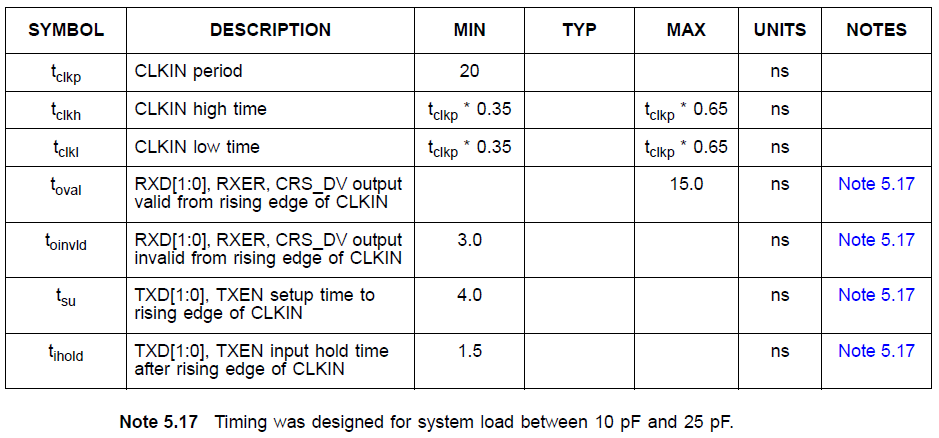


_Рисунок 33. Задержки и временные диаграммы для LAN8740A._

Из рисунка 33 получим время установки Tdsu и удержания Tdh для LAN8740A, а также минимальный период такового сигнала. Также будем считать, что минимальные и максимальные задержки распространения данных и тактового сигнала по дорожкам печатной платы известны. В качестве примера рассмотрим следующие значения в наносекундах: Tdbd_max = 0.15, Tdbd_min = 0.1, Tcbd_max = 0.12 и Tcbd_min = 0.07.

Занесем эти задержки в xdc-файл и сразу добавим ограничения на период входного (i_clk) и выходного (o_clk) тактовых сигналов:
```tcl
# период тактового сигнала 
set Tclk 20

# время установки и удержания для микросхемы LAN8740A
set Tdsu 4.0
set Tdh 1.5

# минимальное и максимальное время распространения данных по дорожкам платы
set Tdbd_max 0.15
set Tdbd_min 0.1

# минимальное и максимальное время распространения тактового сигнала по дорожкам платы
set Tcbd_max 0.12
set Tcbd_min 0.07

# ограничение на период входного тактового сигнала
create_clock -period $Tclk -name i_clk [get_ports i_clk]

# ограничение на период выходного тактового сигнала
create_generated_clock -name o_clk -source [get_ports i_clk] -divide_by 1 [get_ports o_clk]
```

Пусть требуется запускать данные из FPGA и принимать их микросхемой LAN8740A с помощью одного и того же фронта тактового сигнала. В [4] для этого случая были получены следующие уравнения: 


По умолчанию при временном анализе по Setup защелкивающим фронтом считается следующий фронт тактового сигнала (правило Setup = 1). Нам же требуется, чтобы запускающий и защелкивающий фронты совпадали, поэтому в уравнение для output_delay_max пришлось добавить дополнительное слагаемое Tclk. По той же причине слагаемое Tclk появляется в уравнении для анализа по Hold.

Основываясь на уравнениях (2), добавим в xdc-файл ограничения для выходного сигнала o_data:
```tcl
# временные ограничения для выходного сигнала o_data
set_output_delay -clock o_clk -max [expr $Tclk + $Tdbd_max + $Tdsu - $Tcbd_min] [get_ports o_data]
set_output_delay -clock o_clk -min [expr $Tclk + $Tdbd_min - $Tdh  - $Tcbd_max] [get_ports o_data]
```

Ниже показаны разделы временного отчета, описывающие задержки для защёлкивающего фронта такового сигнала. При анализе по Setup (см. рисунок 34) считается, что защелкивающий фронт формируется в момент времени 20 нс, что на один период позже появления запускающего фронта. Дополнительная задержка в 20 нс компенсируется за счет слагаемого Tclk в уравнениях (2), поэтому в отчете величина output delay равна –24.080 нс. 

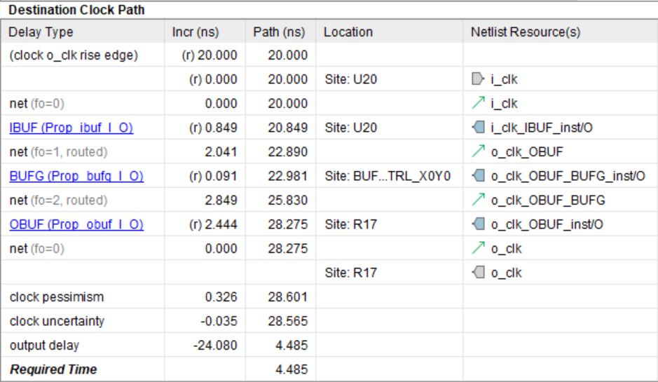

_Рисунок 34. Задержки для защелкивающего фронта при анализе по Setup._

Та же картина наблюдается при анализе по Hold (см. рисунок 35). Предыдущий защелкивающий фронт должен формироваться на один период раньше запускающего, то есть в –20 нс. Однако, он появляется в нулевой момент времени. По этой причине в отчете значение output delay равно –18.480 нс.   

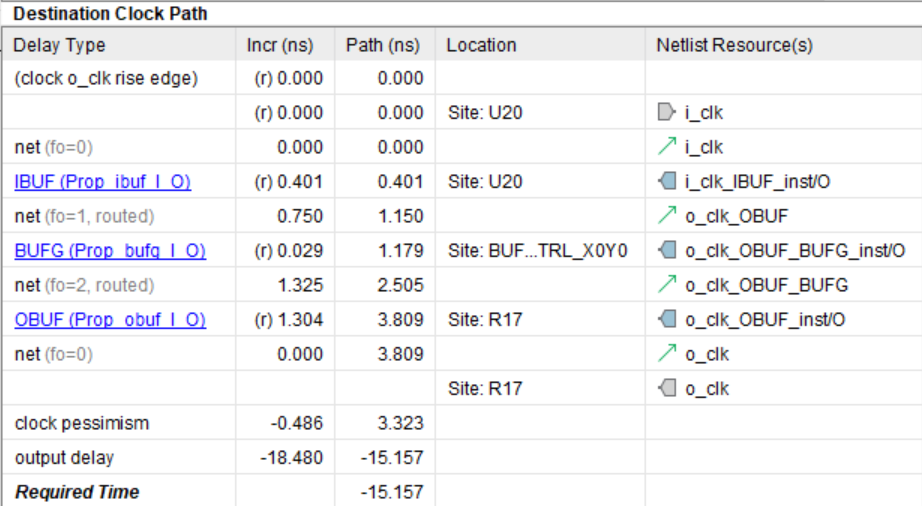

_Рисунок 35. Задержки для защелкивающего фронта при анализе по Hold._

Все описанные выше несоответствия усложняют интерпретацию временных отчетов. Эту проблему можно решить, если модифицировать правила временного анализа с помощью команды `set_multicycle_path`. Для начала удалим из уравнений (2) слагаемые Tclk. Теперь они примут вид: 


Соответствующим образом обновим временные ограничения для выходного сигнала o_data в xdc-файле:
```tcl
# временные ограничения для выходного сигнала o_data
set_output_delay -clock o_clk -max [expr $Tdbd_max + $Tdsu - $Tcbd_min] [get_ports o_data]
set_output_delay -clock o_clk -min [expr $Tdbd_min - $Tdh  - $Tcbd_max] [get_ports o_data]
```

Для анализа по Setup по умолчанию временной анализатор считает, что защелкивающий фронт формируется спустя один период после запускающего (правило Setup = 1). Нам же требуется, чтобы они появлялись в один и тот же момент времени. Для этого подвинем защелкивающий фронт на одну позицию влево. Это обозначается в виде правила Setup = 0. Добавим в xdc-файл следующую команду: 
```tcl
# добавление multicycle path
set_multicycle_path 0 -setup -end -to [get_ports o_data]
```

Как и ранее ключ `-end` указывает, что изменяется положение защелкивающего фронта. Обратите внимание, что выше отсутствует ключ `-from`, то есть не указано начало пути. Так можно делать, и в этом случае модифицируется анализ для всех путей, которые заканчиваются на выходной ножке `o_data` FPGA.

Рассмотрим, какие изменения произошли во временных отчетах. При анализе по Setup теперь, как и ожидается, защелкивающий фронт появляется в нулевой момент времени. Также обратите внимание, что на рисунке 36 отсутствует величина _clock uncertainty_, задающая неопределенность для тактового сигнала из-за джиттера. Теперь запускающий и защелкивающий фронты это один и тот же фронт, поэтому джиттер не оказывает никакого влияния. Таким образом, временной отчет стал не только более понятным, но и более точным.

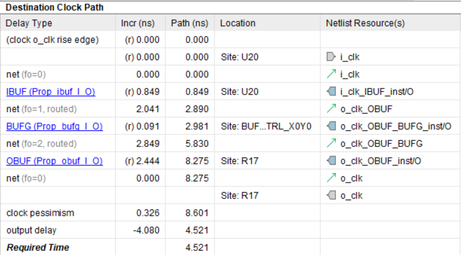

_Рисунок 36. Задержки для защелкивающего фронта при анализе по Setup._

При анализе по Hold защелкивающий фронт теперь формируется в момент времени –20 нс (см. рисунок 37). Строка clock uncertainty теперь наоборот появляется, так как теперь запускающий и предыдущий защелкивающий фронты – это разные фронты.

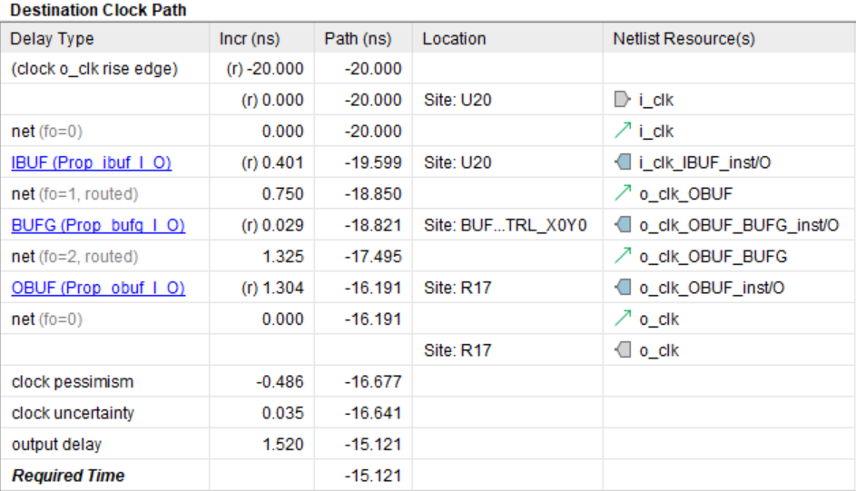

_Рисунок 37. Задержки для защелкивающего фронта при анализе по Hold._

## Заключение

В статье представлен способ модификации правил проведения временного анализа. Показаны возможности использования команды `set_multicycle_path` для исправления нарушений во временных ограничениях. Рассмотрено несколько практических примеров.

## Ссылки

1. [Основы статического временного анализа. Часть 5: False Path Constraint](./timings5_false_path.md)
2. [Vivado Design Analysis and Closure Techniques (UG 906)](https://docs.xilinx.com/v/u/2017.3-English/ug906-vivado-design-analysis)
3. [Основы статического временного анализа. Часть 1: Period Constraint](./timings1_intro.md)
4. [Основы статического временного анализа. Часть 4: Source Synchronous Output Delay Constraint](./timings4_source_output_delay.md)
5. [Datasheet LAN8740A](https://archive.fpga-systems.org/go?http://www.datasheet.es/PDF/1021686/LAN8740A-pdf.html)